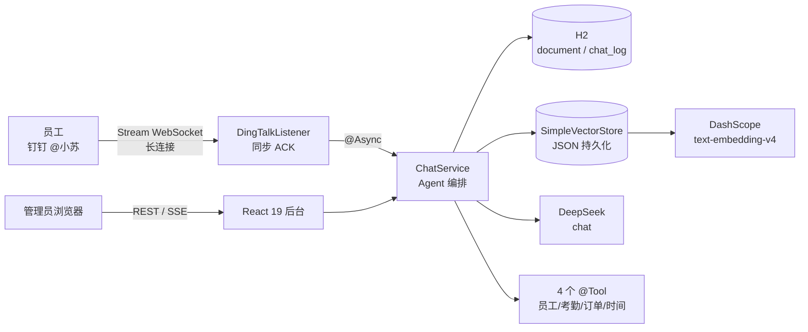

# 小苏 —— 公司内部 AI 助手

> 招聘笔试项目 · Java 21 + Spring AI + 钉钉 + React 19 · 5 天交付

「小苏」是面向公司员工的内部 AI 助手：员工在钉钉里 @ 它就能查规章制度（带原文引用）、查考勤订单等实时数据；管理员通过 Web 后台维护知识库、查看全部对话日志与 Token 消耗。

🌐 在线演示：<https://xiaosu.lingke.store>

## ✨ 功能一览

（截图占位：钉钉对话截图 + 后台截图，提交前补充）

| 功能 | 说明 |
|---|---|
| 📚 文档知识库 | 上传 md/txt/pdf/docx，SHA256 去重 + 同名自动替换（增量更新），删除后不再参与问答 |
| 💬 智能问答 | RAG 带引用（文件+切片+原文）、多轮对话按会话隔离、SSE 流式输出、检索不到明确拒答、隐私问题规则拦截 |
| 🔧 工具调用 | 员工/考勤/订单/时间 4 个工具，LLM 自主决策调用（非 if-else 路由），调用轨迹完整落库 |
| 💼 钉钉集成 | Stream 模式（出站长连接，无需公网 IP）、@机器人问答、Markdown 引用卡片、异常友好兜底 |
| 🖥️ 管理后台 | 文档管理（上传/列表/删除/切片预览）、对话日志（工具/tokens/耗时）、模型设置与连通测试、调试聊天页 |

## 🏗️ 架构



问答链路：拒答预检（规则）→ RAG 检索（topK+阈值）→ 拼装引用上下文 → 多轮记忆（会话隔离）→ 工具回调（模型自主决策，ToolCallAdvisor 执行）→ 流式生成 → 全链路落 chat_log（含工具调用与 Token 用量）。

## 🚀 快速开始

```bash
# 1. 环境：Java 21 / Node 20+ / pnpm / Maven 3.9+
git clone https://github.com/xixi141/xiaosu.git && cd xiaosu
cp .env.example .env   # 填入 DEEPSEEK_API_KEY、DASHSCOPE_API_KEY（钉钉凭证可选）

# 2. 一条命令启动（前后端 + 自动加载 .env）
./scripts/dev.sh
# 后端 http://localhost:8080  前端 http://localhost:5173

# 3. 导入知识库文档
./scripts/seed.sh
```

## 🐳 Docker 部署（云服务器）

```bash
# 本地构建前端产物并推送仓库
cd web && pnpm install && pnpm build && cd ..

# 云服务器（已装 Docker）
git clone https://github.com/xixi141/xiaosu.git && cd xiaosu
cp .env.example .env   # 真实 key + DINGTALK_ENABLED=true + 钉钉凭证
docker compose up -d --build
# 访问 http://<服务器IP>/  → 管理后台；钉钉测试群 @小苏 即用
```

钉钉 Stream 模式为出站长连接，部署后**无需配置公网回调地址**。

## ⚙️ 环境变量

| 变量 | 说明 | 默认 |
|---|---|---|
| `DEEPSEEK_API_KEY` | chat 模型 key（DeepSeek） | 占位符（仅启动，调用会失败） |
| `OPENAI_BASE_URL` | chat 接口地址 | `https://api.deepseek.com` |
| `CHAT_MODEL` | chat 模型名 | `deepseek-chat` |
| `DASHSCOPE_API_KEY` | embedding 模型 key（阿里云百炼） | 占位符 |
| `EMBEDDING_BASE_URL` | embedding 接口地址 | DashScope compatible-mode |
| `EMBEDDING_MODEL` / `EMBEDDING_DIMENSIONS` | embedding 模型/维度 | `text-embedding-v4` / `1024` |
| `RAG_TOP_K` / `RAG_THRESHOLD` | 检索条数 / 相似度阈值 | `4` / `0.35` |
| `RAG_CHUNK_SIZE` / `RAG_CHUNK_OVERLAP` | 切块大小/重叠（字符） | `600` / `80` |
| `DINGTALK_ENABLED` / `DINGTALK_CLIENT_ID` / `DINGTALK_CLIENT_SECRET` | 钉钉 Stream 凭证 | 禁用 |
| `SERVER_PORT` | 后端端口 | `8080` |

「多模型适配」：chat 与 embedding 走两个供应商（DeepSeek + 通义），同一 Spring AI OpenAI 接口，双 base-url 独立配置。

## 📡 API 文档

| 方法 | 路径 | 说明 |
|---|---|---|
| POST | `/api/documents` | 上传文档（multipart file + overwrite），返回 sha256/切片数/是否重复 |
| GET | `/api/documents` | 文档列表（分页/关键词） |
| GET | `/api/documents/{id}` | 文档详情 + 切片预览 |
| DELETE | `/api/documents/{id}` | 删除（级联删切片/向量/原件） |
| POST | `/api/chat` | 非流式问答（钉钉走这条） |
| POST | `/api/chat/stream` | SSE 流式：`meta`（引用）→ `token`×N → `done`（用量/工具） |
| GET | `/api/logs` | 对话日志分页（用户/状态过滤） |
| GET | `/api/logs/{id}` | 日志详情（工具调用/引用） |
| GET | `/api/settings` | 模型/RAG/IM 配置（key 掩码） |
| POST | `/api/settings/test-connection` | 模型连通性测试 |
| GET | `/api/health` | 组件健康状态 |

## 🧪 测试

```bash
./scripts/test.sh   # 26 条测试全部离线（自写 Fake LLM/Embedding，不花 API 钱）
```

覆盖：文档入库/去重/同名替换/删除级联、检索持久化、切块器、RAG 引用与拒答、多轮会话、**脚本化 LLM 驱动真实工具执行的 agent loop**、SSE 事件序列（MockMvc）。真实 API 连通性测试（@Tag("live")）默认排除，手动跑：`mvn test -Dgroups=live`。

## 🗺️ Roadmap

- [ ] pgvector 适配器（VectorStoreService 已接口化，可平滑替换 SimpleVectorStore）
- [ ] 运行时切换模型（当前修改 .env 重启生效）
- [ ] 钉钉卡片消息 / 文件问答（富消息形态加分项）
- [ ] 飞书接入（DingTalkMessageProcessor 的消息处理链路可复用）
- [ ] Langfuse 可观测性接入
- [ ] Evals 自动化评测集（20+ case）
- [ ] MCP Server 形态

## 📚 技术栈

- 后端：Java 21 · Spring Boot 3.5.16 · Spring AI 1.1.8 · H2 · Apache Tika · 钉钉 Stream SDK 1.3.7 · JUnit 5 · MockMvc · Lombok
- 前端：React 19 · Vite · Tailwind v4 · TypeScript strict · pnpm
- 模型：DeepSeek（chat）+ DashScope text-embedding-v4（embedding）
- 部署：Docker Compose（云服务器） / scripts/start.sh（本地 jar）

## 📄 License

MIT
