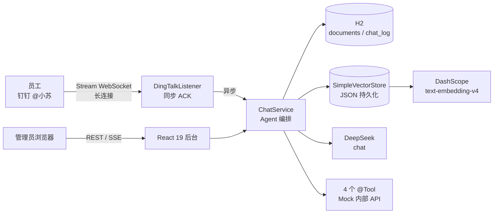

# 「小苏」AI 助手 Implementation Plan

> **For agentic workers:** REQUIRED SUB-SKILL: Use superpowers:subagent-driven-development (recommended) or superpowers:executing-plans to implement this plan task-by-task. Steps use checkbox (`- [ ]`) syntax for tracking.

**Goal:** 5 天内交付招聘笔试项目「小苏」——钉钉接入的公司内部 AI 助手（RAG 知识库问答 + 工具调用 + 多轮对话 + Web 管理后台），目标 85+ 分。

**Architecture:** 前后端分离。Spring Boot 3.5.16 + Spring AI 1.1.8 后端（chat=DeepSeek、embedding=DashScope text-embedding-v4，双 base-url 一个 openai starter）；H2 文件模式 + SimpleVectorStore（JSON 持久化）做数据层；钉钉 Stream 模式（WebSocket 长连接，无需公网 IP）做 IM 入口；React 19 + Vite + Tailwind v4 管理后台。本地 `scripts/dev.sh` 一条命令启动，云服务器 docker-compose 部署。

**Tech Stack:** Java 21, Spring Boot 3.5.16, Spring AI 1.1.8 (BOM), DeepSeek API, DashScope embedding, H2, Apache Tika, 钉钉 Stream SDK, React 19, Vite, Tailwind v4, pnpm, JUnit 5, MockMvc, Docker。

## Global Constraints

- 仓库 public、多 commit（每任务结束 commit 一次）、`.env` 永不入库（.gitignore 兜底）
- 配置全外置：所有 API Key/模型名/Base URL 走环境变量；提供 `.env.example`
- 日志落 `logs/` 目录（logback-spring.xml），不只打 console
- 单文件 ≤ 500 行（Java/TS）、单目录 ≤ 8 个文件（顶层与 Java 包目录均遵守）
- 数据结构强类型：Java record/entity 不用 Map<String,Object> 糊弄；TS 开启 strict，禁 any
- 启动/测试/种子数据命令统一放 `scripts/*.sh`
- Java 类必须能脱离 Docker 在 Windows 本机运行（本地无 Docker，云服务器才有）
- 测试不依赖真实 API：用 Spring AI 自带 MockChatModel/MockEmbeddingModel
- 知识库文档与 mock JSON 数据全部 AI 生成，不外部找资料
- AI_USAGE.md 从 D1 开始每日记录真实 AI 协作事件，最终由用户第一人称定稿

## 与已批准设计的偏差（YAGNI 裁剪，执行时按此为准）

1. **chat_memory 表取消**：上下文恢复重启后不保留（验收不考重启恢复），改用内存 `InMemoryChatMemory` + 过期清理，省掉 Message 序列化复杂度。多轮隔离仍按 `sessionKey = userId#conversationId` 严格隔离。
2. **自定义 RequestResponseAdvisor（RagAdvisor）取消**：检索在 ChatService 内同步完成（调用 LLM 前），检索结果作为局部变量传给 CitationAssembler。逻辑更直白、面试更好讲。
3. **前端不引 shadcn CLI 生成的组件目录**（会炸「单目录≤8文件」）：Tailwind v4 手写 + 自写 Button/Table/Badge/Dialog 小组件（components/ui.tsx 单文件）。
4. **切块器自写**（`XiaosuTextSplitter`）：按空行分段 → 按 `。！？；` 切句 → 合并到 ~600 字符块（≈400 中文 token），重叠 80 字符。中文边界可控，不依赖 TokenTextSplitter 英文标点行为。

## File Structure Map

```
D:\A_one\xiaosu\
├─ .gitignore  .env.example  .env(不入库)  README.md  AI_USAGE.md  自评.md
├─ docker-compose.yml  Dockerfile
├─ backend/
│  ├─ pom.xml
│  └─ src/
│     ├─ main/java/com/xiaosu/
│     │  ├─ XiaosuApplication.java
│     │  ├─ config/    AppProperties.java  AiClientConfig.java  VectorStoreConfig.java  AsyncConfig.java  CorsConfig.java  RetryConfig.java
│     │  ├─ controller/ DocumentController.java  ChatController.java  LogController.java  SettingController.java  HealthController.java
│     │  ├─ service/   DocumentService.java  DocumentIngestService.java  ChatService.java  LogService.java  SettingService.java  VectorStoreService.java  MockDataService.java
│     │  ├─ rag/       CitationAssembler.java  RefusalGuard.java  RagContext.java
│     │  ├─ tool/      ToolConfig.java  EmployeeTool.java  AttendanceTool.java  OrderTool.java  DateTimeTool.java  ToolRecorder.java
│     │  │  └─ model/  Employee.java  AttendanceRecord.java  OrderRecord.java
│     │  ├─ im/        DingTalkClientStarter.java  DingTalkMessageListener.java  DingTalkReplyService.java  DingTalkProperties.java
│     │  ├─ memory/    ChatSessionService.java  ChatMemoryManager.java
│     │  ├─ entity/    DocumentEntity.java  DocumentChunkEntity.java  ChatLogEntity.java
│     │  ├─ repository/ DocumentRepository.java  DocumentChunkRepository.java  ChatLogRepository.java
│     │  ├─ dto/       ChatRequest.java  ChatResponse.java  Citation.java  StreamEvent.java  IngestResult.java  DocumentDto.java  LogDto.java  HealthDto.java
│     │  ├─ exception/ ApiException.java  GlobalExceptionHandler.java
│     │  ├─ scheduler/ MemoryEvictTask.java
│     │  └─ util/      Sha256Util.java  XiaosuTextSplitter.java  JsonUtil.java
│     ├─ main/resources/ application.yml  logback-spring.xml  mock/{employees,attendance,orders}.json
│     └─ test/java/com/xiaosu/  DocumentIngestServiceTest.java  ChatServiceRagTest.java  ChatServiceToolTest.java  ChatControllerMockMvcTest.java  XiaosuTextSplitterTest.java  TestAiConfig.java
├─ web/
│  ├─ package.json  vite.config.ts  tsconfig.json  index.html
│  └─ src/
│     ├─ main.tsx  App.tsx  index.css
│     ├─ api/client.ts  api/types.ts
│     ├─ hooks/useSSE.ts
│     ├─ components/ui.tsx  components/ChatBubble.tsx  components/UploadZone.tsx  components/LogDetailDrawer.tsx
│     └─ pages/  ChatPage.tsx  DocumentsPage.tsx  LogsPage.tsx  SettingsPage.tsx
├─ knowledge/  员工手册.md 新人入职指南.md FAQ.md 报销制度.md 考勤制度.md + 生成的 .docx/.pdf/.txt
├─ scripts/  dev.sh  test.sh  seed.sh  start.sh  gen_knowledge.py
└─ data/  logs/  docs/   （data/logs 进 .gitignore）
```

### 依赖坐标（Maven，执行时若解析失败以 Maven Central 为准微调）

- `org.springframework.boot:spring-boot-starter-parent:3.5.16`
- BOM: `org.springframework.ai:spring-ai-bom:1.1.8`
- `org.springframework.ai:spring-ai-starter-model-openai`（chat+embedding 双 base-url）
- `org.springframework.ai:spring-ai-tika-document-reader`（md/txt/pdf/docx 解析）
- `com.h2database:h2`(runtime)、`spring-boot-starter-data-jpa`、`spring-boot-starter-validation`、`spring-retry` + `spring-aspects`、`org.projectlombok:lombok`
- `com.dingtalk.open:dingtalk-stream:1.3.2`（Task 10 加入；若该坐标拉不到，用官方文档当前坐标并在 Task 10 记录）

---

## Day 1（8-16 周六）：工程底座

### Task 0: 仓库初始化与红线文件

**Files:**
- Create: `.gitignore`、`.env.example`、`README.md`（骨架）、`AI_USAGE.md`（骨架，D1 记录）
- Create: `docs/superpowers/plans/`（本计划已在此）

**Interfaces:** 无（项目第一个任务）

- [ ] **Step 1: git init 并创建 .gitignore**

```bash
cd /d/A_one/xiaosu && git init -b main
```

`.gitignore` 内容：

```gitignore
# 环境变量（淘汰项红线：.env 永不入库）
.env

# 运行数据
data/
logs/
*.mv.db
vector-store.json

# 构建产物
backend/target/
web/node_modules/
web/dist/

# IDE
.idea/
.vscode/
*.iml

# 系统
.DS_Store
Thumbs.db
```

- [ ] **Step 2: 创建 .env.example（全部外置配置的单一事实源）**

```bash
# ===== 大模型 =====
# chat 模型：DeepSeek（OpenAI 兼容）
DEEPSEEK_API_KEY=sk-xxxxxxxxxxxxxxxx
OPENAI_BASE_URL=https://api.deepseek.com
CHAT_MODEL=deepseek-chat
CHAT_TEMPERATURE=0.3
# embedding 模型：阿里云 DashScope compatible-mode
DASHSCOPE_API_KEY=sk-xxxxxxxxxxxxxxxx
EMBEDDING_BASE_URL=https://dashscope.aliyuncs.com/compatible-mode/v1
EMBEDDING_MODEL=text-embedding-v4
EMBEDDING_DIMENSIONS=1024

# ===== RAG =====
RAG_TOP_K=4
RAG_THRESHOLD=0.35
RAG_CHUNK_SIZE=600
RAG_CHUNK_OVERLAP=80

# ===== 钉钉（留空 = IM 禁用，应用照常启动）=====
DINGTALK_ENABLED=false
DINGTALK_CLIENT_ID=
DINGTALK_CLIENT_SECRET=

# ===== 服务 =====
SERVER_PORT=8080
```

- [ ] **Step 3: 创建 README.md 与 AI_USAGE.md 骨架并首次 commit**

`AI_USAGE.md` 骨架（每天追加，最终定稿）：

```markdown
# AI_USAGE.md — 本项目 AI 工具使用记录

> 说明：本文件从开发第一天开始逐日记录，最终版本为真实经历，非套话。

## 使用的 AI 工具清单（持续更新）
| 工具 | 环节 | 体验 |
|---|---|---|
| Claude Code | （D1） | |

## 每日记录
### D1（2026-08-16）
- 今天做了什么：
- 给 AI 的 prompt 例子：
- 哪里能用/哪里必须改：
- 被带沟里的经历：
- 怎么验证 AI 代码：

## 五个必答题（定稿时填）
1. 用了哪些 AI 工具…
2. 具体 prompt 例子…
3. 被带沟里的经历…
4. 怎么验证…
5. 重做会怎么调整…
```

`README.md` 骨架（Task 23 填充）：

```markdown
# 小苏 —— 公司内部 AI 助手
> 招聘笔试项目 · 5 天交付 · Java 21 + Spring AI + 钉钉 + React 19

（任务 23 填充完整内容）
```

```bash
git add .gitignore .env.example README.md AI_USAGE.md
git commit -m "chore: init repo with .gitignore and .env.example"
```

- [ ] **Step 4: 验证**

```bash
git status   # 期望：working tree clean
git log --oneline   # 期望：1 条 commit
```

### Task 1: 后端骨架（pom + 配置 + 健康检查）

**Files:**
- Create: `backend/pom.xml`、`backend/src/main/resources/application.yml`、`backend/src/main/resources/logback-spring.xml`
- Create: `backend/src/main/java/com/xiaosu/XiaosuApplication.java`
- Create: `backend/src/main/java/com/xiaosu/config/{AppProperties,CorsConfig,AsyncConfig,RetryConfig}.java`
- Create: `backend/src/main/java/com/xiaosu/controller/HealthController.java`
- Create: `backend/src/main/java/com/xiaosu/dto/HealthDto.java`

**Interfaces:**
- Produces: `GET /api/health` → `HealthDto{status, db, vectorStore, chatModel, embeddingModel, dingtalk, time}`
- Produces: `AppProperties`（@ConfigurationProperties "xiaosu"）：`uploadDir, vectorStorePath, RAG 参数, DingTalkProperties`

- [ ] **Step 1: 写 pom.xml（完整内容）**

```xml
<?xml version="1.0" encoding="UTF-8"?>
<project xmlns="http://maven.apache.org/POM/4.0.0"
         xmlns:xsi="http://www.w3.org/2001/XMLSchema-instance"
         xsi:schemaLocation="http://maven.apache.org/POM/4.0.0 https://maven.apache.org/xsd/maven-4.0.0.xsd">
    <modelVersion>4.0.0</modelVersion>
    <parent>
        <groupId>org.springframework.boot</groupId>
        <artifactId>spring-boot-starter-parent</artifactId>
        <version>3.5.16</version>
        <relativePath/>
    </parent>
    <groupId>com.xiaosu</groupId>
    <artifactId>xiaosu-backend</artifactId>
    <version>0.1.0</version>
    <name>xiaosu-backend</name>
    <description>公司内部 AI 助手「小苏」后端服务</description>
    <properties>
        <java.version>21</java.version>
        <spring-ai.version>1.1.8</spring-ai.version>
    </properties>
    <dependencyManagement>
        <dependencies>
            <dependency>
                <groupId>org.springframework.ai</groupId>
                <artifactId>spring-ai-bom</artifactId>
                <version>${spring-ai.version}</version>
                <type>pom</type>
                <scope>import</scope>
            </dependency>
        </dependencies>
    </dependencyManagement>
    <dependencies>
        <dependency>
            <groupId>org.springframework.boot</groupId>
            <artifactId>spring-boot-starter-web</artifactId>
        </dependency>
        <dependency>
            <groupId>org.springframework.boot</groupId>
            <artifactId>spring-boot-starter-data-jpa</artifactId>
        </dependency>
        <dependency>
            <groupId>org.springframework.boot</groupId>
            <artifactId>spring-boot-starter-validation</artifactId>
        </dependency>
        <dependency>
            <groupId>com.h2database</groupId>
            <artifactId>h2</artifactId>
            <scope>runtime</scope>
        </dependency>
        <dependency>
            <groupId>org.springframework.ai</groupId>
            <artifactId>spring-ai-starter-model-openai</artifactId>
        </dependency>
        <dependency>
            <groupId>org.springframework.ai</groupId>
            <artifactId>spring-ai-tika-document-reader</artifactId>
        </dependency>
        <dependency>
            <groupId>org.springframework.retry</groupId>
            <artifactId>spring-retry</artifactId>
        </dependency>
        <dependency>
            <groupId>org.springframework</groupId>
            <artifactId>spring-aspects</artifactId>
        </dependency>
        <dependency>
            <groupId>org.projectlombok</groupId>
            <artifactId>lombok</artifactId>
            <optional>true</optional>
        </dependency>
        <dependency>
            <groupId>org.springframework.boot</groupId>
            <artifactId>spring-boot-starter-test</artifactId>
            <scope>test</scope>
        </dependency>
    </dependencies>
    <build>
        <plugins>
            <plugin>
                <groupId>org.springframework.boot</groupId>
                <artifactId>spring-boot-maven-plugin</artifactId>
                <configuration>
                    <excludes>
                        <exclude>
                            <groupId>org.projectlombok</groupId>
                            <artifactId>lombok</artifactId>
                        </exclude>
                    </excludes>
                </configuration>
            </plugin>
        </plugins>
    </build>
</project>
```

- [ ] **Step 2: 写 application.yml（全外置配置）**

```yaml
server:
  port: ${SERVER_PORT:8080}

spring:
  application:
    name: xiaosu
  datasource:
    url: jdbc:h2:file:${DATA_DIR:./data}/xiaosu;AUTO_SERVER=TRUE
    driver-class-name: org.h2.Driver
    username: sa
    password: ""
  jpa:
    hibernate:
      ddl-auto: update
    open-in-view: false
  servlet:
    multipart:
      max-file-size: 20MB
      max-request-size: 20MB
  ai:
    openai:
      api-key: ${DEEPSEEK_API_KEY:}
      base-url: ${OPENAI_BASE_URL:https://api.deepseek.com}
      chat:
        options:
          model: ${CHAT_MODEL:deepseek-chat}
          temperature: ${CHAT_TEMPERATURE:0.3}
      embedding:
        api-key: ${DASHSCOPE_API_KEY:}
        base-url: ${EMBEDDING_BASE_URL:https://dashscope.aliyuncs.com/compatible-mode/v1}
        options:
          model: ${EMBEDDING_MODEL:text-embedding-v4}
          dimensions: ${EMBEDDING_DIMENSIONS:1024}

xiaosu:
  upload-dir: ${UPLOAD_DIR:./data/uploads}
  vector-store-path: ${VECTOR_STORE_PATH:./data/vector-store.json}
  rag:
    top-k: ${RAG_TOP_K:4}
    similarity-threshold: ${RAG_THRESHOLD:0.35}
    chunk-size: ${RAG_CHUNK_SIZE:600}
    chunk-overlap: ${RAG_CHUNK_OVERLAP:80}
  dingtalk:
    enabled: ${DINGTALK_ENABLED:false}
    client-id: ${DINGTALK_CLIENT_ID:}
    client-secret: ${DINGTALK_CLIENT_SECRET:}
```

- [ ] **Step 3: 写 logback-spring.xml（日志落 logs/）**

```xml
<?xml version="1.0" encoding="UTF-8"?>
<configuration>
    <property name="LOG_DIR" value="${LOG_DIR:-./logs}"/>
    <appender name="CONSOLE" class="ch.qos.logback.core.ConsoleAppender">
        <encoder>
            <pattern>%d{HH:mm:ss.SSS} %-5level [%thread] %logger{36} - %msg%n</pattern>
            <charset>UTF-8</charset>
        </encoder>
    </appender>
    <appender name="FILE" class="ch.qos.logback.core.rolling.RollingFileAppender">
        <file>${LOG_DIR}/application.log</file>
        <rollingPolicy class="ch.qos.logback.core.rolling.SizeAndTimeBasedRollingPolicy">
            <fileNamePattern>${LOG_DIR}/application.%d{yyyy-MM-dd}.%i.log</fileNamePattern>
            <maxFileSize>10MB</maxFileSize>
            <maxHistory>7</maxHistory>
        </rollingPolicy>
        <encoder>
            <pattern>%d{yyyy-MM-dd HH:mm:ss.SSS} %-5level [%thread] %logger{36} - %msg%n</pattern>
            <charset>UTF-8</charset>
        </encoder>
    </appender>
    <appender name="ERROR_FILE" class="ch.qos.logback.core.rolling.RollingFileAppender">
        <file>${LOG_DIR}/error.log</file>
        <rollingPolicy class="ch.qos.logback.core.rolling.SizeAndTimeBasedRollingPolicy">
            <fileNamePattern>${LOG_DIR}/error.%d{yyyy-MM-dd}.%i.log</fileNamePattern>
            <maxFileSize>10MB</maxFileSize>
            <maxHistory>7</maxHistory>
        </rollingPolicy>
        <filter class="ch.qos.logback.classic.filter.ThresholdFilter">
            <level>ERROR</level>
        </filter>
        <encoder>
            <pattern>%d{yyyy-MM-dd HH:mm:ss.SSS} %-5level [%thread] %logger{36} - %msg%n</pattern>
            <charset>UTF-8</charset>
        </encoder>
    </appender>
    <root level="INFO">
        <appender-ref ref="CONSOLE"/>
        <appender-ref ref="FILE"/>
        <appender-ref ref="ERROR_FILE"/>
    </root>
</configuration>
```

- [ ] **Step 4: 写主类与配置类**

`XiaosuApplication.java`：

```java
package com.xiaosu;

import org.springframework.boot.SpringApplication;
import org.springframework.boot.autoconfigure.SpringBootApplication;
import org.springframework.boot.context.properties.ConfigurationPropertiesScan;
import org.springframework.scheduling.annotation.EnableAsync;

@SpringBootApplication
@EnableAsync
@ConfigurationPropertiesScan
public class XiaosuApplication {
    public static void main(String[] args) {
        SpringApplication.run(XiaosuApplication.class, args);
    }
}
```

`config/AppProperties.java`（类型安全的全部外置配置）：

```java
package com.xiaosu.config;

import org.springframework.boot.context.properties.ConfigurationProperties;

@ConfigurationProperties(prefix = "xiaosu")
public record AppProperties(
        String uploadDir,
        String vectorStorePath,
        Rag rag,
        Dingtalk dingtalk
) {
    public record Rag(int topK, double similarityThreshold, int chunkSize, int chunkOverlap) {}
    public record Dingtalk(boolean enabled, String clientId, String clientSecret) {}
}
```

`config/CorsConfig.java`：

```java
package com.xiaosu.config;

import org.springframework.context.annotation.Configuration;
import org.springframework.web.servlet.config.annotation.CorsRegistry;
import org.springframework.web.servlet.config.annotation.WebMvcConfigurer;

@Configuration
public class CorsConfig implements WebMvcConfigurer {
    @Override
    public void addCorsMappings(CorsRegistry registry) {
        registry.addMapping("/api/**")
                .allowedOriginPatterns("*")
                .allowedMethods("GET", "POST", "PUT", "DELETE", "OPTIONS");
    }
}
```

`config/AsyncConfig.java`（钉钉消息异步处理线程池）：

```java
package com.xiaosu.config;

import org.springframework.context.annotation.Bean;
import org.springframework.context.annotation.Configuration;
import org.springframework.scheduling.concurrent.ThreadPoolTaskExecutor;

import java.util.concurrent.Executor;

@Configuration
public class AsyncConfig {
    @Bean(name = "imExecutor")
    public Executor imExecutor() {
        ThreadPoolTaskExecutor executor = new ThreadPoolTaskExecutor();
        executor.setCorePoolSize(2);
        executor.setMaxPoolSize(4);
        executor.setQueueCapacity(100);
        executor.setThreadNamePrefix("im-");
        executor.initialize();
        return executor;
    }
}
```

`config/RetryConfig.java`（LLM 重试与降级的基础设施）：

```java
package com.xiaosu.config;

import org.springframework.context.annotation.Configuration;
import org.springframework.retry.annotation.EnableRetry;

@Configuration
@EnableRetry
public class RetryConfig {
}
```

- [ ] **Step 5: 写 HealthController 与 HealthDto**

`dto/HealthDto.java`：

```java
package com.xiaosu.dto;

import java.util.Map;

public record HealthDto(
        String status,
        String db,
        long vectorStoreCount,
        String chatModel,
        String embeddingModel,
        Map<String, Object> dingtalk,
        String time
) {
}
```

`controller/HealthController.java`（用 DataSource 做 DB 探活，不依赖 Task 2 的 repository）：

```java
package com.xiaosu.controller;

import com.xiaosu.config.AppProperties;
import com.xiaosu.dto.HealthDto;
import org.springframework.ai.chat.model.ChatModel;
import org.springframework.ai.embedding.EmbeddingModel;
import org.springframework.web.bind.annotation.GetMapping;
import org.springframework.web.bind.annotation.RequestMapping;
import org.springframework.web.bind.annotation.RestController;

import javax.sql.DataSource;
import java.sql.Connection;
import java.time.LocalDateTime;
import java.util.Map;

@RestController
@RequestMapping("/api/health")
public class HealthController {

    private final DataSource dataSource;
    private final AppProperties props;
    private final ChatModel chatModel;
    private final EmbeddingModel embeddingModel;

    public HealthController(DataSource dataSource, AppProperties props,
                            ChatModel chatModel, EmbeddingModel embeddingModel) {
        this.dataSource = dataSource;
        this.props = props;
        this.chatModel = chatModel;
        this.embeddingModel = embeddingModel;
    }

    @GetMapping
    public HealthDto health() {
        boolean dbOk = true;
        try (Connection ignored = dataSource.getConnection()) {
            // 连接成功即视为 DB UP
        } catch (Exception e) {
            dbOk = false;
        }
        return new HealthDto(
                dbOk ? "UP" : "DEGRADED",
                dbOk ? "UP" : "DOWN",
                0,
                chatModel.getClass().getSimpleName(),
                embeddingModel.getClass().getSimpleName(),
                Map.of(
                        "enabled", props.dingtalk().enabled(),
                        "connected", false
                ),
                LocalDateTime.now().toString()
        );
    }
}
```

- [ ] **Step 6: 启动验证（首次跑 mvn，锁定依赖解析）**

```bash
cd backend && mvn -q compile
cd backend && mvn spring-boot:run
curl http://localhost:8080/api/health
```

期望：HTTP 200，JSON 含 `"status":"UP"`、`"chatModel":"OpenAiChatModel"`。若依赖坐标解析失败，按 Maven Central 实际坐标修正 pom 并记录到 AI_USAGE.md（这就是「AI 查的版本信息要现场验证」的实例）。

- [ ] **Step 7: Commit**

```bash
git add backend/
git commit -m "feat: backend skeleton with externalized config, health endpoint and logs"
```

### Task 2: 实体与仓库（3 表 + 3 repository + 冒烟测试）

**Files:**
- Create: `backend/src/main/java/com/xiaosu/entity/{DocumentEntity,DocumentChunkEntity,ChatLogEntity}.java`
- Create: `backend/src/main/java/com/xiaosu/repository/{DocumentRepository,DocumentChunkRepository,ChatLogRepository}.java`
- Test: `backend/src/test/java/com/xiaosu/repository/RepositorySmokeTest.java`

**Interfaces:**
- Consumes: H2 数据源（Task 1 配置）
- Produces:
  - `DocumentRepository extends JpaRepository<DocumentEntity, Long>`：`Optional<DocumentEntity> findBySha256(String sha256)`、`List<DocumentEntity> findByFilenameOrderByCreatedAtDesc(String filename)`
  - `DocumentChunkRepository extends JpaRepository<DocumentChunkEntity, Long>`：`List<DocumentChunkEntity> findByDocumentIdOrderByChunkIndex(Long documentId)`、`List<DocumentChunkEntity> findByDocumentIdIn(List<Long> documentIds)`、`long deleteByDocumentId(Long documentId)`
  - `ChatLogRepository extends JpaRepository<ChatLogEntity, Long>`：`Page<ChatLogEntity> findByUserIdContainingIgnoreCase(String userId, Pageable pageable)`、`Page<ChatLogEntity> findByStatus(String status, Pageable pageable)`、`Page<ChatLogEntity> findAll(Pageable pageable)`
- 状态枚举：`DocumentEntity.Status {PARSING, READY, FAILED}`；`ChatLogEntity.Status {SUCCESS, FALLBACK, FAILED, REFUSED}`

- [ ] **Step 1: 写失败测试（RepositorySmokeTest）**

```java
package com.xiaosu.repository;

import com.xiaosu.entity.DocumentEntity;
import com.xiaosu.entity.DocumentChunkEntity;
import com.xiaosu.entity.ChatLogEntity;
import org.junit.jupiter.api.Test;
import org.springframework.beans.factory.annotation.Autowired;
import org.springframework.boot.test.autoconfigure.orm.jpa.DataJpaTest;

import java.time.LocalDateTime;

import static org.assertj.core.api.Assertions.assertThat;

@DataJpaTest
class RepositorySmokeTest {

    @Autowired DocumentRepository documentRepository;
    @Autowired DocumentChunkRepository chunkRepository;
    @Autowired ChatLogRepository chatLogRepository;

    @Test
    void documentCrudAndSha256Lookup() {
        DocumentEntity doc = new DocumentEntity();
        doc.setFilename("员工手册.md");
        doc.setFileType("md");
        doc.setSha256("a".repeat(64));
        doc.setStatus(DocumentEntity.Status.READY);
        doc.setCreatedAt(LocalDateTime.now());
        documentRepository.save(doc);

        assertThat(documentRepository.findBySha256("a".repeat(64))).isPresent();

        DocumentChunkEntity chunk = new DocumentChunkEntity();
        chunk.setDocumentId(doc.getId());
        chunk.setVectorId("doc" + doc.getId() + "c0");
        chunk.setChunkIndex(0);
        chunk.setContent("年假满一年可享受 5 天带薪年假");
        chunk.setCharCount(15);
        chunk.setCreatedAt(LocalDateTime.now());
        chunkRepository.save(chunk);

        assertThat(chunkRepository.findByDocumentIdOrderByChunkIndex(doc.getId())).hasSize(1);
        assertThat(chunkRepository.deleteByDocumentId(doc.getId())).isEqualTo(1);
        assertThat(chunkRepository.findByDocumentIdOrderByChunkIndex(doc.getId())).isEmpty();
    }

    @Test
    void chatLogPersistsToolCallsJson() {
        ChatLogEntity log = new ChatLogEntity();
        log.setSessionId("u001#conv1");
        log.setUserId("u001");
        log.setQuestion("员工 001 是哪个部门的？");
        log.setAnswer("研发部");
        log.setModel("deepseek-chat");
        log.setStatus(ChatLogEntity.Status.SUCCESS);
        log.setCreatedAt(LocalDateTime.now());
        chatLogRepository.save(log);

        assertThat(chatLogRepository.findByUserIdContainingIgnoreCase("u001",
                org.springframework.data.domain.PageRequest.of(0, 10))).hasSize(1);
    }
}
```

- [ ] **Step 2: 跑测试确认编译失败**

```bash
cd backend && mvn -q test -Dtest=RepositorySmokeTest
```

期望：编译失败（DocumentEntity 等不存在）。

- [ ] **Step 3: 写三个实体（完整实现）**

`entity/DocumentEntity.java`：

```java
package com.xiaosu.entity;

import jakarta.persistence.*;
import lombok.Getter;
import lombok.NoArgsConstructor;
import lombok.Setter;

import java.time.LocalDateTime;

@Entity
@Table(name = "document")
@Getter
@Setter
@NoArgsConstructor
public class DocumentEntity {

    @Id
    @GeneratedValue(strategy = GenerationType.IDENTITY)
    private Long id;

    @Column(nullable = false)
    private String filename;

    private String fileType;

    private Long fileSize;

    @Column(unique = true, nullable = false, length = 64)
    private String sha256;

    @Enumerated(EnumType.STRING)
    private Status status;

    private Integer chunkCount;

    @Column(length = 512)
    private String errorMessage;

    private LocalDateTime createdAt;

    private LocalDateTime updatedAt;

    public enum Status { PARSING, READY, FAILED }
}
```

`entity/DocumentChunkEntity.java`：

```java
package com.xiaosu.entity;

import jakarta.persistence.*;
import lombok.Getter;
import lombok.NoArgsConstructor;
import lombok.Setter;

import java.time.LocalDateTime;

@Entity
@Table(name = "document_chunk")
@Getter
@Setter
@NoArgsConstructor
public class DocumentChunkEntity {

    @Id
    @GeneratedValue(strategy = GenerationType.IDENTITY)
    private Long id;

    @Column(nullable = false)
    private Long documentId;

    /** SimpleVectorStore 中的 Document.id，用于删除文档时精确删除向量 */
    @Column(unique = true, nullable = false, length = 64)
    private String vectorId;

    @Column(nullable = false)
    private Integer chunkIndex;

    @Lob
    @Column(nullable = false)
    private String content;

    private Integer charCount;

    private LocalDateTime createdAt;
}
```

`entity/ChatLogEntity.java`：

```java
package com.xiaosu.entity;

import jakarta.persistence.*;
import lombok.Getter;
import lombok.NoArgsConstructor;
import lombok.Setter;

import java.time.LocalDateTime;

@Entity
@Table(name = "chat_log")
@Getter
@Setter
@NoArgsConstructor
public class ChatLogEntity {

    @Id
    @GeneratedValue(strategy = GenerationType.IDENTITY)
    private Long id;

    @Column(nullable = false)
    private String sessionId;

    private String userId;

    private String conversationId;

    @Lob
    private String question;

    @Lob
    private String answer;

    private String model;

    private Integer inputTokens;

    private Integer outputTokens;

    private Integer totalTokens;

    /** JSON: [{name, arguments, resultSummary}] */
    @Lob
    private String toolCalls;

    /** JSON: [{documentId, filename, chunkIndex, snippet}] */
    @Lob
    private String citations;

    private Boolean isRefused;

    @Enumerated(EnumType.STRING)
    private Status status;

    @Column(length = 512)
    private String errorMessage;

    private Long latencyMs;

    private LocalDateTime createdAt;

    public enum Status { SUCCESS, FALLBACK, FAILED, REFUSED }
}
```

- [ ] **Step 4: 写三个 repository**

`repository/DocumentRepository.java`：

```java
package com.xiaosu.repository;

import com.xiaosu.entity.DocumentEntity;
import org.springframework.data.domain.Page;
import org.springframework.data.domain.Pageable;
import org.springframework.data.jpa.repository.JpaRepository;

import java.util.List;
import java.util.Optional;

public interface DocumentRepository extends JpaRepository<DocumentEntity, Long> {
    Optional<DocumentEntity> findBySha256(String sha256);
    List<DocumentEntity> findByFilenameOrderByCreatedAtDesc(String filename);
    Page<DocumentEntity> findByFilenameContainingIgnoreCase(String keyword, Pageable pageable);
}
```

`repository/DocumentChunkRepository.java`：

```java
package com.xiaosu.repository;

import com.xiaosu.entity.DocumentChunkEntity;
import org.springframework.data.jpa.repository.JpaRepository;

import java.util.List;

public interface DocumentChunkRepository extends JpaRepository<DocumentChunkEntity, Long> {
    List<DocumentChunkEntity> findByDocumentIdOrderByChunkIndex(Long documentId);
    List<DocumentChunkEntity> findByDocumentIdIn(List<Long> documentIds);
    long deleteByDocumentId(Long documentId);
}
```

`repository/ChatLogRepository.java`：

```java
package com.xiaosu.repository;

import com.xiaosu.entity.ChatLogEntity;
import org.springframework.data.domain.Page;
import org.springframework.data.domain.Pageable;
import org.springframework.data.jpa.repository.JpaRepository;

public interface ChatLogRepository extends JpaRepository<ChatLogEntity, Long> {
    Page<ChatLogEntity> findAll(Pageable pageable);
    Page<ChatLogEntity> findByStatus(ChatLogEntity.Status status, Pageable pageable);
    Page<ChatLogEntity> findByUserIdContainingIgnoreCase(String userId, Pageable pageable);
    Page<ChatLogEntity> findByUserIdContainingIgnoreCaseAndStatus(String userId, ChatLogEntity.Status status, Pageable pageable);
}
```

- [ ] **Step 5: 跑测试确认通过并 commit**

```bash
cd backend && mvn -q test -Dtest=RepositorySmokeTest   # 期望：2 tests PASS
git add backend/
git commit -m "feat: document/chunk/chat-log entities with JPA repositories"
```

### Task 3: Spring AI 装配与真实连通冒烟（live 测试，手动跑）

**Files:**
- Create: `backend/src/main/java/com/xiaosu/config/AiClientConfig.java`
- Test: `backend/src/test/java/com/xiaosu/AiConnectivityLiveTest.java`（@Tag("live")，默认不跑）

**Interfaces:**
- Consumes: `spring.ai.openai.*` 配置（Task 1 application.yml）
- Produces:
  - `ChatClient chatClient` bean（后续 ChatService 注入）
  - `ChatModel`、`EmbeddingModel`（starter 自动装配，无需声明）
  - `ToolCallbackProvider toolCallbackProvider`（Task 17 注册工具后自动收集）

- [ ] **Step 1: 写 AiClientConfig**

```java
package com.xiaosu.config;

import org.springframework.ai.chat.client.ChatClient;
import org.springframework.ai.tool.ToolCallbackProvider;
import org.springframework.ai.tool.method.MethodToolCallbackProvider;
import org.springframework.context.annotation.Bean;
import org.springframework.context.annotation.Configuration;

@Configuration
public class AiClientConfig {

    @Bean
    public ChatClient chatClient(ChatClient.Builder builder) {
        return builder.build();
    }

    /**
     * 收集所有 @Tool 注解方法，注册为模型可调用的工具。
     * Task 17 中 EmployeeTool 等组件就位后自动生效。
     */
    @Bean
    public ToolCallbackProvider toolCallbackProvider(Object[] toolObjects) {
        return MethodToolCallbackProvider.builder().toolObjects(toolObjects).build();
    }
}
```

注意：`Object[] toolObjects` 会把所有 bean 都扫一遍，只有带 @Tool 方法的类产生回调，语义正确但日志可能刷警告。若 1.1.8 中 `toolObjects(Object...)` 行为不符，改为显式列出工具 bean（Task 17 调整）。

- [ ] **Step 2: 写 live 连通测试（真实 API，不参与 mvn test）**

```java
package com.xiaosu;

import org.junit.jupiter.api.Tag;
import org.junit.jupiter.api.Test;
import org.springframework.ai.chat.model.ChatResponse;
import org.springframework.ai.embedding.EmbeddingResponse;
import org.springframework.beans.factory.annotation.Autowired;
import org.springframework.boot.test.context.SpringBootTest;

import static org.assertj.core.api.Assertions.assertThat;

/**
 * 真实 API 连通性冒烟：需要 .env 中的真实 key，仅手动跑（mvn test 默认排除）。
 * 运行：set -a && source .env && set +a && mvn test -Dtest=AiConnectivityLiveTest
 */
@SpringBootTest
@Tag("live")
class AiConnectivityLiveTest {

    @Autowired org.springframework.ai.chat.model.ChatModel chatModel;
    @Autowired org.springframework.ai.embedding.EmbeddingModel embeddingModel;

    @Test
    void deepseekChatWorks() {
        ChatResponse response = chatModel.call(
                new org.springframework.ai.chat.prompt.Prompt("用一句话回答：1+1 等于几？"));
        String text = response.getResult().getOutput().getText();
        System.out.println("CHAT 回复: " + text);
        assertThat(text).contains("2");
    }

    @Test
    void dashscopeEmbeddingWorks() {
        EmbeddingResponse response = embeddingModel.call(
                new org.springframework.ai.embedding.EmbeddingRequest(
                        java.util.List.of("员工年假制度"), null));
        System.out.println("EMBEDDING 维度: " + response.getResults().get(0).getOutput().length);
        assertThat(response.getResults().get(0).getOutput()).hasSize(1024);
    }
}
```

- [ ] **Step 3: 配置 .env 并跑 live 测试**

```bash
cd /d/A_one/xiaosu && cp .env.example .env
# 用户手动填入 DEEPSEEK_API_KEY 与 DASHSCOPE_API_KEY
set -a && source .env && set +a
cd backend && mvn test -Dtest=AiConnectivityLiveTest
```

期望：2 tests PASS（DeepSeek 回复含"2"、embedding 维度 1024）。**若 embedding 维度不是 1024，把 application.yml 的 `dimensions` 参数对齐实际返回。** 若 openai starter 不支持 chat/embedding 分 key 配置（报 401），改为在 AiClientConfig 里手动 new 两个客户端 bean（OpenAiApi + OpenAiChatModel/OpenAiEmbeddingModel 显式装配），并在 AI_USAGE.md 记录该坑。

- [ ] **Step 4: commit**

```bash
git add backend/
git commit -m "feat: Spring AI wiring with live connectivity smoke test"
```

### Task 4: 前端骨架 + 一键启动脚本

**Files:**
- Create: `web/package.json`、`web/vite.config.ts`、`web/tsconfig.json`、`web/index.html`、`web/src/main.tsx`、`web/src/App.tsx`、`web/src/index.css`、`web/src/api/client.ts`、`web/src/api/types.ts`
- Create: `scripts/dev.sh`

**Interfaces:**
- Produces: `api/client.ts` 导出 `apiFetch<T>(path, init?)`、`apiGet<T>`、`apiPost<T>`、`apiDelete<T>`；`types.ts` 导出 `HealthDto` 等类型
- Produces: `scripts/dev.sh` 一条命令起前后端（读 .env）

- [ ] **Step 1: 初始化前端项目（pnpm 手动搭，不用脚手架交互）**

`web/package.json`：

```json
{
  "name": "xiaosu-web",
  "private": true,
  "version": "0.1.0",
  "type": "module",
  "scripts": {
    "dev": "vite",
    "build": "tsc -b && vite build",
    "preview": "vite preview"
  },
  "dependencies": {
    "react": "^19.1.0",
    "react-dom": "^19.1.0"
  },
  "devDependencies": {
    "@tailwindcss/vite": "^4.1.0",
    "@types/react": "^19.1.0",
    "@types/react-dom": "^19.1.0",
    "@vitejs/plugin-react": "^4.5.0",
    "tailwindcss": "^4.1.0",
    "typescript": "~5.8.0",
    "vite": "^6.3.0"
  }
}
```

`web/vite.config.ts`：

```typescript
import { defineConfig } from 'vite'
import react from '@vitejs/plugin-react'
import tailwindcss from '@tailwindcss/vite'

export default defineConfig({
  plugins: [react(), tailwindcss()],
  server: {
    port: 5173,
    proxy: {
      '/api': {
        target: 'http://localhost:8080',
        changeOrigin: true,
      },
    },
  },
})
```

`web/tsconfig.json`：

```json
{
  "compilerOptions": {
    "target": "ES2022",
    "useDefineForClassFields": true,
    "lib": ["ES2022", "DOM", "DOM.Iterable"],
    "module": "ESNext",
    "skipLibCheck": true,
    "moduleResolution": "bundler",
    "allowImportingTsExtensions": true,
    "isolatedModules": true,
    "moduleDetection": "force",
    "noEmit": true,
    "jsx": "react-jsx",
    "strict": true,
    "noUnusedLocals": true,
    "noUnusedParameters": true,
    "noFallthroughCasesInSwitch": true
  },
  "include": ["src"]
}
```

`web/index.html`：

```html
<!doctype html>
<html lang="zh-CN">
  <head>
    <meta charset="UTF-8" />
    <meta name="viewport" content="width=device-width, initial-scale=1.0" />
    <title>小苏 · 管理后台</title>
  </head>
  <body>
    <div id="root"></div>
    <script type="module" src="/src/main.tsx"></script>
  </body>
</html>
```

`web/src/index.css`（Tailwind v4 入口）：

```css
@import "tailwindcss";

body {
  font-family: "PingFang SC", "Microsoft YaHei", system-ui, sans-serif;
}
```

`web/src/main.tsx`：

```tsx
import { StrictMode } from 'react'
import { createRoot } from 'react-dom/client'
import './index.css'
import App from './App'

createRoot(document.getElementById('root')!).render(
  <StrictMode>
    <App />
  </StrictMode>,
)
```

`web/src/api/types.ts`：

```typescript
export interface HealthDto {
  status: string
  db: string
  vectorStoreCount: number
  chatModel: string
  embeddingModel: string
  dingtalk: Record<string, unknown>
  time: string
}

export interface Citation {
  documentId: string
  filename: string
  chunkIndex: number
  snippet: string
}

export interface UsageInfo {
  inputTokens: number
  outputTokens: number
  totalTokens: number
}

export interface ChatRequest {
  sessionId: string
  userId: string
  question: string
}

export interface ChatResponse {
  answer: string
  citations: Citation[]
  toolCalls: ToolCallInfo[]
  usage: UsageInfo
  status: string
}

export interface ToolCallInfo {
  name: string
  arguments: string
  resultSummary: string
}

export type StreamEvent =
  | { type: 'meta'; citations: Citation[] }
  | { type: 'token'; delta: string }
  | { type: 'tool'; name: string; status: string }
  | { type: 'done'; usage: UsageInfo; status: string }
  | { type: 'error'; message: string }
```

`web/src/api/client.ts`：

```typescript
const BASE = '/api'

export class ApiError extends Error {
  constructor(
    public status: number,
    message: string,
  ) {
    super(message)
  }
}

export async function apiFetch<T>(path: string, init?: RequestInit): Promise<T> {
  const res = await fetch(`${BASE}${path}`, {
    headers: { 'Content-Type': 'application/json' },
    ...init,
  })
  if (!res.ok) {
    throw new ApiError(res.status, `HTTP ${res.status}: ${await res.text()}`)
  }
  return res.json() as Promise<T>
}

export const apiGet = <T,>(path: string) => apiFetch<T>(path)
export const apiPost = <T,>(path: string, body: unknown) =>
  apiFetch<T>(path, { method: 'POST', body: JSON.stringify(body) })
export const apiDelete = <T,>(path: string) => apiFetch<T>(path, { method: 'DELETE' })
```

`web/src/App.tsx`（Tab 导航壳，页面后续填充）：

```tsx
import { useState } from 'react'
import HealthPanel from './pages/SettingsPage'

type Tab = 'chat' | 'documents' | 'logs' | 'settings'

const TABS: { key: Tab; label: string }[] = [
  { key: 'chat', label: '调试聊天' },
  { key: 'documents', label: '文档管理' },
  { key: 'logs', label: '对话日志' },
  { key: 'settings', label: '设置' },
]

export default function App() {
  const [tab, setTab] = useState<Tab>('chat')

  return (
    <div className="min-h-screen bg-slate-50 text-slate-900">
      <header className="border-b border-slate-200 bg-white">
        <div className="mx-auto flex max-w-6xl items-center gap-6 px-4 py-3">
          <h1 className="text-lg font-bold">小苏 · 管理后台</h1>
          <nav className="flex gap-1">
            {TABS.map((t) => (
              <button
                key={t.key}
                onClick={() => setTab(t.key)}
                className={`rounded-md px-3 py-1.5 text-sm ${
                  tab === t.key
                    ? 'bg-blue-600 text-white'
                    : 'text-slate-600 hover:bg-slate-100'
                }`}
              >
                {t.label}
              </button>
            ))}
          </nav>
        </div>
      </header>
      <main className="mx-auto max-w-6xl px-4 py-6">
        {tab === 'chat' && <div className="text-slate-500">调试聊天页（Task 15 后接入）</div>}
        {tab === 'documents' && <div className="text-slate-500">文档管理页（Task 9 后接入）</div>}
        {tab === 'logs' && <div className="text-slate-500">对话日志页（Task 16 后接入）</div>}
        {tab === 'settings' && <HealthPanel />}
      </main>
    </div>
  )
}
```

`web/src/pages/SettingsPage.tsx`（先只做 HealthPanel，后续扩成完整设置页）：

```tsx
import { useEffect, useState } from 'react'
import { apiGet } from '../api/client'
import type { HealthDto } from '../api/types'

export default function SettingsPage() {
  const [health, setHealth] = useState<HealthDto | null>(null)
  const [error, setError] = useState('')

  useEffect(() => {
    apiGet<HealthDto>('/health')
      .then(setHealth)
      .catch((e: Error) => setError(e.message))
  }, [])

  if (error) return <div className="text-red-600">健康检查失败：{error}</div>
  if (!health) return <div className="text-slate-500">加载中…</div>

  return (
    <div className="rounded-lg border border-slate-200 bg-white p-4">
      <h2 className="mb-3 text-base font-semibold">服务健康状态</h2>
      <dl className="grid grid-cols-2 gap-3 text-sm">
        <div><dt className="text-slate-500">状态</dt><dd>{health.status}</dd></div>
        <div><dt className="text-slate-500">数据库</dt><dd>{health.db}</dd></div>
        <div><dt className="text-slate-500">向量库文档数</dt><dd>{health.vectorStoreCount}</dd></div>
        <div><dt className="text-slate-500">Chat 模型</dt><dd>{health.chatModel}</dd></div>
        <div><dt className="text-slate-500">Embedding 模型</dt><dd>{health.embeddingModel}</dd></div>
        <div><dt className="text-slate-500">钉钉</dt><dd>{String(health.dingtalk.enabled ?? false)}</dd></div>
      </dl>
    </div>
  )
}
```

- [ ] **Step 2: 写 scripts/dev.sh（一条命令启动）**

```bash
#!/usr/bin/env bash
# 一条命令启动前后端（Windows Git Bash / Linux / macOS 通用）
set -euo pipefail
cd "$(dirname "$0")/.."

if [ ! -f .env ]; then
  echo "[dev.sh] 缺少 .env 文件，请先执行: cp .env.example .env 并填入 API Key"
  exit 1
fi

set -a
# shellcheck disable=SC1091
source .env
set +a

echo "[dev.sh] 启动后端 (http://localhost:${SERVER_PORT:-8080}) ..."
(cd backend && mvn -q spring-boot:run) &
BACKEND_PID=$!

echo "[dev.sh] 启动前端 (http://localhost:5173) ..."
(cd web && pnpm dev) &
WEB_PID=$!

trap 'echo "[dev.sh] 停止服务"; kill $BACKEND_PID $WEB_PID 2>/dev/null || true' EXIT INT TERM
wait
```

```bash
chmod +x scripts/dev.sh
```

- [ ] **Step 3: 验证前端构建与页面渲染**

```bash
cd web && pnpm install && pnpm build   # 期望：tsc + vite build 无错误
cd /d/A_one/xiaosu && ./scripts/dev.sh  # 终端保持运行
# 浏览器打开 http://localhost:5173 → 看到导航与「设置」页健康面板（后端已启动时显示 UP）
```

- [ ] **Step 4: commit**

```bash
git add web/ scripts/
git commit -m "feat: react 19 admin shell with tailwind v4 and one-command dev script"
```

### Task 5: 钉钉开发者后台申请（用户手动）+ D1 收尾

**Files:** 无代码。用户操作 + AI_USAGE.md 记录。

- [ ] **Step 1: 用户去钉钉开放平台申请（唯一外部依赖，尽早）**

步骤：打开 https://open.dingtalk.com → 开发者后台 → 创建企业内部应用 → 机器人 → 消息接收模式选 **Stream 模式** → 拿到 `Client ID` 和 `Client Secret`（写入 .env 的 DINGTALK_*）。若需审批，先把申请提交出去再继续后续任务。

- [ ] **Step 2: 更新 .env 的钉钉段并验证 .env 不入库**

```bash
git status --short   # 期望：看不到 .env（.gitignore 已生效）
git check-ignore -v .env   # 期望：输出 .gitignore 规则
```

- [ ] **Step 3: 在 AI_USAGE.md 记录 D1 真实事件（必须真实，示例格式）**

记录内容要求：今天用 Claude Code 做了什么（生成骨架/查版本）、给了什么 prompt、哪段代码直接能用、哪里改了为什么、有没有 AI 出错（如依赖版本/坐标问题）、怎么验证的（mvn test/curl）。

- [ ] **Step 4: commit**

```bash
git add AI_USAGE.md
git commit -m "docs: AI_USAGE.md day 1 records"
```

**Day 1 验收清单：** ① `./scripts/dev.sh` 一条命令起前后端 ② `/api/health` 全绿（DeepSeek/DashScope 连通 live 测试 PASS）③ git log ≥ 4 commit ④ .env 不入库 ⑤ 钉钉应用申请已提交 ⑥ AI_USAGE.md 有 D1 真实记录。

---

## Day 2（8-17 周日）：知识库全链路

### Task 6: 知识库文档与 Mock 数据生成

**Files:**
- Create: `knowledge/员工手册.md`、`knowledge/新人入职指南.md`、`knowledge/FAQ.md`、`knowledge/报销制度.txt`、`knowledge/考勤制度.txt`、`knowledge/信息安全规范.md`
- Create: `scripts/gen_knowledge.py`（生成 `knowledge/出差管理制度.docx`、`knowledge/办公设备申领.pdf`）
- Create: `backend/src/main/resources/mock/employees.json`、`attendance.json`、`orders.json`

**Interfaces:**
- Consumes: 无
- Produces: 供 Task 9 上传测试的知识文档；供 Task 17 MockDataService 加载的 JSON（字段结构见下方）

- [ ] **Step 1: 写知识文档（Claude 生成后人工校一遍关键数字，保证验收题目能命中）**

**硬性要求（对应验收 7.1）：** `员工手册.md` 必须包含「员工每年有 5 天带薪年假（工作满一年）」与「报销发票所需材料」章节；`新人入职指南.md` 必须包含「入职第一天要做的事」清单。每篇 800-2000 字，标题层级清晰（#/##/###），内容为公司规章制度风格。

`knowledge/员工手册.md` 结构：

```markdown
# 员工手册

## 第一章 年假制度
员工工作满一年后，每年可享受 5 天带薪年假；工作满五年后，每年可享受 10 天带薪年假。
年假应在当年 12 月 31 日前使用完毕，未休完的年假不予折现。
申请年假需提前 3 个工作日通过 OA 系统提交申请，经直属主管审批后生效。

## 第二章 报销制度
### 报销发票所需材料
1. 增值税发票原件（发票抬头：XX 科技有限公司）
2. 费用明细清单
3. 出差报销需附出差审批单与行程单
4. 金额超过 2000 元的单笔报销需提供支付凭证
发票必须真实有效，报销提交后 5 个工作日内完成审核。

### 报销流程
（略：OA 提交 → 主管审批 → 财务审核 → 打款）

## 第三章 考勤制度
上班时间 9:00-18:00，午休 12:00-13:00。迟到 30 分钟以内扣半日工资的 1/10；
月累计迟到超过 5 次，按公司规定进行绩效扣分。请假需提前一天在 OA 提交。

## 第四章 加班制度
工作日加班超过 21:00 可报销打车费；加班须提前报备，法定节假日加班按 3 倍工资补偿。

## 第五章 出差制度
出差住宿标准：一线城市 500 元/晚，其他城市 350 元/晚；出差补贴 80 元/天。
```

（其余 5 篇同风格生成；`FAQ.md` 用「Q: … A: …」格式写 30+ 条，覆盖年假/报销/考勤/设备/账号等。）

- [ ] **Step 2: 写 scripts/gen_knowledge.py（用 python-docx + reportlab 生成 docx/pdf，验证格式兼容）**

```python
"""生成知识库的 docx/pdf 测试文档，验证格式兼容性。
运行：uv run --with python-docx --with reportlab scripts/gen_knowledge.py
"""
from pathlib import Path
from docx import Document as DocxDocument
from reportlab.lib.pagesizes import A4
from reportlab.pdfbase import pdfmetrics
from reportlab.pdfbase.ttfonts import TTFont
from reportlab.pdfgen import canvas

ROOT = Path(__file__).resolve().parent.parent
KNOWLEDGE = ROOT / "knowledge"

# 中文字体（Windows 自带宋体，reportlab 需要 ttf）
FONT_PATH = r"C:\Windows\Fonts\simsun.ttc"
if Path(FONT_PATH).exists():
    pdfmetrics.registerFont(TTFont("SimSun", FONT_PATH))


def gen_docx():
    doc = DocxDocument()
    doc.add_heading("出差管理制度", 0)
    doc.add_heading("一、出差审批", level=1)
    doc.add_paragraph("员工出差须提前 3 个工作日填写《出差申请单》，经部门负责人和分管领导审批后生效。")
    doc.add_heading("二、住宿标准", level=1)
    doc.add_paragraph("一线城市（北上广深）住宿标准为 500 元/晚，其他城市 350 元/晚，超出部分自理。")
    doc.add_heading("三、出差补贴", level=1)
    doc.add_paragraph("出差期间每日补贴 80 元，按实际出差天数计算，与当月工资一并发放。")
    doc.add_heading("四、差旅报销", level=1)
    doc.add_paragraph("出差结束 5 个工作日内提交报销，需附发票原件、行程单与出差申请单。")
    out = KNOWLEDGE / "出差管理制度.docx"
    doc.save(str(out))
    print(f"生成 {out}")


def gen_pdf():
    out = KNOWLEDGE / "办公设备申领.pdf"
    c = canvas.Canvas(str(out), pagesize=A4)
    width, height = A4
    lines = [
        ("办公设备申领规范", 20),
        ("一、申领范围：笔记本电脑、显示器、键盘鼠标、耳机等办公设备。", 14),
        ("二、申领流程：新员工入职后由直属主管在 IT 服务平台提交设备申领单，",
         "IT 部门在 2 个工作日内完成设备发放。",),
        ("三、设备归还：员工离职前须将全部办公设备归还 IT 部门，", "损坏或丢失按设备残值赔偿。",),
        ("四、更换标准：笔记本使用满 3 年或出现影响使用的故障时可申请更换。",),
    ]
    y = height - 60
    for item in lines:
        if isinstance(item, tuple):
            text, size = item
        else:
            text, size = item, 14
        c.setFont("SimSun" if Path(FONT_PATH).exists() else "Helvetica", size)
        c.drawString(60, y, text)
        y -= 26
    c.save()
    print(f"生成 {out}")


if __name__ == "__main__":
    gen_docx()
    gen_pdf()
```

```bash
cd /d/A_one/xiaosu && uv run --with python-docx --with reportlab scripts/gen_knowledge.py
ls knowledge/   # 期望：员工手册.md 新人入职指南.md FAQ.md 报销制度.txt 考勤制度.txt 信息安全规范.md 出差管理制度.docx 办公设备申领.pdf
```

- [ ] **Step 3: 写 mock JSON（含边界数据：迟到/加班/退款订单）**

`backend/src/main/resources/mock/employees.json`（15 条，含 001 张三-研发部-P5）：

```json
[
  {"id": "001", "name": "张三", "dept": "研发部", "level": "P5", "title": "高级工程师", "phone": "13800000001", "hireDate": "2023-03-01"},
  {"id": "002", "name": "李四", "dept": "研发部", "level": "P4", "title": "工程师", "phone": "13800000002", "hireDate": "2024-07-15"},
  {"id": "003", "name": "王五", "dept": "销售部", "level": "P4", "title": "销售经理", "phone": "13800000003", "hireDate": "2022-11-01"},
  {"id": "004", "name": "赵六", "dept": "人事部", "level": "P3", "title": "HRBP", "phone": "13800000004", "hireDate": "2025-01-06"},
  {"id": "005", "name": "钱七", "dept": "财务部", "level": "P4", "title": "会计", "phone": "13800000005", "hireDate": "2023-09-18"}
]
```

（继续补到 15 条，覆盖全部部门。）

`backend/src/main/resources/mock/attendance.json`（约 20 条，日期集中在 2026-08-10 至 2026-08-14（上周），含迟到/请假）：

```json
[
  {"empId": "001", "date": "2026-08-10", "checkIn": "08:55", "checkOut": "18:30", "status": "正常"},
  {"empId": "001", "date": "2026-08-11", "checkIn": "09:15", "checkOut": "18:40", "status": "迟到"},
  {"empId": "001", "date": "2026-08-12", "checkIn": "08:50", "checkOut": "21:10", "status": "加班"},
  {"empId": "001", "date": "2026-08-13", "checkIn": "09:00", "checkOut": "18:30", "status": "正常"},
  {"empId": "001", "date": "2026-08-14", "checkIn": "08:58", "checkOut": "18:20", "status": "正常"},
  {"empId": "002", "date": "2026-08-10", "checkIn": "09:05", "checkOut": "18:30", "status": "正常"},
  {"empId": "002", "date": "2026-08-11", "checkIn": "09:00", "checkOut": "18:30", "status": "正常"},
  {"empId": "002", "date": "2026-08-12", "checkIn": "09:20", "checkOut": "18:30", "status": "迟到"},
  {"empId": "002", "date": "2026-08-13", "checkIn": "08:55", "checkOut": "18:30", "status": "正常"},
  {"empId": "002", "date": "2026-08-14", "checkIn": "09:00", "checkOut": "18:30", "status": "正常"}
]
```

（再补 10 条其他员工，含请假 status。）

`backend/src/main/resources/mock/orders.json`（约 20 条，日期集中在 2026-08-10 至 2026-08-14，含退款订单）：

```json
[
  {"id": "O2026081001", "amount": 12800, "date": "2026-08-10", "customer": "A 公司", "status": "已支付"},
  {"id": "O2026081002", "amount": 5600, "date": "2026-08-10", "customer": "B 公司", "status": "已支付"},
  {"id": "O2026081101", "amount": 9800, "date": "2026-08-11", "customer": "C 公司", "status": "已支付"},
  {"id": "O2026081102", "amount": 3200, "date": "2026-08-11", "customer": "D 公司", "status": "已退款"},
  {"id": "O2026081201", "amount": 15600, "date": "2026-08-12", "customer": "A 公司", "status": "已支付"},
  {"id": "O2026081301", "amount": 4200, "date": "2026-08-13", "customer": "E 公司", "status": "已支付"},
  {"id": "O2026081401", "amount": 8900, "date": "2026-08-14", "customer": "F 公司", "status": "已支付"}
]
```

（再补 13 条到 20 条，注意：上周（8-10 至 8-14）已支付订单数量与金额要能在测试时人工核算，例如已支付 17 条、退款 3 条。）

- [ ] **Step 4: commit**

```bash
git add knowledge/ scripts/gen_knowledge.py backend/src/main/resources/mock/
git commit -m "feat: knowledge base docs (md/txt/docx/pdf) and mock api data"
```

### Task 7: 中文切块器（TDD）

**Files:**
- Test: `backend/src/test/java/com/xiaosu/util/XiaosuTextSplitterTest.java`
- Create: `backend/src/main/java/com/xiaosu/util/XiaosuTextSplitter.java`

**Interfaces:**
- Produces: `List<String> XiaosuTextSplitter.split(String text, int chunkSize, int overlap)`——按空行分段→长段按 `。！？；\n` 切句→合并到 chunkSize 字符→块间重叠 overlap 字符；空文本返回空 list；纯空白段丢弃

- [ ] **Step 1: 写失败测试**

```java
package com.xiaosu.util;

import org.junit.jupiter.api.Test;

import java.util.List;

import static org.assertj.core.api.Assertions.assertThat;

class XiaosuTextSplitterTest {

    private final XiaosuTextSplitter splitter = new XiaosuTextSplitter();

    @Test
    void splitsByParagraphsAndSentences() {
        String text = "第一章 年假制度\n\n员工工作满一年后，每年可享受 5 天带薪年假。\n\n第二章 考勤制度\n\n上班时间 9:00-18:00。迟到需在 OA 补卡。";

        List<String> chunks = splitter.split(text, 60, 0);

        assertThat(chunks).hasSize(2);
        assertThat(chunks.get(0)).contains("年假制度").contains("5 天");
        assertThat(chunks.get(1)).contains("考勤制度").contains("9:00-18:00");
    }

    @Test
    void mergesShortChunksUntilChunkSize() {
        String text = "第一条。第二条。第三条。第四条。第五条。";

        List<String> chunks = splitter.split(text, 12, 0);

        assertThat(chunks).hasSize(1);
        assertThat(chunks.get(0)).isEqualTo("第一条。第二条。第三条。第四条。第五条。");
    }

    @Test
    void addsOverlapBetweenChunks() {
        String text = "第一句内容，比较长。第二句内容，也比较长。第三句内容，更加长。";

        List<String> chunks = splitter.split(text, 10, 3);

        assertThat(chunks).hasSizeGreaterThan(1);
        assertThat(chunks.get(1)).startsWith(chunks.get(0).substring(chunks.get(0).length() - 3));
    }

    @Test
    void ignoresEmptyAndBlankLines() {
        String text = "\n\n   \n\n只有这一段有效内容。\n\n";

        List<String> chunks = splitter.split(text, 100, 0);

        assertThat(chunks).hasSize(1);
        assertThat(chunks.get(0)).contains("只有这一段有效内容");
    }
}
```

- [ ] **Step 2: 跑测试确认失败**

```bash
cd backend && mvn -q test -Dtest=XiaosuTextSplitterTest
```

期望：编译失败（类不存在）。

- [ ] **Step 3: 实现切块器**

```java
package com.xiaosu.util;

import org.springframework.stereotype.Component;

import java.util.ArrayList;
import java.util.List;

/**
 * 中文文档切块器：
 * 1. 按空行分段（中文文档段落语义边界最清晰）
 * 2. 长段按 。！？； 与换行切句
 * 3. 合并短句直到接近 chunkSize 字符（600 汉字 ≈ 400 token）
 * 4. 块之间保留 overlap 字符重叠，避免切断上下文
 */
@Component
public class XiaosuTextSplitter {

    private static final String SENTENCE_BOUNDARY = "[。！？；\\n]+";

    public List<String> split(String text, int chunkSize, int overlap) {
        if (text == null || text.isBlank()) {
            return List.of();
        }
        List<String> sentences = new ArrayList<>();
        for (String paragraph : text.split("\\n\\s*\\n")) {
            if (paragraph.isBlank()) {
                continue;
            }
            for (String sentence : paragraph.split(SENTENCE_BOUNDARY)) {
                if (!sentence.isBlank()) {
                    sentences.add(sentence.trim());
                }
            }
        }

        List<String> chunks = new ArrayList<>();
        StringBuilder current = new StringBuilder();
        for (String sentence : sentences) {
            if (sentence.length() > chunkSize) {
                flush(chunks, current);
                // 超长句按 chunkSize 硬切
                for (int i = 0; i < sentence.length(); i += chunkSize - overlap) {
                    chunks.add(sentence.substring(i, Math.min(sentence.length(), i + chunkSize)));
                }
                continue;
            }
            if (current.length() + sentence.length() > chunkSize) {
                flush(chunks, current);
                if (overlap > 0 && !chunks.isEmpty()) {
                    String prev = chunks.get(chunks.size() - 1);
                    if (prev.length() > overlap) {
                        current.append(prev.substring(prev.length() - overlap));
                    }
                }
            }
            if (!current.isEmpty()) {
                current.append(' ');
            }
            current.append(sentence);
        }
        flush(chunks, current);
        return chunks;
    }

    private void flush(List<String> chunks, StringBuilder current) {
        if (!current.isEmpty()) {
            chunks.add(current.toString().trim());
            current.setLength(0);
        }
    }
}
```

- [ ] **Step 4: 跑测试确认通过**

```bash
cd backend && mvn -q test -Dtest=XiaosuTextSplitterTest   # 期望：4 tests PASS
```

- [ ] **Step 5: commit**

```bash
git add backend/src/main/java/com/xiaosu/util/ backend/src/test/java/com/xiaosu/util/
git commit -m "feat: chinese text splitter with paragraph and sentence boundaries"
```

### Task 8: VectorStoreService + SimpleVectorStore 持久化（TDD）

**Files:**
- Create: `backend/src/main/java/com/xiaosu/config/VectorStoreConfig.java`
- Create: `backend/src/main/java/com/xiaosu/service/VectorStoreService.java`
- Test: `backend/src/test/java/com/xiaosu/service/VectorStoreServiceTest.java`
- Create: `backend/src/main/java/com/xiaosu/rag/RagContext.java`（检索结果上下文 record，rag 包保持 ≤8 文件：RagContext/CitationAssembler/RefusalGuard）
- Test helper: `backend/src/test/java/com/xiaosu/TestAiConfig.java`（FakeEmbeddingModel/FakeChatModel 供所有测试复用）

**Interfaces:**
- Produces:
  - `RagContext(List<RagHit> hits, String contextText)`；`RagHit(String documentId, String filename, int chunkIndex, String content, double score)`
  - `VectorStoreService`: `void add(List<org.springframework.ai.document.Document> docs)`、`void delete(List<String> ids)`、`List<RagHit> search(String query)`（内部按 AppProperties 的 topK/threshold）、`long count()`、`void persist()`、`void load()`

- [ ] **Step 1: 写 TestAiConfig（Fake 模型，后续所有测试复用）**

```java
package com.xiaosu;

import org.springframework.ai.chat.model.ChatModel;
import org.springframework.ai.embedding.EmbeddingModel;
import org.springframework.ai.model.function.MockChatModel;
import org.springframework.boot.test.context.TestConfiguration;
import org.springframework.context.annotation.Bean;
import org.springframework.context.annotation.Primary;

/**
 * 测试专用配置：MockChatModel/MockEmbeddingModel 替换真实模型，全程不触网。
 * MockChatModel 用法（1.1.x）：构造函数传 (text | List<ChatModelRequest>)。
 */
@TestConfiguration
public class TestAiConfig {

    @Bean
    @Primary
    public ChatModel mockChatModel() {
        return new MockChatModel("这是模拟回答[1]");
    }

    @Bean
    @Primary
    public EmbeddingModel mockEmbeddingModel() {
        return new org.springframework.ai.model.function.MockEmbeddingModel();
    }
}
```

> ⚠️ 执行时用 IDE 确认 MockChatModel/MockEmbeddingModel 在 1.1.8 的确切包与构造签名（包可能为 `org.springframework.ai.model.function.MockChatModel`），不符则当场修正并在 AI_USAGE.md 记录。MockEmbeddingModel 返回向量维度固定（如 3 维），与 SimpleVectorStore 兼容即可。

- [ ] **Step 2: 写失败测试（VectorStoreServiceTest）**

```java
package com.xiaosu.service;

import com.xiaosu.TestAiConfig;
import org.junit.jupiter.api.BeforeEach;
import org.junit.jupiter.api.Test;
import org.junit.jupiter.api.io.TempDir;
import org.springframework.ai.document.Document;
import org.springframework.ai.embedding.EmbeddingModel;
import org.springframework.beans.factory.annotation.Autowired;
import org.springframework.boot.test.context.SpringBootTest;
import org.springframework.context.annotation.Import;

import java.nio.file.Path;
import java.util.List;
import java.util.Map;

import static org.assertj.core.api.Assertions.assertThat;

@SpringBootTest
@Import(TestAiConfig.class)
class VectorStoreServiceTest {

    @Autowired EmbeddingModel embeddingModel;
    @Autowired VectorStoreService vectorStoreService;

    @TempDir Path tempDir;

    @BeforeEach
    void setUp() {
        // 每个测试用独立向量库（构造函数接受 EmbeddingModel 与自定义路径）
        vectorStoreService.reset(tempDir.resolve("vector-store.json").toString());
    }

    @Test
    void addSearchAndDelete() {
        vectorStoreService.add(List.of(
                Document.builder().id("doc1c0").text("员工工作满一年后每年可享受 5 天带薪年假")
                        .metadata(Map.of("filename", "员工手册.md", "documentId", "1", "chunkIndex", 0)).build(),
                Document.builder().id("doc1c1").text("报销需提供增值税发票原件和费用明细清单")
                        .metadata(Map.of("filename", "员工手册.md", "documentId", "1", "chunkIndex", 1)).build()
        ));
        vectorStoreService.persist();

        assertThat(vectorStoreService.count()).isEqualTo(2);

        List<RagContext.RagHit> hits = vectorStoreService.search("年假有几天");
        assertThat(hits).isNotEmpty();
        assertThat(hits.get(0).filename()).isEqualTo("员工手册.md");
        assertThat(hits.get(0).content()).contains("年假");

        vectorStoreService.delete(List.of("doc1c0", "doc1c1"));
        assertThat(vectorStoreService.count()).isZero();
        assertThat(vectorStoreService.search("年假有几天")).isEmpty();
    }

    @Test
    void persistsAcrossReload() {
        vectorStoreService.add(List.of(
                Document.builder().id("doc2c0").text("出差住宿标准一线城市 500 元每晚上限")
                        .metadata(Map.of("filename", "出差管理制度.docx", "documentId", "2", "chunkIndex", 0)).build()
        ));
        vectorStoreService.persist();

        vectorStoreService.reload();

        assertThat(vectorStoreService.count()).isEqualTo(1);
        assertThat(vectorStoreService.search("住宿标准").get(0).filename()).isEqualTo("出差管理制度.docx");
    }
}
```

- [ ] **Step 3: 跑测试确认失败**

```bash
cd backend && mvn -q test -Dtest=VectorStoreServiceTest   # 期望：编译失败
```

- [ ] **Step 4: 实现 RagContext、VectorStoreConfig、VectorStoreService**

`rag/RagContext.java`：

```java
package com.xiaosu.dto;

import java.util.List;

/** 一次检索的完整上下文：命中列表 + 拼给模型的编号文本 */
public record RagContext(List<RagHit> hits, String contextText) {
    public record RagHit(String documentId, String filename, int chunkIndex, String content, double score) {
    }
}
```

`config/VectorStoreConfig.java`：

```java
package com.xiaosu.config;

import com.xiaosu.service.VectorStoreService;
import org.springframework.ai.embedding.EmbeddingModel;
import org.springframework.ai.vectorstore.SimpleVectorStore;
import org.springframework.context.annotation.Bean;
import org.springframework.context.annotation.Configuration;

import java.io.File;

@Configuration
public class VectorStoreConfig {

    @Bean
    public SimpleVectorStore simpleVectorStore(EmbeddingModel embeddingModel, AppProperties props) {
        File file = new File(props.vectorStorePath());
        SimpleVectorStore store = SimpleVectorStore.builder(embeddingModel).build();
        if (file.exists()) {
            store.load(file);
        }
        return store;
    }

    @Bean
    public VectorStoreService vectorStoreService(SimpleVectorStore store, AppProperties props) {
        return new VectorStoreService(store, props);
    }
}
```

`service/VectorStoreService.java`：

```java
package com.xiaosu.service;

import com.xiaosu.config.AppProperties;
import com.xiaosu.rag.RagContext;
import org.springframework.ai.document.Document;
import org.springframework.ai.vectorstore.SearchRequest;
import org.springframework.ai.vectorstore.SimpleVectorStore;
import org.springframework.ai.vectorstore.filter.FilterExpressionBuilder;
import org.springframework.stereotype.Service;

import java.io.File;
import java.util.List;
import java.util.Map;

@Service
public class VectorStoreService {

    private final AppProperties props;
    private SimpleVectorStore store;

    public VectorStoreService(SimpleVectorStore store, AppProperties props) {
        this.store = store;
        this.props = props;
    }

    /** 测试用：替换底层存储路径 */
    public void reset(String path) {
        this.store = SimpleVectorStore.builder(store.getEmbeddingModel()).build();
        store.setVectorStoreFilePath(path);
    }

    public void add(List<Document> docs) {
        store.add(docs);
        persist();
    }

    public void delete(List<String> ids) {
        store.delete(ids);
        persist();
    }

    public List<RagContext.RagHit> search(String query) {
        List<Document> docs = store.similaritySearch(SearchRequest.builder()
                .query(query)
                .topK(props.rag().topK())
                .similarityThreshold(props.rag().similarityThreshold())
                .build());
        return docs.stream()
                .map(d -> new RagContext.RagHit(
                        String.valueOf(d.getMetadata().get("documentId")),
                        String.valueOf(d.getMetadata().get("filename")),
                        (int) d.getMetadata().getOrDefault("chunkIndex", 0),
                        d.getText(),
                        (double) d.getMetadata().getOrDefault("distance", 0.0)))
                .toList();
    }

    public long count() {
        return store.getSimilarDocumentsCount();
    }

    public void persist() {
        store.save(new File(props.vectorStorePath()));
    }

    public void reload() {
        File file = new File(props.vectorStorePath());
        if (file.exists()) {
            store.load(file);
        }
    }
}
```

> ⚠️ 执行时确认 SimpleVectorStore 1.1.8 的 API：`builder(embeddingModel).build()`、`save(File)`、`load(File)`、`getSimilarDocumentsCount()`、`setVectorStoreFilePath(String)`。若个别方法签名不同（如 getSimilarDocumentsCount 不存在，改用内部字段或 delete 后重查），当场修正并记录。metadata 中距离/相似度字段名若为 `similarity` 或 `distance`，以实际为准（score 仅用于日志展示，不参与逻辑）。

- [ ] **Step 5: 跑测试确认通过**

```bash
cd backend && mvn -q test -Dtest=VectorStoreServiceTest   # 期望：2 tests PASS
```

- [ ] **Step 6: commit**

```bash
git add backend/src/main/java/com/xiaosu/config/VectorStoreConfig.java backend/src/main/java/com/xiaosu/service/VectorStoreService.java backend/src/main/java/com/xiaosu/dto/RagContext.java backend/src/test/
git commit -m "feat: simple vector store service with json persistence"
```

### Task 9: 文档入库 + 增量更新 + CRUD API（TDD，核心任务）

**Files:**
- Create: `backend/src/main/java/com/xiaosu/service/DocumentIngestService.java`、`backend/src/main/java/com/xiaosu/service/DocumentService.java`
- Create: `backend/src/main/java/com/xiaosu/controller/DocumentController.java`
- Create: `backend/src/main/java/com/xiaosu/dto/IngestResult.java`、`backend/src/main/java/com/xiaosu/dto/DocumentDto.java`
- Create: `backend/src/main/java/com/xiaosu/util/Sha256Util.java`
- Test: `backend/src/test/java/com/xiaosu/service/DocumentIngestServiceTest.java`

**Interfaces:**
- Consumes: `DocumentRepository`、`DocumentChunkRepository`（Task 2）、`VectorStoreService`（Task 8）、`XiaosuTextSplitter`（Task 7）、`AppProperties`（Task 1）
- Produces:
  - `IngestResult ingest(byte[] bytes, String filename, boolean overwrite)`：返回 `IngestResult(Long documentId, String filename, String sha256, String status, int chunkCount, boolean duplicate, String errorMessage)`
  - `void delete(Long id)`：级联删 chunk 行 + 向量 + 原件文件
  - `List<DocumentDto> list(int page, int size, String keyword)`、`DocumentDto detail(Long id)`（含切片预览）
  - REST：`POST /api/documents`（multipart，form 参数 file/overwrite）、`GET /api/documents`、`GET /api/documents/{id}`、`DELETE /api/documents/{id}`

- [ ] **Step 1: 写失败测试（DocumentIngestServiceTest）**

```java
package com.xiaosu.service;

import com.xiaosu.TestAiConfig;
import com.xiaosu.config.AppProperties;
import com.xiaosu.entity.DocumentEntity;
import com.xiaosu.repository.DocumentChunkRepository;
import com.xiaosu.repository.DocumentRepository;
import org.junit.jupiter.api.BeforeEach;
import org.junit.jupiter.api.Test;
import org.junit.jupiter.api.io.TempDir;
import org.springframework.beans.factory.annotation.Autowired;
import org.springframework.boot.test.context.SpringBootTest;
import org.springframework.context.annotation.Import;

import java.nio.charset.StandardCharsets;
import java.nio.file.Path;
import java.util.List;

import static org.assertj.core.api.Assertions.assertThat;

@SpringBootTest
@Import(TestAiConfig.class)
class DocumentIngestServiceTest {

    @Autowired DocumentIngestService ingestService;
    @Autowired DocumentRepository documentRepository;
    @Autowired DocumentChunkRepository chunkRepository;
    @Autowired VectorStoreService vectorStoreService;
    @Autowired AppProperties props;

    @TempDir Path tempDir;

    private static final String MD = """
            # 测试手册

            ## 年假
            员工工作满一年后每年可享受 5 天带薪年假，需提前 3 个工作日申请。

            ## 报销
            报销需提供增值税发票原件、费用明细清单，金额超过 2000 元需附支付凭证。
            """;

    @BeforeEach
    void setUp() {
        documentRepository.deleteAll();
        chunkRepository.deleteAll();
    }

    private IngestResult ingest(String filename) {
        return ingestService.ingest(MD.getBytes(StandardCharsets.UTF_8), filename, false);
    }

    @Test
    void ingestsDocumentWithChunksAndVectors() {
        IngestResult result = ingest("测试手册.md");

        assertThat(result.status()).isEqualTo("READY");
        assertThat(result.chunkCount()).isGreaterThan(0);
        DocumentEntity doc = documentRepository.findBySha256(result.sha256()).orElseThrow();
        assertThat(doc.getStatus()).isEqualTo(DocumentEntity.Status.READY);
        assertThat(chunkRepository.findByDocumentIdOrderByChunkIndex(doc.getId())).hasSize(result.chunkCount());
        assertThat(vectorStoreService.count()).isEqualTo(result.chunkCount());
        assertThat(vectorStoreService.search("年假几天").get(0).filename()).isEqualTo("测试手册.md");
    }

    @Test
    void sameContentReturnsDuplicate() {
        ingest("测试手册.md");
        IngestResult again = ingest("测试手册.md");

        assertThat(again.duplicate()).isTrue();
        assertThat(documentRepository.count()).isEqualTo(1);
    }

    @Test
    void overwriteReplacesOldChunks() {
        IngestResult first = ingest("测试手册.md");
        String newContent = MD + "\n## 新增章节\n新内容：仅此一句，覆盖后应能检索到。";
        IngestResult second = ingestService.ingest(newContent.getBytes(StandardCharsets.UTF_8), "测试手册.md", true);

        assertThat(second.duplicate()).isFalse();
        assertThat(documentRepository.count()).isEqualTo(1);
        assertThat(chunkRepository.findByDocumentIdOrderByChunkIndex(first.documentId())).isEmpty();
        assertThat(vectorStoreService.search("新增章节").get(0).content()).contains("覆盖后应能检索到");
    }

    @Test
    void deleteRemovesChunksVectorsAndFile() {
        IngestResult result = ingest("测试手册.md");
        Long docId = result.documentId();

        ingestService.delete(docId);

        assertThat(documentRepository.findById(docId)).isEmpty();
        assertThat(chunkRepository.findByDocumentIdOrderByChunkIndex(docId)).isEmpty();
        assertThat(vectorStoreService.search("年假")).isEmpty();
    }
}
```

- [ ] **Step 2: 跑测试确认失败**

```bash
cd backend && mvn -q test -Dtest=DocumentIngestServiceTest   # 期望：编译失败
```

- [ ] **Step 3: 实现 Sha256Util 与两个 Service**

`util/Sha256Util.java`：

```java
package com.xiaosu.util;

import java.security.MessageDigest;
import java.security.NoSuchAlgorithmException;

public final class Sha256Util {

    private Sha256Util() {
    }

    public static String hex(byte[] bytes) {
        try {
            MessageDigest digest = MessageDigest.getInstance("SHA-256");
            StringBuilder sb = new StringBuilder(64);
            for (byte b : digest.digest(bytes)) {
                sb.append(String.format("%02x", b));
            }
            return sb.toString();
        } catch (NoSuchAlgorithmException e) {
            throw new IllegalStateException("SHA-256 不可用", e);
        }
    }
}
```

`dto/IngestResult.java`：

```java
package com.xiaosu.dto;

public record IngestResult(
        Long documentId,
        String filename,
        String sha256,
        String status,
        int chunkCount,
        boolean duplicate,
        String errorMessage
) {
    public static IngestResult duplicate(String filename, String sha256, Long documentId) {
        return new IngestResult(documentId, filename, sha256, "READY", 0, true, null);
    }

    public static IngestResult failed(String filename, String sha256, String errorMessage) {
        return new IngestResult(null, filename, sha256, "FAILED", 0, false, errorMessage);
    }
}
```

`dto/DocumentDto.java`：

```java
package com.xiaosu.dto;

import java.time.LocalDateTime;
import java.util.List;

public record DocumentDto(
        Long id,
        String filename,
        String fileType,
        Long fileSize,
        String status,
        Integer chunkCount,
        String errorMessage,
        LocalDateTime createdAt,
        List<ChunkPreview> chunks
) {
    public record ChunkPreview(int index, String preview, int charCount) {
    }
}
```

`service/DocumentIngestService.java`（核心：增量更新分水岭逻辑）：

```java
package com.xiaosu.service;

import com.xiaosu.config.AppProperties;
import com.xiaosu.dto.IngestResult;
import com.xiaosu.entity.DocumentChunkEntity;
import com.xiaosu.entity.DocumentEntity;
import com.xiaosu.repository.DocumentChunkRepository;
import com.xiaosu.repository.DocumentRepository;
import com.xiaosu.util.Sha256Util;
import com.xiaosu.util.XiaosuTextSplitter;
import lombok.extern.slf4j.Slf4j;
import org.springframework.ai.document.Document;
import org.springframework.ai.reader.tika.TikaDocumentReader;
import org.springframework.core.io.ByteArrayResource;
import org.springframework.stereotype.Service;
import org.springframework.transaction.annotation.Transactional;

import java.io.IOException;
import java.nio.file.Files;
import java.nio.file.Path;
import java.time.LocalDateTime;
import java.util.ArrayList;
import java.util.List;
import java.util.Map;

@Service
@Slf4j
public class DocumentIngestService {

    private final DocumentRepository documentRepository;
    private final DocumentChunkRepository chunkRepository;
    private final DocumentService documentService;
    private final VectorStoreService vectorStoreService;
    private final XiaosuTextSplitter splitter;
    private final AppProperties props;

    public DocumentIngestService(DocumentRepository documentRepository,
                                 DocumentChunkRepository chunkRepository,
                                 DocumentService documentService,
                                 VectorStoreService vectorStoreService,
                                 XiaosuTextSplitter splitter,
                                 AppProperties props) {
        this.documentRepository = documentRepository;
        this.chunkRepository = chunkRepository;
        this.documentService = documentService;
        this.vectorStoreService = vectorStoreService;
        this.splitter = splitter;
        this.props = props;
    }

    /**
     * 入库全链路：SHA256 去重（增量更新分水岭）→ 存原件 → Tika 解析 → 中文切块
     * → embedding → 向量库 → 落库。同内容再传返回 duplicate；overwrite 时先删旧再建。
     */
    @Transactional
    public IngestResult ingest(byte[] bytes, String filename, boolean overwrite) {
        String sha256 = Sha256Util.hex(bytes);
        var existing = documentRepository.findBySha256(sha256);
        if (existing.isPresent()) {
            if (!overwrite) {
                log.info("文档内容未变化，跳过重复处理: {} ({})", filename, sha256);
                return IngestResult.duplicate(filename, sha256, existing.get().getId());
            }
            documentService.delete(existing.get().getId());
        }

        DocumentEntity doc = new DocumentEntity();
        doc.setFilename(filename);
        doc.setFileType(extensionOf(filename));
        doc.setFileSize((long) bytes.length);
        doc.setSha256(sha256);
        doc.setStatus(DocumentEntity.Status.PARSING);
        doc.setCreatedAt(LocalDateTime.now());
        doc.setUpdatedAt(LocalDateTime.now());
        documentRepository.save(doc);

        List<String> addedVectorIds = new ArrayList<>();
        try {
            saveOriginal(bytes, doc);
            List<String> chunks = parseAndSplit(bytes, filename);
            if (chunks.isEmpty()) {
                throw new IllegalStateException("文档解析后无有效内容");
            }

            List<Document> vectors = new ArrayList<>();
            List<DocumentChunkEntity> chunkRows = new ArrayList<>();
            for (int i = 0; i < chunks.size(); i++) {
                String vectorId = "doc" + doc.getId() + "c" + i;
                vectors.add(Document.builder()
                        .id(vectorId)
                        .text(chunks.get(i))
                        .metadata(Map.of(
                                "documentId", String.valueOf(doc.getId()),
                                "filename", filename,
                                "chunkIndex", i))
                        .build());
                DocumentChunkEntity row = new DocumentChunkEntity();
                row.setDocumentId(doc.getId());
                row.setVectorId(vectorId);
                row.setChunkIndex(i);
                row.setContent(chunks.get(i));
                row.setCharCount(chunks.get(i).length());
                row.setCreatedAt(LocalDateTime.now());
                chunkRows.add(row);
            }

            vectorStoreService.add(vectors);
            addedVectorIds.addAll(vectors.stream().map(Document::getId).toList());
            chunkRepository.saveAll(chunkRows);

            doc.setStatus(DocumentEntity.Status.READY);
            doc.setChunkCount(chunks.size());
            doc.setUpdatedAt(LocalDateTime.now());
            documentRepository.save(doc);

            log.info("文档入库完成: {} 切片 {} 个", filename, chunks.size());
            return new IngestResult(doc.getId(), filename, sha256, "READY", chunks.size(), false, null);
        } catch (Exception e) {
            log.error("文档入库失败: {}", filename, e);
            // 向量库不参与 DB 事务：失败时回滚已写入的向量，保证「FAILED 文档不可检索」
            if (!addedVectorIds.isEmpty()) {
                try {
                    vectorStoreService.delete(addedVectorIds);
                } catch (Exception ve) {
                    log.error("失败清理向量异常: {}", filename, ve);
                }
            }
            deleteOriginalQuietly(doc);
            doc.setStatus(DocumentEntity.Status.FAILED);
            doc.setErrorMessage(e.getMessage());
            doc.setUpdatedAt(LocalDateTime.now());
            documentRepository.save(doc);
            return IngestResult.failed(filename, sha256, e.getMessage());
        }
    }

    public void delete(Long id) {
        documentService.delete(id);
    }

    private List<String> parseAndSplit(byte[] bytes, String filename) {
        TikaDocumentReader reader = new TikaDocumentReader(new ByteArrayResource(bytes));
        List<Document> parsed = reader.get();
        if (parsed.isEmpty()) {
            throw new IllegalStateException("Tika 未解析出内容: " + filename);
        }
        List<String> chunks = new ArrayList<>();
        for (Document d : parsed) {
            chunks.addAll(splitter.split(d.getText(), props.rag().chunkSize(), props.rag().chunkOverlap()));
        }
        return chunks;
    }

    /** 原件按 {uploadDir}/{documentId}.{ext} 确定性命名，删除时可精确清理。 */
    private void saveOriginal(byte[] bytes, DocumentEntity doc) throws IOException {
        Path dir = Path.of(props.uploadDir());
        Files.createDirectories(dir);
        Files.write(dir.resolve(doc.getId() + "." + doc.getFileType()), bytes);
    }

    private void deleteOriginalQuietly(DocumentEntity doc) {
        try {
            Files.deleteIfExists(Path.of(props.uploadDir(), doc.getId() + "." + doc.getFileType()));
        } catch (IOException e) {
            log.warn("原件清理失败: {}.{}", doc.getId(), doc.getFileType());
        }
    }

    private String extensionOf(String filename) {
        int dot = filename.lastIndexOf('.');
        return dot < 0 ? "bin" : filename.substring(dot + 1).toLowerCase();
    }
}
```

`service/DocumentService.java`：

```java
package com.xiaosu.service;

import com.xiaosu.config.AppProperties;
import com.xiaosu.dto.DocumentDto;
import com.xiaosu.entity.DocumentChunkEntity;
import com.xiaosu.entity.DocumentEntity;
import com.xiaosu.repository.DocumentChunkRepository;
import com.xiaosu.repository.DocumentRepository;
import lombok.extern.slf4j.Slf4j;
import org.springframework.data.domain.PageRequest;
import org.springframework.data.domain.Sort;
import org.springframework.stereotype.Service;
import org.springframework.transaction.annotation.Transactional;

import java.io.IOException;
import java.nio.file.Files;
import java.nio.file.Path;
import java.util.List;

@Service
@Slf4j
public class DocumentService {

    private final DocumentRepository documentRepository;
    private final DocumentChunkRepository chunkRepository;
    private final VectorStoreService vectorStoreService;
    private final AppProperties props;

    public DocumentService(DocumentRepository documentRepository,
                           DocumentChunkRepository chunkRepository,
                           VectorStoreService vectorStoreService,
                           AppProperties props) {
        this.documentRepository = documentRepository;
        this.chunkRepository = chunkRepository;
        this.vectorStoreService = vectorStoreService;
        this.props = props;
    }

    public List<DocumentDto> list(int page, int size, String keyword) {
        var pageable = PageRequest.of(Math.max(page, 0), Math.min(Math.max(size, 1), 100),
                Sort.by(Sort.Direction.DESC, "createdAt"));
        var docs = (keyword == null || keyword.isBlank())
                ? documentRepository.findAll(pageable)
                : documentRepository.findByFilenameContainingIgnoreCase(keyword, pageable);
        return docs.stream().map(this::toDto).toList();
    }

    public DocumentDto detail(Long id) {
        DocumentEntity doc = documentRepository.findById(id)
                .orElseThrow(() -> new IllegalArgumentException("文档不存在: " + id));
        List<DocumentDto.ChunkPreview> previews = chunkRepository
                .findByDocumentIdOrderByChunkIndex(id).stream()
                .map(c -> new DocumentDto.ChunkPreview(c.getChunkIndex(), previewOf(c.getContent()), c.getCharCount()))
                .toList();
        return new DocumentDto(doc.getId(), doc.getFilename(), doc.getFileType(), doc.getFileSize(),
                doc.getStatus().name(), doc.getChunkCount(), doc.getErrorMessage(), doc.getCreatedAt(), previews);
    }

    /** 删除文档：级联删切片行 + 精确删向量 + 删原件文件。保证「删除后不再命中」。 */
    @Transactional
    public void delete(Long id) {
        DocumentEntity doc = documentRepository.findById(id)
                .orElseThrow(() -> new IllegalArgumentException("文档不存在: " + id));
        List<String> vectorIds = chunkRepository.findByDocumentIdOrderByChunkIndex(id).stream()
                .map(DocumentChunkEntity::getVectorId)
                .toList();
        if (!vectorIds.isEmpty()) {
            vectorStoreService.delete(vectorIds);
        }
        chunkRepository.deleteByDocumentId(id);
        documentRepository.delete(doc);
        // 原件按 {uploadDir}/{id}.{ext} 确定性命名（见 DocumentIngestService.saveOriginal）
        try {
            Files.deleteIfExists(Path.of(props.uploadDir(), id + "." + doc.getFileType()));
        } catch (IOException e) {
            log.warn("原件删除失败: {}.{}", id, doc.getFileType());
        }
        log.info("文档已删除: {} (切片 {} 个)", doc.getFilename(), vectorIds.size());
    }

    private DocumentDto toDto(DocumentEntity d) {
        return new DocumentDto(d.getId(), d.getFilename(), d.getFileType(), d.getFileSize(),
                d.getStatus().name(), d.getChunkCount(), d.getErrorMessage(), d.getCreatedAt(), List.of());
    }

    private String previewOf(String content) {
        return content.length() > 120 ? content.substring(0, 120) + "…" : content;
    }
}
```

- [ ] **Step 4: 写 DocumentController**

```java
package com.xiaosu.controller;

import com.xiaosu.dto.DocumentDto;
import com.xiaosu.dto.IngestResult;
import com.xiaosu.service.DocumentIngestService;
import com.xiaosu.service.DocumentService;
import org.springframework.http.ResponseEntity;
import org.springframework.web.bind.annotation.*;
import org.springframework.web.multipart.MultipartFile;

import java.io.IOException;
import java.util.List;

@RestController
@RequestMapping("/api/documents")
public class DocumentController {

    private final DocumentIngestService ingestService;
    private final DocumentService documentService;

    public DocumentController(DocumentIngestService ingestService, DocumentService documentService) {
        this.ingestService = ingestService;
        this.documentService = documentService;
    }

    @PostMapping
    public ResponseEntity<IngestResult> upload(@RequestParam("file") MultipartFile file,
                                               @RequestParam(value = "overwrite", defaultValue = "false") boolean overwrite)
            throws IOException {
        IngestResult result = ingestService.ingest(file.getBytes(), file.getOriginalFilename(), overwrite);
        return ResponseEntity.ok(result);
    }

    @GetMapping
    public List<DocumentDto> list(@RequestParam(defaultValue = "0") int page,
                                  @RequestParam(defaultValue = "20") int size,
                                  @RequestParam(required = false) String keyword) {
        return documentService.list(page, size, keyword);
    }

    @GetMapping("/{id}")
    public DocumentDto detail(@PathVariable Long id) {
        return documentService.detail(id);
    }

    @DeleteMapping("/{id}")
    public ResponseEntity<Void> delete(@PathVariable Long id) {
        documentService.delete(id);
        return ResponseEntity.noContent().build();
    }
}
```

- [ ] **Step 5: 跑测试确认通过**

```bash
cd backend && mvn -q test -Dtest=DocumentIngestServiceTest   # 期望：4 tests PASS
```

- [ ] **Step 6: 全量测试 + commit**

```bash
cd backend && mvn -q test   # 期望：全部测试 PASS（live 测试需手动排除，确认 surefire 默认跳过 live tag）
git add backend/src/
git commit -m "feat: document ingest pipeline with sha256 dedup, tika parse, chunk and index"
```

### Task 10: 钉钉 SDK 接入 + echo 冒烟

**Files:**
- Modify: `backend/pom.xml`（加钉钉 stream 依赖）
- Create: `backend/src/main/java/com/xiaosu/im/{DingTalkClientStarter,DingTalkMessageListener,DingTalkReplyService}.java`

**Interfaces:**
- Consumes: `AppProperties.dingtalk`（enabled/clientId/clientSecret）
- Produces: 服务启动时若 `dingtalk.enabled=true` 则建立 Stream 长连接；收到机器人消息后原样 echo 回 `sessionWebhook`（本任务只验证链路，Task 19 接业务）

- [ ] **Step 1: 加依赖并锁定版本**

pom.xml 中 dependencies 增加：

```xml
<dependency>
    <groupId>com.dingtalk.open</groupId>
    <artifactId>dingtalk-stream</artifactId>
    <version>1.3.2</version>
</dependency>
```

```bash
cd backend && mvn -q dependency:resolve   # 若坐标拉不到，用 https://search.maven.org 查官方最新坐标并替换，记录到 AI_USAGE.md
```

- [ ] **Step 2: 写三个类（SDK API 以官方示例为准，执行时对照）

`im/DingTalkClientStarter.java`：

```java
package com.xiaosu.im;

import com.dingtalk.open.app.api.OpenDingTalkClient;
import com.dingtalk.open.app.api.OpenDingTalkStreamClientBuilder;
import com.dingtalk.open.app.api.security.AuthClientCredential;
import com.xiaosu.config.AppProperties;
import jakarta.annotation.PostConstruct;
import jakarta.annotation.PreDestroy;
import lombok.extern.slf4j.Slf4j;
import org.springframework.boot.autoconfigure.condition.ConditionalOnProperty;
import org.springframework.stereotype.Component;

@Component
@ConditionalOnProperty(prefix = "xiaosu.dingtalk", name = "enabled", havingValue = "true")
@Slf4j
public class DingTalkClientStarter {

    private final AppProperties props;
    private final DingTalkMessageListener listener;
    private OpenDingTalkClient client;

    public DingTalkClientStarter(AppProperties props, DingTalkMessageListener listener) {
        this.props = props;
        this.listener = listener;
    }

    @PostConstruct
    public void start() throws Exception {
        client = OpenDingTalkStreamClientBuilder.custom()
                .credential(new AuthClientCredential(props.dingtalk().clientId(), props.dingtalk().clientSecret()))
                .registerCallbackListener("/v1.0/im/bot/messages/get", listener)
                .build();
        client.start();
        log.info("钉钉 Stream 长连接已启动");
    }

    @PreDestroy
    public void stop() throws Exception {
        if (client != null) {
            client.stop();
        }
    }
}
```

`im/DingTalkMessageListener.java`（本任务先 echo，Task 19 接业务）：

```java
package com.xiaosu.im;

import com.dingtalk.open.app.api.callback.CallbackContext;
import com.dingtalk.open.app.api.chatbot.BotCallbackDataModel;
import lombok.extern.slf4j.Slf4j;
import org.springframework.stereotype.Component;

import java.util.function.Consumer;

@Component
@Slf4j
public class DingTalkMessageListener implements Consumer<CallbackContext<BotCallbackDataModel>> {

    private final DingTalkReplyService replyService;

    public DingTalkMessageListener(DingTalkReplyService replyService) {
        this.replyService = replyService;
    }

    @Override
    public void accept(CallbackContext<BotCallbackDataModel> context) {
        BotCallbackDataModel data = context.getData();
        String text = data.getText() == null ? "" : data.getText().getContent();
        log.info("收到钉钉消息: sender={} conversation={} text={}",
                data.getSenderStaffId(), data.getConversationId(), text);
        // Task 19 替换为业务处理；本任务先 echo 验证链路
        replyService.sendMarkdown(data.getSessionWebhook(), "小苏",
                "收到你的消息（echo 冒烟）：\n\n> " + text);
        context.succeed();
    }
}
```

`im/DingTalkReplyService.java`：

```java
package com.xiaosu.im;

import lombok.extern.slf4j.Slf4j;
import org.springframework.http.MediaType;
import org.springframework.stereotype.Service;
import org.springframework.web.client.RestClient;

import java.util.Map;

@Service
@Slf4j
public class DingTalkReplyService {

    private final RestClient restClient = RestClient.builder().build();

    /** 通过会话级 webhook 回复 Markdown 卡片。 */
    public void sendMarkdown(String sessionWebhook, String title, String markdownText) {
        if (sessionWebhook == null || sessionWebhook.isBlank()) {
            log.warn("sessionWebhook 为空，无法回复");
            return;
        }
        try {
            restClient.post()
                    .uri(sessionWebhook)
                    .contentType(MediaType.APPLICATION_JSON)
                    .body(Map.of(
                            "msgtype", "markdown",
                            "markdown", Map.of("title", title, "text", markdownText)))
                    .retrieve()
                    .toBodilessEntity();
        } catch (Exception e) {
            log.error("钉钉回复失败: {}", e.getMessage());
        }
    }
}
```

> ⚠️ 钉钉 SDK 具体类名/方法（BotCallbackDataModel、CallbackContext、OpenDingTalkClient）以执行时拉到的 SDK 版本实际 API 为准；若 1.3.2 与示例不符，对照官方 GitHub 示例调整并记录到 AI_USAGE.md（这是「AI 给的 SDK 用法必须现场验证」的实例）。

- [ ] **Step 3: 冒烟验证**

```bash
# .env 中 DINGTALK_ENABLED=true + 填 clientId/secret
./scripts/dev.sh
# 日志期望：钉钉 Stream 长连接已启动
# 在钉钉测试群里 @小苏 发消息 → 收到 echo 回复
```

- [ ] **Step 4: commit**

```bash
git add backend/
git commit -m "feat: dingtalk stream client with echo smoke test"
```

### Task 11: 文档列表/详情 API 前端接通 + seed 脚本

**Files:**
- Modify: `web/src/pages/DocumentsPage.tsx`（完整实现）、`web/src/components/UploadZone.tsx`、`web/src/components/ui.tsx`
- Modify: `web/src/api/types.ts`（加 DocumentDto）
- Create: `scripts/seed.sh`

**Interfaces:**
- Consumes: `GET/POST/DELETE /api/documents`（Task 9）
- Produces: 文档管理页（上传/列表/状态/删除/切片预览）；`scripts/seed.sh` 一键把 knowledge/ 全部文档导入

- [ ] **Step 1: 扩展 types.ts**

```typescript
export interface DocumentDto {
  id: number
  filename: string
  fileType: string
  fileSize: number
  status: 'PARSING' | 'READY' | 'FAILED'
  chunkCount: number
  errorMessage: string | null
  createdAt: string
  chunks: ChunkPreview[]
}

export interface ChunkPreview {
  index: number
  preview: string
  charCount: number
}

export interface IngestResult {
  documentId: number | null
  filename: string
  sha256: string
  status: string
  chunkCount: number
  duplicate: boolean
  errorMessage: string | null
}
```

- [ ] **Step 2: 写 ui.tsx 基础组件（Button/Badge/Table/Dialog 单文件）**

```tsx
import { ReactNode } from 'react'

export function Button({ children, onClick, variant = 'primary', disabled = false }: {
  children: ReactNode
  onClick?: () => void
  variant?: 'primary' | 'danger' | 'ghost'
  disabled?: boolean
}) {
  const styles = {
    primary: 'bg-blue-600 text-white hover:bg-blue-700',
    danger: 'bg-red-600 text-white hover:bg-red-700',
    ghost: 'text-slate-600 hover:bg-slate-100',
  }
  return (
    <button
      disabled={disabled}
      onClick={onClick}
      className={`rounded-md px-3 py-1.5 text-sm transition disabled:opacity-50 ${styles[variant]}`}
    >
      {children}
    </button>
  )
}

export function Badge({ tone, children }: { tone: 'green' | 'red' | 'amber' | 'gray'; children: ReactNode }) {
  const styles = {
    green: 'bg-green-100 text-green-700',
    red: 'bg-red-100 text-red-700',
    amber: 'bg-amber-100 text-amber-700',
    gray: 'bg-slate-100 text-slate-600',
  }
  return <span className={`inline-block rounded-full px-2 py-0.5 text-xs ${styles[tone]}`}>{children}</span>
}

export function Table<T extends { id: string | number }>({ columns, rows, onRowClick }: {
  columns: { key: string; title: string; render: (row: T) => ReactNode }[]
  rows: T[]
  onRowClick?: (row: T) => void
}) {
  return (
    <table className="w-full border-collapse text-sm">
      <thead>
        <tr className="border-b border-slate-200 text-left text-slate-500">
          {columns.map((c) => (
            <th key={c.key} className="px-3 py-2 font-medium">{c.title}</th>
          ))}
        </tr>
      </thead>
      <tbody>
        {rows.map((row) => (
          <tr
            key={row.id}
            onClick={() => onRowClick?.(row)}
            className={`border-b border-slate-100 ${onRowClick ? 'cursor-pointer hover:bg-slate-50' : ''}`}
          >
            {columns.map((c) => (
              <td key={c.key} className="px-3 py-2">{c.render(row)}</td>
            ))}
          </tr>
        ))}
      </tbody>
    </table>
  )
}

export function Dialog({ open, title, onClose, children }: {
  open: boolean
  title: string
  onClose: () => void
  children: ReactNode
}) {
  if (!open) return null
  return (
    <div className="fixed inset-0 z-50 flex items-center justify-center bg-black/30" onClick={onClose}>
      <div
        className="max-h-[80vh] w-full max-w-2xl overflow-auto rounded-lg bg-white p-4 shadow-xl"
        onClick={(e) => e.stopPropagation()}
      >
        <div className="mb-3 flex items-center justify-between">
          <h3 className="text-base font-semibold">{title}</h3>
          <button onClick={onClose} className="text-slate-400 hover:text-slate-600">✕</button>
        </div>
        {children}
      </div>
    </div>
  )
}
```

- [ ] **Step 3: 写 UploadZone 与 DocumentsPage**

`web/src/components/UploadZone.tsx`：

```tsx
import { useCallback, useState } from 'react'
import { apiPost } from '../api/client'
import type { IngestResult } from '../api/types'

export default function UploadZone({ onUploaded }: { onUploaded: (r: IngestResult) => void }) {
  const [dragging, setDragging] = useState(false)
  const [uploading, setUploading] = useState(false)

  const upload = useCallback(async (file: File) => {
    setUploading(true)
    try {
      const form = new FormData()
      form.append('file', file)
      const res = await fetch('/api/documents', { method: 'POST', body: form })
      const result = (await res.json()) as IngestResult
      onUploaded(result)
    } finally {
      setUploading(false)
    }
  }, [onUploaded])

  return (
    <label
      onDragOver={(e) => { e.preventDefault(); setDragging(true) }}
      onDragLeave={() => setDragging(false)}
      onDrop={(e) => {
        e.preventDefault()
        setDragging(false)
        const file = e.dataTransfer.files[0]
        if (file) void upload(file)
      }}
      className={`flex cursor-pointer flex-col items-center justify-center rounded-lg border-2 border-dashed p-8 text-center transition ${
        dragging ? 'border-blue-500 bg-blue-50' : 'border-slate-300 bg-white hover:border-blue-400'
      }`}
    >
      <input
        type="file"
        accept=".md,.txt,.pdf,.docx"
        className="hidden"
        onChange={(e) => {
          const file = e.target.files?.[0]
          if (file) void upload(file)
        }}
      />
      <span className="text-sm font-medium text-slate-700">
        {uploading ? '上传处理中…' : '点击或拖拽上传文档（md / txt / pdf / docx）'}
      </span>
      <span className="mt-1 text-xs text-slate-400">同名同内容文件会自动去重；同名不同内容可勾选覆盖</span>
    </label>
  )
}
```

`web/src/pages/DocumentsPage.tsx`：

```tsx
import { useCallback, useEffect, useState } from 'react'
import { apiDelete, apiGet } from '../api/client'
import type { DocumentDto, IngestResult } from '../api/types'
import UploadZone from '../components/UploadZone'
import { Badge, Button, Dialog, Table } from '../components/ui'

const STATUS_TONE = { READY: 'green', PARSING: 'amber', FAILED: 'red' } as const

export default function DocumentsPage() {
  const [docs, setDocs] = useState<DocumentDto[]>([])
  const [detail, setDetail] = useState<DocumentDto | null>(null)
  const [message, setMessage] = useState('')

  const refresh = useCallback(() => {
    apiGet<DocumentDto[]>('/documents').then(setDocs).catch((e: Error) => setMessage(e.message))
  }, [])

  useEffect(refresh, [refresh])

  const handleUploaded = (r: IngestResult) => {
    setMessage(r.duplicate
      ? `「${r.filename}」内容未变化，已跳过重复处理`
      : r.status === 'FAILED'
        ? `「${r.filename}」处理失败：${r.errorMessage ?? '未知错误'}`
        : `「${r.filename}」已入库，${r.chunkCount} 个切片`)
    refresh()
  }

  const handleDelete = async (id: number, filename: string) => {
    if (!window.confirm(`确定删除「${filename}」？删除后不再参与问答。`)) return
    await apiDelete(`/documents/${id}`)
    setMessage(`已删除「${filename}」`)
    refresh()
  }

  const openDetail = (doc: DocumentDto) => {
    apiGet<DocumentDto>(`/documents/${doc.id}`).then(setDetail).catch((e: Error) => setMessage(e.message))
  }

  return (
    <div className="space-y-4">
      <UploadZone onUploaded={handleUploaded} />
      {message && <p className="text-sm text-slate-600">{message}</p>}
      <div className="rounded-lg border border-slate-200 bg-white">
        <Table
          columns={[
            { key: 'filename', title: '文件名', render: (d) => <span className="font-medium">{d.filename}</span> },
            { key: 'type', title: '类型', render: (d) => <span className="text-slate-500">{d.fileType}</span> },
            {
              key: 'status',
              title: '状态',
              render: (d) => <Badge tone={STATUS_TONE[d.status] ?? 'gray'}>{d.status}</Badge>,
            },
            { key: 'chunks', title: '切片数', render: (d) => <span>{d.chunkCount}</span> },
            {
              key: 'createdAt',
              title: '上传时间',
              render: (d) => <span className="text-slate-500">{d.createdAt?.replace('T', ' ').slice(0, 19)}</span>,
            },
            {
              key: 'actions',
              title: '操作',
              render: (d) => (
                <span className="flex gap-2">
                  <Button variant="ghost" onClick={() => openDetail(d)}>切片预览</Button>
                  <Button variant="danger" onClick={() => void handleDelete(d.id, d.filename)}>删除</Button>
                </span>
              ),
            },
          ]}
          rows={docs}
        />
      </div>
      <Dialog open={detail !== null} title={detail ? `「${detail.filename}」切片预览` : ''} onClose={() => setDetail(null)}>
        {detail?.chunks.length ? (
          <ol className="space-y-3">
            {detail.chunks.map((c) => (
              <li key={c.index} className="rounded-md bg-slate-50 p-3 text-sm">
                <span className="mr-2 font-mono text-xs text-slate-400">#{c.index}</span>
                {c.preview}
              </li>
            ))}
          </ol>
        ) : (
          <p className="text-sm text-slate-500">无切片（可能解析失败：{detail?.errorMessage ?? '未知原因'}）</p>
        )}
      </Dialog>
    </div>
  )
}
```

- [ ] **Step 4: 写 scripts/seed.sh（一键导入 knowledge/）**

```bash
#!/usr/bin/env bash
# 把 knowledge/ 下所有文档导入知识库
set -euo pipefail
cd "$(dirname "$0")/.."
BASE_URL="${BASE_URL:-http://localhost:8080}"

for file in knowledge/*; do
  name=$(basename "$file")
  echo "[seed] 上传 $name ..."
  curl -sf -X POST "$BASE_URL/api/documents" -F "file=@$file" > /dev/null || {
    echo "[seed] $name 上传失败（服务未启动？）"
    exit 1
  }
done
echo "[seed] 完成"
```

- [ ] **Step 5: 端到端验证（验收 7.6 前半）**

```bash
./scripts/dev.sh          # 另开终端
./scripts/seed.sh         # 期望：全部文档上传成功
# 浏览器 http://localhost:5173 → 文档管理页：状态 READY、切片数 > 0
# 重跑 seed.sh：期望返回 duplicate（同内容去重）
```

- [ ] **Step 6: commit**

```bash
git add web/ scripts/seed.sh
git commit -m "feat: document admin page with upload/list/delete/chunk preview and seed script"
```

**Day 2 验收清单：** ① knowledge/ 7 种格式文档齐备且 7.1 关键词命中 ② 上传→READY→切片数 ③ 重传同文件→duplicate ④ 删除→列表消失 ⑤ 钉钉 echo 冒烟通（若凭证已批）⑥ AI_USAGE.md 有 D2 记录。

---

## Day 3（8-18 周一）：智能问答核心（验收 7.1 / 7.4）

### Task 12: ChatService 非流式问答 + 引用 + 日志（TDD，核心任务）

**Files:**
- Create: `backend/src/main/java/com/xiaosu/dto/{ChatRequest,ChatResponse,Citation,StreamEvent,UsageInfo,ToolCallInfo}.java`（6 个 record，同包）
- Create: `backend/src/main/java/com/xiaosu/rag/{CitationAssembler,RefusalGuard}.java`
- Create: `backend/src/main/java/com/xiaosu/tool/ToolRecorder.java`（工具执行记录器，Task 17 工具类使用）
- Create: `backend/src/main/java/com/xiaosu/service/{ChatService,LlmGateway}.java`
- Create: `backend/src/main/java/com/xiaosu/controller/ChatController.java`（先做非流式 POST /api/chat）
- Test: `backend/src/test/java/com/xiaosu/service/ChatServiceRagTest.java`

**Interfaces:**
- Consumes: `VectorStoreService`（Task 8）、`ChatLogRepository`（Task 2）、`ChatClient`（Task 3）、`AppProperties`（Task 1）
- Produces:
  - `ChatResponseDto ask(ChatRequest req)`：非流式；`ChatRequest(String sessionId, String userId, String question)`
  - `ChatResponseDto(String answer, List<Citation> citations, List<ToolCallInfo> toolCalls, UsageInfo usage, String status)`，status ∈ {SUCCESS, FALLBACK, REFUSED}
  - `Citation(String documentId, String filename, int chunkIndex, String snippet)`；`ToolCallInfo(String name, String arguments, String resultSummary)`；`UsageInfo(Integer inputTokens, Integer outputTokens, Integer totalTokens)`
  - `RagContext` 检索由 ChatService 内部调 `VectorStoreService.search`
  - `LlmGateway.stream(ChatClient client, String question, Map<String,Object> toolContext)`：@Retryable 包装（仅重试网络超时/5xx；4xx 不重试直接降级）

- [ ] **Step 1: 写失败测试（ChatServiceRagTest，Mock LLM 全程不触网）**

```java
package com.xiaosu.service;

import com.xiaosu.TestAiConfig;
import com.xiaosu.dto.ChatRequest;
import com.xiaosu.dto.ChatResponseDto;
import com.xiaosu.entity.ChatLogEntity;
import com.xiaosu.repository.ChatLogRepository;
import org.junit.jupiter.api.BeforeEach;
import org.junit.jupiter.api.Test;
import org.junit.jupiter.api.io.TempDir;
import org.springframework.ai.document.Document;
import org.springframework.beans.factory.annotation.Autowired;
import org.springframework.boot.test.context.SpringBootTest;
import org.springframework.context.annotation.Import;

import java.nio.file.Path;
import java.util.List;
import java.util.Map;

import static org.assertj.core.api.Assertions.assertThat;

@SpringBootTest
@Import(TestAiConfig.class)
class ChatServiceRagTest {

    @Autowired ChatService chatService;
    @Autowired VectorStoreService vectorStoreService;
    @Autowired ChatLogRepository chatLogRepository;

    @TempDir Path tempDir;

    @BeforeEach
    void setUp() {
        chatLogRepository.deleteAll();
        vectorStoreService.reset(tempDir.resolve("vs.json").toString());
        vectorStoreService.add(List.of(
                Document.builder().id("d1c0")
                        .text("员工工作满一年后，每年可享受 5 天带薪年假，需提前 3 个工作日申请。")
                        .metadata(Map.of("documentId", "1", "filename", "员工手册.md", "chunkIndex", 0))
                        .build(),
                Document.builder().id("d1c1")
                        .text("报销需提供增值税发票原件和费用明细清单。")
                        .metadata(Map.of("documentId", "1", "filename", "员工手册.md", "chunkIndex", 1))
                        .build()
        ));
    }

    private ChatRequest req(String q) {
        return new ChatRequest("test-session", "tester", q);
    }

    @Test
    void answersWithCitationsFromKnowledgeBase() {
        // TestAiConfig 的 MockChatModel 固定返回「这是模拟回答[1]」
        ChatResponseDto resp = chatService.ask(req("员工每年有几天年假？"));

        assertThat(resp.status()).isEqualTo("SUCCESS");
        assertThat(resp.citations()).isNotEmpty();
        assertThat(resp.citations().get(0).filename()).isEqualTo("员工手册.md");
        assertThat(resp.citations().get(0).snippet()).contains("年假");
        // 日志落库
        List<ChatLogEntity> logs = chatLogRepository.findAll();
        assertThat(logs).hasSize(1);
        assertThat(logs.get(0).getQuestion()).isEqualTo("员工每年有几天年假？");
        assertThat(logs.get(0).getStatus()).isEqualTo(ChatLogEntity.Status.SUCCESS);
    }

    @Test
    void refusesWithoutCallingModel() {
        ChatResponseDto resp = chatService.ask(req("我们公司 CEO 的家庭住址是？"));

        assertThat(resp.status()).isEqualTo("REFUSED");
        assertThat(resp.answer()).contains("无法");   // 拒绝文案 ≠ MockChatModel 的「这是模拟回答」
        List<ChatLogEntity> logs = chatLogRepository.findAll();
        assertThat(logs.get(0).getIsRefused()).isTrue();
    }
}
```

- [ ] **Step 2: 跑测试确认失败**

```bash
cd backend && mvn -q test -Dtest=ChatServiceRagTest   # 期望：编译失败
```

- [ ] **Step 3: 写 DTO records（一次全写）**

`dto/ChatRequest.java`：

```java
package com.xiaosu.dto;

import jakarta.validation.constraints.NotBlank;

public record ChatRequest(
        @NotBlank String sessionId,
        String userId,
        @NotBlank String question
) {
}
```

`dto/Citation.java`：

```java
package com.xiaosu.dto;

/** 引用来源：可跳转到对应文档切片 */
public record Citation(String documentId, String filename, int chunkIndex, String snippet) {
}
```

`dto/ChatResponseDto.java`（ToolCallInfo/UsageInfo 作为嵌套 record，控制 dto 包 ≤8 文件）：

```java
package com.xiaosu.dto;

import org.springframework.ai.chat.metadata.Usage;

import java.util.List;

public record ChatResponseDto(
        String answer,
        List<Citation> citations,
        List<ToolCallInfo> toolCalls,
        UsageInfo usage,
        String status
) {
    public static ChatResponseDto refused(String answer) {
        return new ChatResponseDto(answer, List.of(), List.of(), new UsageInfo(0, 0, 0), "REFUSED");
    }

    public static ChatResponseDto fallback(String answer) {
        return new ChatResponseDto(answer, List.of(), List.of(), new UsageInfo(0, 0, 0), "FALLBACK");
    }

    /** 一次工具调用的记录 */
    public record ToolCallInfo(String name, String arguments, String resultSummary) {
    }

    /** token 用量（对应验收 7.6「Token 消耗」展示） */
    public record UsageInfo(Integer inputTokens, Integer outputTokens, Integer totalTokens) {
        public static UsageInfo from(Usage usage) {
            if (usage == null) {
                return new UsageInfo(0, 0, 0);
            }
            return new UsageInfo(safe(usage.getPromptTokens()), safe(usage.getCompletionTokens()), safe(usage.getTotalTokens()));
        }

        private static Integer safe(Integer v) {
            return v == null ? 0 : v;
        }
    }
}
```

`dto/StreamEvent.java`（Task 14 流式用，本任务一并创建）：

```java
package com.xiaosu.dto;

import java.util.List;

/**
 * SSE 事件：{type:meta,citations[]} → {type:token,delta}×N → {type:done,usage,status}
 * 或 {type:error,message}。单 record + 静态工厂，type 字段判别。
 */
public record StreamEvent(
        String type,
        String delta,
        List<Citation> citations,
        List<ChatResponseDto.ToolCallInfo> toolCalls,
        ChatResponseDto.UsageInfo usage,
        String status,
        String message
) {
    public static StreamEvent meta(List<Citation> citations) {
        return new StreamEvent("meta", null, citations, List.of(), null, null, null);
    }

    public static StreamEvent token(String delta) {
        return new StreamEvent("token", delta, null, null, null, null, null);
    }

    public static StreamEvent done(ChatResponseDto.UsageInfo usage, List<ChatResponseDto.ToolCallInfo> toolCalls, String status) {
        return new StreamEvent("done", null, null, toolCalls, usage, status, null);
    }

    public static StreamEvent error(String message) {
        return new StreamEvent("error", null, null, null, null, "FALLBACK", message);
    }
}
```

- [ ] **Step 4: 写 rag 包三个类**

`rag/RagContext.java`（Task 8 已建，此处补全完整定义——若 Task 8 执行时已按该定义创建则跳过）：

```java
package com.xiaosu.rag;

import java.util.List;

/** 一次检索的完整上下文：命中列表 + 拼给模型的编号文本 */
public record RagContext(List<RagHit> hits, String contextText) {
    public record RagHit(String documentId, String filename, int chunkIndex, String content, double score) {
    }
}
```

`rag/RefusalGuard.java`：

```java
package com.xiaosu.rag;

import org.springframework.stereotype.Component;

import java.util.List;
import java.util.Optional;
import java.util.regex.Pattern;

/**
 * 规则化拒答预检：命中隐私/未公开经营数据关键词时短路拒绝，不调模型。
 * 与 system prompt 中的拒答规则构成双保险（验收 7.4）。
 */
@Component
public class RefusalGuard {

    private static final String REFUSAL_TEXT =
            "抱歉，这个问题涉及的信息不在我能够查询的范围内（涉及个人隐私或未公开的公司数据），无法回答。";

    private static final List<Pattern> PATTERNS = List.of(
            Pattern.compile("(CEO|总裁|董事长|总经理|老板).{0,12}(住址|家庭住址|家庭地址|私人地址|房产)"),
            Pattern.compile("(家庭住址|家庭地址|私人住址|家住哪里)"),
            Pattern.compile("20(3\\d|4\\d|5\\d).{0,8}(销售目标|营收目标|经营目标|战略目标)"),
            Pattern.compile("(身份证号|银行卡号|工资条|薪资明细|公积金账号|社保账号)"),
            Pattern.compile("(竞品|竞争对手).{0,10}(报价|数据|方案|策略)")
    );

    public Optional<String> check(String question) {
        for (Pattern p : PATTERNS) {
            if (p.matcher(question).find()) {
                return Optional.of(REFUSAL_TEXT);
            }
        }
        return Optional.empty();
    }
}
```

`rag/CitationAssembler.java`：

```java
package com.xiaosu.rag;

import com.xiaosu.dto.Citation;
import org.springframework.stereotype.Component;

import java.util.List;

/**
 * 引用组装：检索命中的每个切片生成一条 Citation（含文件名/切片序号/原文摘要），
 * 前端点击可跳转；钉钉卡片展示为「来源列表」。
 */
@Component
public class CitationAssembler {

    public List<Citation> fromHits(List<RagContext.RagHit> hits) {
        return hits.stream()
                .map(h -> new Citation(h.documentId(), h.filename(), h.chunkIndex(), snippetOf(h.content())))
                .toList();
    }

    /** 拼给模型的编号上下文：[1] 文件名\n内容 … */
    public String buildContextText(List<RagContext.RagHit> hits) {
        if (hits.isEmpty()) {
            return "（本次未检索到相关文档内容）";
        }
        StringBuilder sb = new StringBuilder();
        for (int i = 0; i < hits.size(); i++) {
            RagContext.RagHit h = hits.get(i);
            sb.append('[').append(i + 1).append("] ").append(h.filename()).append('\n')
              .append(h.content()).append("\n\n");
        }
        return sb.toString();
    }

    private String snippetOf(String content) {
        return content.length() > 150 ? content.substring(0, 150) + "…" : content;
    }
}
```

- [ ] **Step 5: 写 ToolRecorder（工具执行记录，经 toolContext 传递给工具方法）**

`tool/ToolRecorder.java`：

```java
package com.xiaosu.tool;

import com.xiaosu.dto.ChatResponseDto.ToolCallInfo;

import java.util.ArrayList;
import java.util.List;

/**
 * 一次问答内工具调用的记录器。ChatService 创建后放入 toolContext（Map），
 * 工具方法通过 ToolContext 参数取出并记录（跨线程安全，不依赖 ThreadLocal）。
 */
public class ToolRecorder {

    public static final String TOOL_CONTEXT_KEY = "xiaosu.toolRecorder";

    private final List<ToolCallInfo> calls = new ArrayList<>();

    public synchronized void record(String name, String arguments, String resultSummary) {
        calls.add(new ToolCallInfo(name, arguments, resultSummary));
    }

    public synchronized List<ToolCallInfo> calls() {
        return List.copyOf(calls);
    }
}
```

- [ ] **Step 6: 写 LlmGateway（重试边界）与 ChatService（核心编排）**

`service/LlmGateway.java`：

```java
package com.xiaosu.service;

import org.springframework.ai.chat.client.ChatClient;
import org.springframework.ai.chat.model.ChatResponse;
import org.springframework.retry.annotation.Backoff;
import org.springframework.retry.annotation.Retryable;
import org.springframework.stereotype.Component;
import org.springframework.web.client.HttpServerErrorException;
import org.springframework.web.client.ResourceAccessException;
import reactor.core.publisher.Flux;

import java.util.Map;

/**
 * LLM 调用的重试边界：仅网络超时（ResourceAccessException）与 5xx 重试（1s/3s 退避）；
 * 4xx（401 坏 key、400 参数错）不重试，由 ChatService 直接降级（验收 7.5）。
 */
@Component
public class LlmGateway {

    @Retryable(retryFor = {ResourceAccessException.class, HttpServerErrorException.class},
            maxAttempts = 3,
            backoff = @Backoff(delay = 1000, multiplier = 2))
    public Flux<ChatResponse> stream(ChatClient chatClient, String question, Map<String, Object> toolContext) {
        return chatClient.prompt()
                .user(question)
                .toolContext(toolContext)
                .stream()
                .chatResponse();
    }
}
```

`service/ChatService.java`：

```java
package com.xiaosu.service;

import com.xiaosu.config.AppProperties;
import com.xiaosu.dto.*;
import com.xiaosu.entity.ChatLogEntity;
import com.xiaosu.rag.CitationAssembler;
import com.xiaosu.rag.RagContext;
import com.xiaosu.rag.RefusalGuard;
import com.xiaosu.repository.ChatLogRepository;
import com.xiaosu.tool.ToolRecorder;
import com.xiaosu.util.JsonUtil;
import lombok.extern.slf4j.Slf4j;
import org.springframework.ai.chat.client.ChatClient;
import org.springframework.ai.chat.client.advisor.MessageChatMemoryAdvisor;
import org.springframework.ai.chat.model.ChatResponse;
import org.springframework.ai.chat.metadata.Usage;
import org.springframework.ai.tool.ToolCallbackProvider;
import org.springframework.stereotype.Service;
import reactor.core.publisher.Flux;
import reactor.core.publisher.Mono;

import java.time.LocalDateTime;
import java.util.List;
import java.util.Map;
import java.util.concurrent.atomic.AtomicReference;

@Service
@Slf4j
public class ChatService {

    static final String SYSTEM_PROMPT = """
            你是「小苏」，公司的内部 AI 助手。
            回答规则：
            1. 优先依据【知识库】内容回答，并在引用处标注编号，如 [1] 或 [1][2]。
            2. 知识库中没有相关内容时，直接说「根据知识库资料，没有找到相关信息」，严禁编造。
            3. 员工信息、考勤、订单等实时数据必须调用工具查询，回答时说明数据来源。
            4. 涉及个人隐私或未公开经营数据的问题，一律拒绝回答。
            5. 回答简洁、口语化、中文；多轮对话注意结合前面对话的上下文。
            """;

    private final ChatClient chatClient;
    private final ChatClient.Builder chatClientBuilder;
    private final ToolCallbackProvider toolCallbackProvider;
    private final VectorStoreService vectorStoreService;
    private final RefusalGuard refusalGuard;
    private final CitationAssembler citationAssembler;
    private final ChatLogRepository chatLogRepository;
    private final LlmGateway llmGateway;
    private final AppProperties props;

    public ChatService(ChatClient chatClient,
                       ChatClient.Builder chatClientBuilder,
                       ToolCallbackProvider toolCallbackProvider,
                       VectorStoreService vectorStoreService,
                       RefusalGuard refusalGuard,
                       CitationAssembler citationAssembler,
                       ChatLogRepository chatLogRepository,
                       LlmGateway llmGateway,
                       AppProperties props) {
        this.chatClient = chatClient;
        this.chatClientBuilder = chatClientBuilder;
        this.toolCallbackProvider = toolCallbackProvider;
        this.vectorStoreService = vectorStoreService;
        this.refusalGuard = refusalGuard;
        this.citationAssembler = citationAssembler;
        this.chatLogRepository = chatLogRepository;
        this.llmGateway = llmGateway;
        this.props = props;
    }

    /** 非流式问答（钉钉与后台日志用同一条链路） */
    public ChatResponseDto ask(ChatRequest req) {
        long start = System.currentTimeMillis();
        var refusal = refusalGuard.check(req.question());
        if (refusal.isPresent()) {
            ChatResponseDto resp = ChatResponseDto.refused(refusal.get());
            saveLog(req, resp, 0, start, ChatLogEntity.Status.REFUSED, null);
            return resp;
        }

        RagContext ctx = retrieve(req.question());
        ToolRecorder recorder = new ToolRecorder();
        try {
            ChatClient client = buildClient(ctx, req.sessionId());
            ChatResponse response = client.prompt()
                    .user(req.question())
                    .toolContext(Map.of(ToolRecorder.TOOL_CONTEXT_KEY, recorder))
                    .call()
                    .chatResponse();
            String answer = response.getResult().getOutput().getText();
            Usage usage = response.getMetadata().getUsage();
            long latency = System.currentTimeMillis() - start;
            ChatResponseDto resp = new ChatResponseDto(
                    answer,
                    citationAssembler.fromHits(ctx.hits()),
                    recorder.calls(),
                    UsageInfo.from(usage),
                    "SUCCESS");
            saveLog(req, resp, latency, start, ChatLogEntity.Status.SUCCESS, null);
            return resp;
        } catch (Exception e) {
            log.error("问答失败: {}", req.question(), e);
            ChatResponseDto resp = ChatResponseDto.fallback("小苏现在无法连接大脑（服务暂时不可用），请稍后再试");
            saveLog(req, resp, System.currentTimeMillis() - start, start, ChatLogEntity.Status.FALLBACK, e.getMessage());
            return resp;
        }
    }

    /** 流式问答（Web 调试聊天页 SSE） */
    public Flux<StreamEvent> stream(ChatRequest req) {
        long start = System.currentTimeMillis();
        var refusal = refusalGuard.check(req.question());
        if (refusal.isPresent()) {
            ChatResponseDto resp = ChatResponseDto.refused(refusal.get());
            saveLog(req, resp, System.currentTimeMillis() - start, start, ChatLogEntity.Status.REFUSED, null);
            return Flux.just(StreamEvent.error(resp.answer()), StreamEvent.done(resp.usage(), List.of(), "REFUSED"));
        }

        RagContext ctx = retrieve(req.question());
        ToolRecorder recorder = new ToolRecorder();
        StringBuilder answer = new StringBuilder();
        AtomicReference<Usage> usageRef = new AtomicReference<>();
        List<Citation> citations = citationAssembler.fromHits(ctx.hits());

        Flux<ChatResponse> raw;
        try {
            raw = llmGateway.stream(buildClient(ctx, req.sessionId()), req.question(),
                    Map.of(ToolRecorder.TOOL_CONTEXT_KEY, recorder));
        } catch (Exception e) {
            return fallbackFlux(req, start, e);
        }

        return Flux.concat(
                        Flux.just(StreamEvent.meta(citations)),
                        raw.concatMap(response -> {
                            usageRef.set(response.getMetadata().getUsage());
                            String delta = response.getResult().getOutput().getText();
                            if (delta != null) {
                                answer.append(delta);
                            }
                            return Flux.just(StreamEvent.token(delta == null ? "" : delta));
                        }),
                        Flux.defer(() -> {
                            long latency = System.currentTimeMillis() - start;
                            ChatResponseDto resp = new ChatResponseDto(answer.toString(), citations,
                                    recorder.calls(), UsageInfo.from(usageRef.get()), "SUCCESS");
                            saveLog(req, resp, latency, start, ChatLogEntity.Status.SUCCESS, null);
                            return Flux.just(StreamEvent.done(resp.usage(), resp.toolCalls(), "SUCCESS"));
                        }))
                .onErrorResume(e -> {
                    log.error("流式问答失败: {}", req.question(), e);
                    return fallbackFlux(req, start, e);
                });
    }

    private Flux<StreamEvent> fallbackFlux(ChatRequest req, long start, Throwable e) {
        ChatResponseDto resp = ChatResponseDto.fallback("小苏现在无法连接大脑（服务暂时不可用），请稍后再试");
        saveLog(req, resp, System.currentTimeMillis() - start, start, ChatLogEntity.Status.FALLBACK, e.getMessage());
        return Flux.just(StreamEvent.error(resp.answer()), StreamEvent.done(resp.usage(), List.of(), "FALLBACK"));
    }

    private RagContext retrieve(String question) {
        List<RagContext.RagHit> hits = vectorStoreService.search(question);
        String contextText = citationAssembler.buildContextText(hits);
        log.debug("检索命中 {} 条: {}", hits.size(), question);
        return new RagContext(hits, contextText);
    }

    private ChatClient buildClient(RagContext ctx, String sessionId) {
        String system = SYSTEM_PROMPT + "\n\n【知识库】\n" + ctx.contextText();
        MessageChatMemoryAdvisor memoryAdvisor = MessageChatMemoryAdvisor.builder(
                        new org.springframework.ai.chat.memory.MessageWindowChatMemory(10))
                .build();
        return chatClientBuilder.clone()
                .defaultSystem(system)
                .defaultAdvisors(memoryAdvisor)
                .defaultTools(toolCallbackProvider.getToolCallbacks())
                .build();
    }

    private void saveLog(ChatRequest req, ChatResponseDto resp, long latency, long start, ChatLogEntity.Status status, String error) {
        ChatLogEntity log = new ChatLogEntity();
        log.setSessionId(req.sessionId());
        log.setUserId(req.userId());
        log.setQuestion(req.question());
        log.setAnswer(resp.answer());
        log.setModel(props.modelNameOrDefault());
        log.setInputTokens(resp.usage().inputTokens());
        log.setOutputTokens(resp.usage().outputTokens());
        log.setTotalTokens(resp.usage().totalTokens());
        log.setToolCalls(JsonUtil.toJson(resp.toolCalls()));
        log.setCitations(JsonUtil.toJson(resp.citations()));
        log.setIsRefused(status == ChatLogEntity.Status.REFUSED);
        log.setStatus(status);
        log.setErrorMessage(error);
        log.setLatencyMs(latency);
        log.setCreatedAt(LocalDateTime.now());
        chatLogRepository.save(log);
        log.info("对话日志已记录: session={} status={} tokens={} latency={}ms",
                req.sessionId(), status, resp.usage().totalTokens(), latency);
    }
}
```

> ⚠️ 两个执行时验证点（若与 1.1.8 实际 API 不符当场修正并记录 AI_USAGE.md）：
> 1. `ChatClient.Builder` 是否有 `clone()` 方法——若无，改为在 ask/stream 内直接用全局 `chatClient.mutate()`（1.1.x 提供 mutate）重新配置 system/advisors/tools。
> 2. 多轮记忆此处先用 `MessageWindowChatMemory(10)` 按调用新建——**这不会跨请求保持记忆**。Task 14 会换成 ChatMemoryManager 管理的按 sessionKey 复用的 memory，本任务先打通引用链路。
> 3. `JsonUtil`（util 包）：Jackson ObjectMapper 包装（toJson/fromJson），Task 12 一并创建。

`util/JsonUtil.java`：

```java
package com.xiaosu.util;

import com.fasterxml.jackson.core.type.TypeReference;
import com.fasterxml.jackson.databind.ObjectMapper;

public final class JsonUtil {

    private static final ObjectMapper MAPPER = new ObjectMapper();

    private JsonUtil() {
    }

    public static String toJson(Object obj) {
        try {
            return MAPPER.writeValueAsString(obj);
        } catch (Exception e) {
            return "[]";
        }
    }

    public static <T> T fromJson(String json, TypeReference<T> type) {
        try {
            return MAPPER.readValue(json, type);
        } catch (Exception e) {
            return null;
        }
    }
}
```

- [ ] **Step 7: 写 ChatController（非流式）+ 补 AppProperties.modelNameOrDefault**

`controller/ChatController.java`：

```java
package com.xiaosu.controller;

import com.xiaosu.dto.ChatRequest;
import com.xiaosu.dto.ChatResponseDto;
import com.xiaosu.service.ChatService;
import jakarta.validation.Valid;
import org.springframework.http.MediaType;
import org.springframework.web.bind.annotation.PostMapping;
import org.springframework.web.bind.annotation.RequestBody;
import org.springframework.web.bind.annotation.RequestMapping;
import org.springframework.web.bind.annotation.RestController;
import reactor.core.publisher.Flux;

@RestController
@RequestMapping("/api/chat")
public class ChatController {

    private final ChatService chatService;

    public ChatController(ChatService chatService) {
        this.chatService = chatService;
    }

    @PostMapping
    public ChatResponseDto ask(@Valid @RequestBody ChatRequest req) {
        return chatService.ask(req);
    }

    /** 流式在 Task 15 打开 */
    // @PostMapping(value = "/stream", produces = MediaType.TEXT_EVENT_STREAM_VALUE)
    // public Flux<Object> stream(@Valid @RequestBody ChatRequest req) { ... }
}
```

`AppProperties` 增加派生方法（record 内加方法）：

```java
public String modelNameOrDefault() {
    return System.getenv().getOrDefault("CHAT_MODEL", "deepseek-chat");
}
```

- [ ] **Step 8: 跑测试确认通过**

```bash
cd backend && mvn -q test -Dtest=ChatServiceRagTest   # 期望：2 tests PASS
```

- [ ] **Step 9: 手工验收 7.1 / 7.4**

```bash
./scripts/dev.sh && ./scripts/seed.sh
curl -s -X POST http://localhost:8080/api/chat -H "Content-Type: application/json" \
  -d '{"sessionId":"s1","userId":"tester","question":"员工每年有几天年假？"}'
# 期望：answer 提到 5 天 + citations 含 员工手册.md + status=SUCCESS

curl -s -X POST http://localhost:8080/api/chat -H "Content-Type: application/json" \
  -d '{"sessionId":"s1","userId":"tester","question":"我们公司 CEO 的家庭住址是？"}'
# 期望：status=REFUSED、answer 为拒答文案
```

- [ ] **Step 10: commit**

```bash
git add backend/src/
git commit -m "feat: chat service with rag citations, refusal guard and chat log persistence"
```

### Task 13: 多轮记忆与会话隔离（TDD）

**Files:**
- Create: `backend/src/main/java/com/xiaosu/memory/{ChatMemoryManager,ChatSessionService}.java`
- Create: `backend/src/main/java/com/xiaosu/scheduler/MemoryEvictTask.java`
- Modify: `backend/src/main/java/com/xiaosu/service/ChatService.java`（buildClient 改用 ChatMemoryManager）
- Test: `backend/src/test/java/com/xiaosu/memory/ChatMemoryManagerTest.java`

**Interfaces:**
- Produces:
  - `ChatMemoryManager.advisorFor(String sessionKey)` → 每 sessionKey 独立 `MessageWindowChatMemory(10)`（ConcurrentHashMap 缓存），sessionKey = `userId + "#" + conversationId`（无 conversationId 时用 sessionId 兜底）
  - `ChatSessionService.sessionKeyOf(ChatRequest)` → 统一 key 生成
  - `MemoryEvictTask`：每 10 分钟清理 30 分钟未访问的 memory（@Scheduled，需在 XiaosuApplication 加 @EnableScheduling）

- [ ] **Step 1: 写失败测试**

```java
package com.xiaosu.memory;

import org.junit.jupiter.api.Test;
import org.springframework.ai.chat.client.advisor.MessageChatMemoryAdvisor;

import static org.assertj.core.api.Assertions.assertThat;

class ChatMemoryManagerTest {

    @Test
    void sameSessionKeySharesMemoryDifferentKeysIsolate() {
        ChatMemoryManager manager = new ChatMemoryManager();

        MessageChatMemoryAdvisor a1 = manager.advisorFor("u001#conv1");
        MessageChatMemoryAdvisor a2 = manager.advisorFor("u001#conv1");
        MessageChatMemoryAdvisor b1 = manager.advisorFor("u002#conv1");

        assertThat(a1).isSameAs(a2);          // 同 key 复用（多轮上下文保持）
        assertThat(b1).isNotSameAs(a1);       // 不同用户隔离（验收 7.3）
    }

    @Test
    void sessionKeyFormatIsUserAndConversation() {
        ChatSessionService svc = new ChatSessionService();
        assertThat(svc.sessionKeyOf("u001", "conv9")).isEqualTo("u001#conv9");
        assertThat(svc.sessionKeyOf("u001", null)).isEqualTo("u001#direct");
    }
}
```

- [ ] **Step 2: 跑测试确认失败**

```bash
cd backend && mvn -q test -Dtest=ChatMemoryManagerTest   # 期望：编译失败
```

- [ ] **Step 3: 实现**

`memory/ChatMemoryManager.java`：

```java
package com.xiaosu.memory;

import lombok.extern.slf4j.Slf4j;
import org.springframework.ai.chat.client.advisor.MessageChatMemoryAdvisor;
import org.springframework.ai.chat.memory.MessageWindowChatMemory;
import org.springframework.stereotype.Component;

import java.util.Map;
import java.util.concurrent.ConcurrentHashMap;

/**
 * 按 sessionKey（userId#conversationId）隔离的多轮记忆：
 * 每个会话一个 MessageWindowChatMemory（最近 10 条），A 的上下文不可能被 B 接到（验收 7.3）。
 */
@Component
@Slf4j
public class ChatMemoryManager {

    public static final int WINDOW_SIZE = 10;

    private final Map<String, MessageWindowChatMemory> memories = new ConcurrentHashMap<>();
    private final Map<String, Long> lastAccess = new ConcurrentHashMap<>();

    public MessageChatMemoryAdvisor advisorFor(String sessionKey) {
        memories.computeIfAbsent(sessionKey, k -> new MessageWindowChatMemory(WINDOW_SIZE));
        lastAccess.put(sessionKey, System.currentTimeMillis());
        return MessageChatMemoryAdvisor.builder(memories.get(sessionKey)).build();
    }

    /** 清理长时间未访问的会话（防止内存无限增长） */
    public void evictExpired(long ttlMillis) {
        long now = System.currentTimeMillis();
        lastAccess.forEach((key, time) -> {
            if (now - time > ttlMillis) {
                memories.remove(key);
                lastAccess.remove(key);
                log.info("会话记忆已过期清理: {}", key);
            }
        });
    }

    public int activeSessions() {
        return memories.size();
    }
}
```

`memory/ChatSessionService.java`：

```java
package com.xiaosu.memory;

import org.springframework.stereotype.Component;

/** 会话隔离键生成：userId#conversationId（私聊无 conversationId 时用固定后缀） */
@Component
public class ChatSessionService {

    public String sessionKeyOf(String userId, String conversationId) {
        String user = (userId == null || userId.isBlank()) ? "anonymous" : userId;
        String conv = (conversationId == null || conversationId.isBlank()) ? "direct" : conversationId;
        return user + "#" + conv;
    }
}
```

`scheduler/MemoryEvictTask.java`：

```java
package com.xiaosu.scheduler;

import com.xiaosu.memory.ChatMemoryManager;
import lombok.extern.slf4j.Slf4j;
import org.springframework.scheduling.annotation.Scheduled;
import org.springframework.stereotype.Component;

@Component
@Slf4j
public class MemoryEvictTask {

    private static final long TTL_MILLIS = 30 * 60 * 1000L;

    private final ChatMemoryManager memoryManager;

    public MemoryEvictTask(ChatMemoryManager memoryManager) {
        this.memoryManager = memoryManager;
    }

    @Scheduled(fixedRate = 10 * 60 * 1000L)
    public void evict() {
        memoryManager.evictExpired(TTL_MILLIS);
    }
}
```

`XiaosuApplication` 加 `@EnableScheduling`。

- [ ] **Step 4: 修改 ChatService 接入记忆（buildClient 签名加 sessionKey）**

`ChatService.java` 变更点：

```java
// 新增字段
private final ChatMemoryManager chatMemoryManager;
private final ChatSessionService chatSessionService;

// 构造器增加两个参数（ChatMemoryManager, ChatSessionService）

// ask() 与 stream() 中：
String sessionKey = chatSessionService.sessionKeyOf(req.userId(), req.sessionId());
// buildClient(ctx, sessionKey) 改为：
private ChatClient buildClient(RagContext ctx, String sessionKey) {
    String system = SYSTEM_PROMPT + "\n\n【知识库】\n" + ctx.contextText();
    return chatClientBuilder.clone()
            .defaultSystem(system)
            .defaultAdvisors(chatMemoryManager.advisorFor(sessionKey))
            .defaultTools(toolCallbackProvider.getToolCallbacks())
            .build();
}
```

> 说明：Web 调试聊天用 sessionId 代 conversationId；钉钉用真实 conversationId（Task 19）。隔离维度 = userId + 会话，验收 7.3 的「A 问的不能被 B 接着」由 sessionKey 保证。

- [ ] **Step 5: 跑全部测试 + 手工多轮验收**

```bash
cd backend && mvn -q test   # 期望：全部 PASS

# 多轮指代手工验证（真实 LLM）：
curl -s -X POST http://localhost:8080/api/chat -H "Content-Type: application/json" \
  -d '{"sessionId":"convX","userId":"u001","question":"员工 001 是哪个部门的？"}'
curl -s -X POST http://localhost:8080/api/chat -H "Content-Type: application/json" \
  -d '{"sessionId":"convX","userId":"u001","question":"他上周来上班几天？"}'
# 期望：第二问理解「他」=员工 001（工具在 Task 17 才接入，本任务先验证记忆链路）
# 换 userId=u002 问「他呢？」→ 不应继承 u001 上下文
```

- [ ] **Step 6: commit**

```bash
git add backend/src/
git commit -m "feat: per-session chat memory with isolation and expiry"
```

### Task 14: SSE 流式输出

**Files:**
- Modify: `backend/src/main/java/com/xiaosu/controller/ChatController.java`（打开 /stream）
- Modify: `web/src/api/types.ts`（StreamEvent 已定义，确认字段一致）
- Create: `web/src/hooks/useSSE.ts`
- Modify: `web/src/pages/ChatPage.tsx`（打字机聊天页 + 场景快捷按钮 + SessionSwitcher）
- Create: `web/src/components/ChatBubble.tsx`
- Test: `backend/src/test/java/com/xiaosu/ChatControllerMockMvcTest.java`

**Interfaces:**
- Consumes: `ChatService.stream`（Task 12）
- Produces: `POST /api/chat/stream` SSE 事件序列（meta→token×N→done），前端 `useSSE` hook

- [ ] **Step 1: 写失败测试（MockMvc 断言 SSE 事件序列）**

```java
package com.xiaosu;

import org.junit.jupiter.api.Test;
import org.springframework.beans.factory.annotation.Autowired;
import org.springframework.boot.test.autoconfigure.web.servlet.AutoConfigureMockMvc;
import org.springframework.boot.test.context.SpringBootTest;
import org.springframework.context.annotation.Import;
import org.springframework.http.MediaType;
import org.springframework.test.web.servlet.MockMvc;
import org.springframework.test.web.servlet.MvcResult;

import static org.assertj.core.api.Assertions.assertThat;
import static org.springframework.test.web.servlet.request.MockMvcRequestBuilders.post;
import static org.springframework.test.web.servlet.result.MockMvcResultMatchers.status;

@SpringBootTest
@AutoConfigureMockMvc
@Import(TestAiConfig.class)
class ChatControllerMockMvcTest {

    @Autowired MockMvc mockMvc;

    @Test
    void askReturnsJsonStructure() throws Exception {
        MvcResult result = mockMvc.perform(post("/api/chat")
                        .contentType(MediaType.APPLICATION_JSON)
                        .content("""
                                {"sessionId":"s1","userId":"tester","question":"年假几天？"}
                                """))
                .andExpect(status().isOk())
                .andReturn();

        String body = result.getResponse().getContentAsString();
        assertThat(body).contains("\"status\"").contains("\"citations\"").contains("\"usage\"");
    }

    @Test
    void streamEmitsMetaTokenDoneSequence() throws Exception {
        MvcResult result = mockMvc.perform(post("/api/chat/stream")
                        .contentType(MediaType.APPLICATION_JSON)
                        .content("""
                                {"sessionId":"s1","userId":"tester","question":"年假几天？"}
                                """))
                .andExpect(status().isOk())
                .andReturn();

        String body = result.getResponse().getContentAsString();
        assertThat(body).contains("\"type\":\"meta\"");
        assertThat(body).contains("\"type\":\"done\"");
        assertThat(body).doesNotContain("\"type\":\"error\"");
    }
}
```

- [ ] **Step 2: 跑测试确认失败**

```bash
cd backend && mvn -q test -Dtest=ChatControllerMockMvcTest   # 期望：/stream 404 或编译失败
```

- [ ] **Step 3: 打开 ChatController 流式端点**

`ChatController.java` 替换 ask 方法下的注释块：

```java
@PostMapping(value = "/stream", produces = MediaType.TEXT_EVENT_STREAM_VALUE)
public Flux<org.springframework.http.codec.ServerSentEvent<String>> stream(@Valid @RequestBody ChatRequest req) {
    return chatService.stream(req)
            .map(ev -> org.springframework.http.codec.ServerSentEvent.builder(JsonUtil.toJson(ev))
                    .event(ev.type())
                    .build());
}
```

（imports 补 `reactor.core.publisher.Flux`、`com.xiaosu.util.JsonUtil`、`org.springframework.http.codec.ServerSentEvent`）

- [ ] **Step 4: 写 useSSE hook 与 ChatPage**

`web/src/hooks/useSSE.ts`：

```ts
import { useCallback, useRef, useState } from 'react'
import type { StreamEvent } from '../api/types'

export interface SSEState {
  events: StreamEvent[]
  streaming: boolean
}

/** POST + SSE 流式读取：用 fetch ReadableStream 解析（EventSource 不支持 POST） */
export function useSSE(url: string) {
  const [state, setState] = useState<SSEState>({ events: [], streaming: false })
  const abortRef = useRef<AbortController | null>(null)

  const send = useCallback((body: unknown) => {
    abortRef.current?.abort()
    const controller = new AbortController()
    abortRef.current = controller
    setState({ events: [], streaming: true })

    void (async () => {
      try {
        const res = await fetch(url, {
          method: 'POST',
          headers: { 'Content-Type': 'application/json' },
          body: JSON.stringify(body),
          signal: controller.signal,
        })
        if (!res.ok || !res.body) throw new Error(`HTTP ${res.status}`)
        const reader = res.body.getReader()
        const decoder = new TextDecoder()
        let buffer = ''
        for (;;) {
          const { done, value } = await reader.read()
          if (done) break
          buffer += decoder.decode(value, { stream: true })
          const parts = buffer.split('\n\n')
          buffer = parts.pop() ?? ''
          for (const part of parts) {
            const dataLine = part.split('\n').find((l) => l.startsWith('data:'))
            if (!dataLine) continue
            const json = dataLine.slice(5).trim()
            if (!json) continue
            const ev = JSON.parse(json) as StreamEvent
            setState((s) => ({ ...s, events: [...s.events, ev] }))
          }
        }
      } catch (e) {
        if ((e as Error).name !== 'AbortError') {
          setState((s) => ({
            ...s,
            events: [...s.events, { type: 'error', message: (e as Error).message } as StreamEvent],
          }))
        }
      } finally {
        setState((s) => ({ ...s, streaming: false }))
      }
    })()
  }, [url])

  return { ...state, send }
}
```

`web/src/components/ChatBubble.tsx`：

```tsx
import type { Citation, ToolCallInfo } from '../api/types'

export function CitationCard({ citations }: { citations: Citation[] }) {
  if (!citations.length) return null
  return (
    <div className="mt-2 rounded-md bg-blue-50 p-2 text-xs">
      <p className="mb-1 font-medium text-blue-800">📚 来源</p>
      <ul className="space-y-1">
        {citations.map((c, i) => (
          <li key={i} className="text-blue-700">
            [{i + 1}] {c.filename}（切片 #{c.chunkIndex}）
            <p className="text-slate-500">{c.snippet}</p>
          </li>
        ))}
      </ul>
    </div>
  )
}

export function ToolCallTrace({ calls }: { calls: ToolCallInfo[] }) {
  if (!calls.length) return null
  return (
    <details className="mt-2 rounded-md bg-amber-50 p-2 text-xs">
      <summary className="cursor-pointer font-medium text-amber-800">
        🔧 工具调用 × {calls.length}
      </summary>
      {calls.map((c, i) => (
        <div key={i} className="mt-1 text-amber-700">
          <p><b>{c.name}</b>({c.arguments})</p>
          <p className="text-slate-500">{c.resultSummary}</p>
        </div>
      ))}
    </details>
  )
}

export default function ChatBubble({ role, text }: { role: 'user' | 'assistant'; text: string }) {
  return (
    <div className={`flex ${role === 'user' ? 'justify-end' : 'justify-start'}`}>
      <div
        className={`max-w-[75%] whitespace-pre-wrap rounded-lg px-3 py-2 text-sm ${
          role === 'user' ? 'bg-blue-600 text-white' : 'bg-white text-slate-800 border border-slate-200'
        }`}
      >
        {text}
      </div>
    </div>
  )
}
```

`web/src/pages/ChatPage.tsx`：

```tsx
import { useState } from 'react'
import { useSSE } from '../hooks/useSSE'
import ChatBubble, { CitationCard, ToolCallTrace } from '../components/ChatBubble'
import type { StreamEvent } from '../api/types'

const SCENARIOS = [
  { label: '7.1 年假问答', question: '员工每年有几天年假？' },
  { label: '7.1 报销材料', question: '报销发票需要什么材料？' },
  { label: '7.2 员工部门', question: '员工 001 是哪个部门的？' },
  { label: '7.2 订单统计', question: '上周一共多少订单？' },
  { label: '7.2 当前时间', question: '现在几点？' },
  { label: '7.3 多轮指代', question: '他上周来上班几天？' },
  { label: '7.4 拒答', question: '我们公司 CEO 的家庭住址是？' },
]

export default function ChatPage() {
  const [userId, setUserId] = useState('tester')
  const [sessionId, setSessionId] = useState('web-' + Date.now())
  const [input, setInput] = useState('')
  const [turns, setTurns] = useState<{ question: string; events: StreamEvent[] }[]>([])
  const { events, streaming, send } = useSSE('/api/chat/stream')

  const ask = (question: string) => {
    if (!question.trim()) return
    setTurns((t) => [...t, { question, events: [] }])
    send({ sessionId, userId, question })
  }

  // 把 events 追加到最后一个 turn（简化：每次提问后 events 归位到当前 turn）
  const currentEvents = events
  const lastTurnIndex = turns.length - 1

  const answer = currentEvents.filter((e) => e.type === 'token').map((e) => e.delta ?? '').join('')
  const doneEvent = currentEvents.find((e) => e.type === 'done')
  const metaEvent = currentEvents.find((e) => e.type === 'meta')

  return (
    <div className="flex h-[calc(100vh-8rem)] gap-4">
      <div className="flex w-56 flex-col gap-2">
        <label className="text-xs text-slate-500">
          模拟用户（验证会话隔离）
          <input
            className="mt-1 w-full rounded-md border border-slate-300 px-2 py-1 text-sm"
            value={userId}
            onChange={(e) => setUserId(e.target.value)}
          />
        </label>
        <button
          className="rounded-md border border-slate-300 px-2 py-1 text-xs text-slate-600 hover:bg-slate-100"
          onClick={() => setSessionId('web-' + Date.now())}
        >
          新会话（清上下文）
        </button>
        <div className="mt-2">
          <p className="mb-1 text-xs font-medium text-slate-500">场景速测</p>
          {SCENARIOS.map((s) => (
            <button
              key={s.label}
              className="mb-1 block w-full rounded-md bg-slate-100 px-2 py-1 text-left text-xs text-slate-700 hover:bg-slate-200"
              onClick={() => ask(s.question)}
            >
              {s.label}
            </button>
          ))}
        </div>
      </div>

      <div className="flex flex-1 flex-col rounded-lg border border-slate-200 bg-slate-50">
        <div className="flex-1 space-y-3 overflow-auto p-4">
          {turns.map((t, i) => (
            <div key={i} className="space-y-2">
              <ChatBubble role="user" text={t.question} />
              {i === lastTurnIndex && (
                <div className="space-y-2">
                  <ChatBubble role="assistant" text={answer || (streaming ? '思考中…' : '')} />
                  {metaEvent && 'citations' in metaEvent && (
                    <CitationCard citations={(metaEvent as Extract<StreamEvent, { type: 'meta' }>).citations ?? []} />
                  )}
                  {doneEvent && 'toolCalls' in doneEvent && (
                    <ToolCallTrace calls={(doneEvent as Extract<StreamEvent, { type: 'done' }>).toolCalls ?? []} />
                  )}
                  {doneEvent && (
                    <p className="text-xs text-slate-400">
                      tokens: {('usage' in doneEvent && doneEvent.usage?.totalTokens) ?? '-'} · status: {('status' in doneEvent && doneEvent.status) ?? '-'}
                    </p>
                  )}
                </div>
              )}
            </div>
          ))}
        </div>
        <div className="flex gap-2 border-t border-slate-200 bg-white p-3">
          <input
            className="flex-1 rounded-md border border-slate-300 px-3 py-2 text-sm"
            placeholder="问小苏任何问题…（回车发送）"
            value={input}
            onChange={(e) => setInput(e.target.value)}
            onKeyDown={(e) => {
              if (e.key === 'Enter' && !streaming) {
                ask(input)
                setInput('')
              }
            }}
          />
          <button
            className="rounded-md bg-blue-600 px-4 py-2 text-sm text-white hover:bg-blue-700 disabled:opacity-50"
            disabled={streaming}
            onClick={() => {
              ask(input)
              setInput('')
            }}
          >
            发送
          </button>
        </div>
      </div>
    </div>
  )
}
```

- [ ] **Step 5: 跑测试 + 浏览器验收**

```bash
cd backend && mvn -q test -Dtest=ChatControllerMockMvcTest   # 期望：2 tests PASS
./scripts/dev.sh
# 浏览器 http://localhost:5173 → 调试聊天页：问年假 → 打字机流式输出 + 引用卡片 + tokens 展示
```

- [ ] **Step 6: commit**

```bash
git add backend/src/ web/src/
git commit -m "feat: sse streaming chat with citations, tool trace and scenario quick actions"
```

### Task 15: 对话日志查询 API

**Files:**
- Create: `backend/src/main/java/com/xiaosu/dto/LogDto.java`
- Create: `backend/src/main/java/com/xiaosu/service/LogService.java`
- Create: `backend/src/main/java/com/xiaosu/controller/LogController.java`
- Modify: `web/src/api/types.ts`（LogDto）
- Modify: `web/src/pages/LogsPage.tsx`（完整实现）+ `web/src/components/LogDetailDrawer.tsx`

**Interfaces:**
- Produces: `GET /api/logs?page&size&userId&status` → `{items: LogDto[], total: number}`；`GET /api/logs/{id}` → LogDto 详情（含 toolCalls/citations 解析后的对象）
- `LogDto(Long id, String sessionId, String userId, String question, String answer, String model, Integer totalTokens, Long latencyMs, String status, Boolean isRefused, List<ToolCallInfo> toolCalls, List<Citation> citations, String createdAt)`

- [ ] **Step 1: 写 LogService 与 LogDto**

`dto/LogDto.java`：

```java
package com.xiaosu.dto;

import java.util.List;

public record LogDto(
        Long id,
        String sessionId,
        String userId,
        String question,
        String answer,
        String model,
        Integer totalTokens,
        Long latencyMs,
        String status,
        Boolean isRefused,
        String errorMessage,
        List<ToolCallInfo> toolCalls,
        List<Citation> citations,
        String createdAt
) {
    public record Page(List<LogDto> items, long total) {
    }
}
```

`service/LogService.java`：

```java
package com.xiaosu.service;

import com.fasterxml.jackson.core.type.TypeReference;
import com.xiaosu.dto.ChatResponseDto.ToolCallInfo;
import com.xiaosu.dto.Citation;
import com.xiaosu.dto.LogDto;
import com.xiaosu.entity.ChatLogEntity;
import com.xiaosu.repository.ChatLogRepository;
import com.xiaosu.util.JsonUtil;
import org.springframework.data.domain.PageRequest;
import org.springframework.data.domain.Sort;
import org.springframework.stereotype.Service;

import java.util.List;

@Service
public class LogService {

    private static final TypeReference<List<ToolCallInfo>> TOOL_CALLS_TYPE = new TypeReference<>() {
    };
    private static final TypeReference<List<Citation>> CITATIONS_TYPE = new TypeReference<>() {
    };

    private final ChatLogRepository chatLogRepository;

    public LogService(ChatLogRepository chatLogRepository) {
        this.chatLogRepository = chatLogRepository;
    }

    public LogDto.Page list(int page, int size, String userId, String status) {
        var pageable = PageRequest.of(Math.max(page, 0), Math.min(Math.max(size, 1), 100),
                Sort.by(Sort.Direction.DESC, "createdAt"));
        boolean hasUser = userId != null && !userId.isBlank();
        boolean hasStatus = status != null && !status.isBlank();
        var result = hasUser && hasStatus
                ? chatLogRepository.findByUserIdContainingIgnoreCaseAndStatus(userId, ChatLogEntity.Status.valueOf(status), pageable)
                : hasUser
                ? chatLogRepository.findByUserIdContainingIgnoreCase(userId, pageable)
                : hasStatus
                ? chatLogRepository.findByStatus(ChatLogEntity.Status.valueOf(status), pageable)
                : chatLogRepository.findAll(pageable);
        return new LogDto.Page(result.getContent().stream().map(this::toDto).toList(), result.getTotalElements());
    }

    public LogDto detail(Long id) {
        return chatLogRepository.findById(id).map(this::toDto)
                .orElseThrow(() -> new IllegalArgumentException("日志不存在: " + id));
    }

    private LogDto toDto(ChatLogEntity e) {
        List<ToolCallInfo> toolCalls = JsonUtil.fromJson(e.getToolCalls(), TOOL_CALLS_TYPE);
        List<Citation> citations = JsonUtil.fromJson(e.getCitations(), CITATIONS_TYPE);
        return new LogDto(
                e.getId(), e.getSessionId(), e.getUserId(), e.getQuestion(), e.getAnswer(),
                e.getModel(), e.getTotalTokens(), e.getLatencyMs(), e.getStatus().name(),
                e.getIsRefused(), e.getErrorMessage(),
                toolCalls == null ? List.of() : toolCalls,
                citations == null ? List.of() : citations,
                e.getCreatedAt() == null ? null : e.getCreatedAt().toString());
    }
}
```

`controller/LogController.java`：

```java
package com.xiaosu.controller;

import com.xiaosu.dto.LogDto;
import com.xiaosu.service.LogService;
import org.springframework.web.bind.annotation.*;

@RestController
@RequestMapping("/api/logs")
public class LogController {

    private final LogService logService;

    public LogController(LogService logService) {
        this.logService = logService;
    }

    @GetMapping
    public LogDto.Page list(@RequestParam(defaultValue = "0") int page,
                            @RequestParam(defaultValue = "20") int size,
                            @RequestParam(required = false) String userId,
                            @RequestParam(required = false) String status) {
        return logService.list(page, size, userId, status);
    }

    @GetMapping("/{id}")
    public LogDto detail(@PathVariable Long id) {
        return logService.detail(id);
    }
}
```

- [ ] **Step 2: 写 LogsPage + LogDetailDrawer**

`web/src/api/types.ts` 追加：

```typescript
export interface LogDto {
  id: number
  sessionId: string
  userId: string
  question: string
  answer: string
  model: string
  totalTokens: number
  latencyMs: number
  status: 'SUCCESS' | 'FALLBACK' | 'FAILED' | 'REFUSED'
  isRefused: boolean
  errorMessage: string | null
  toolCalls: ToolCallInfo[]
  citations: Citation[]
  createdAt: string
}
```

`web/src/components/LogDetailDrawer.tsx`：

```tsx
import type { LogDto } from '../api/types'
import { CitationCard, ToolCallTrace } from './ChatBubble'
import { Dialog } from './ui'

export default function LogDetailDrawer({ log, onClose }: { log: LogDto | null; onClose: () => void }) {
  return (
    <Dialog open={log !== null} title={log ? `对话详情 #${log.id}` : ''} onClose={onClose}>
      {log && (
        <div className="space-y-3 text-sm">
          <p><b>用户：</b>{log.userId} <span className="text-slate-400">（会话 {log.sessionId}）</span></p>
          <div className="rounded-md bg-slate-50 p-3"><b>问题：</b>{log.question}</div>
          <div className="rounded-md bg-slate-50 p-3"><b>回答：</b>{log.answer}</div>
          <CitationCard citations={log.citations} />
          <ToolCallTrace calls={log.toolCalls} />
          <p className="text-xs text-slate-400">
            模型 {log.model} · {log.totalTokens} tokens · {log.latencyMs}ms · {log.createdAt?.replace('T', ' ').slice(0, 19)}
            {log.errorMessage && <span className="text-red-500"> · 错误：{log.errorMessage}</span>}
          </p>
        </div>
      )}
    </Dialog>
  )
}
```

`web/src/pages/LogsPage.tsx`：

```tsx
import { useCallback, useEffect, useState } from 'react'
import { apiGet } from '../api/client'
import type { LogDto } from '../api/types'
import LogDetailDrawer from '../components/LogDetailDrawer'
import { Badge, Table } from '../components/ui'

const STATUS_TONE = { SUCCESS: 'green', FALLBACK: 'amber', FAILED: 'red', REFUSED: 'gray' } as const

interface LogPage {
  items: LogDto[]
  total: number
}

export default function LogsPage() {
  const [data, setData] = useState<LogPage>({ items: [], total: 0 })
  const [userId, setUserId] = useState('')
  const [status, setStatus] = useState('')
  const [detail, setDetail] = useState<LogDto | null>(null)

  const refresh = useCallback(() => {
    const params = new URLSearchParams()
    if (userId) params.set('userId', userId)
    if (status) params.set('status', status)
    apiGet<LogPage>(`/logs?${params.toString()}`).then(setData).catch(() => setData({ items: [], total: 0 }))
  }, [userId, status])

  useEffect(refresh, [refresh])

  return (
    <div className="space-y-4">
      <div className="flex gap-2">
        <input
          className="rounded-md border border-slate-300 px-3 py-1.5 text-sm"
          placeholder="按用户 ID 过滤"
          value={userId}
          onChange={(e) => setUserId(e.target.value)}
        />
        <select
          className="rounded-md border border-slate-300 px-3 py-1.5 text-sm"
          value={status}
          onChange={(e) => setStatus(e.target.value)}
        >
          <option value="">全部状态</option>
          <option value="SUCCESS">SUCCESS</option>
          <option value="FALLBACK">FALLBACK</option>
          <option value="FAILED">FAILED</option>
          <option value="REFUSED">REFUSED</option>
        </select>
        <span className="self-center text-xs text-slate-400">共 {data.total} 条</span>
      </div>
      <div className="rounded-lg border border-slate-200 bg-white">
        <Table
          columns={[
            { key: 'user', title: '用户', render: (l) => <span>{l.userId}</span> },
            {
              key: 'question',
              title: '问题',
              render: (l) => <span className="block max-w-md truncate">{l.question}</span>,
            },
            {
              key: 'status',
              title: '状态',
              render: (l) => <Badge tone={STATUS_TONE[l.status] ?? 'gray'}>{l.status}</Badge>,
            },
            { key: 'tokens', title: 'Tokens', render: (l) => <span>{l.totalTokens}</span> },
            { key: 'latency', title: '耗时', render: (l) => <span className="text-slate-500">{l.latencyMs}ms</span> },
            {
              key: 'time',
              title: '时间',
              render: (l) => <span className="text-slate-500">{l.createdAt?.replace('T', ' ').slice(0, 19)}</span>,
            },
          ]}
          rows={data.items}
          onRowClick={(l) => setDetail(l)}
        />
      </div>
      <LogDetailDrawer log={detail} onClose={() => setDetail(null)} />
    </div>
  )
}
```

- [ ] **Step 3: 接通 App.tsx（logs 与 chat 路由替换占位）**

`web/src/App.tsx` 中替换占位：

```tsx
import ChatPage from './pages/ChatPage'
import DocumentsPage from './pages/DocumentsPage'
import LogsPage from './pages/LogsPage'
import SettingsPage from './pages/SettingsPage'
// main 内：
{tab === 'chat' && <ChatPage />}
{tab === 'documents' && <DocumentsPage />}
{tab === 'logs' && <LogsPage />}
{tab === 'settings' && <SettingsPage />}
```

- [ ] **Step 4: 验证**

```bash
cd web && pnpm build   # 期望：tsc strict 无错误
curl -s "http://localhost:8080/api/logs?page=0&size=5"   # 期望：含此前对话的日志 JSON
```

- [ ] **Step 5: commit**

```bash
git add backend/src/ web/src/
git commit -m "feat: chat log query api and admin logs page with detail drawer"
```

**Day 3 验收清单：** ① 7.1 年假/报销问答带 [n] 引用且 citations 含文件名+原文 ② 7.4 CEO 住址/2030 目标稳定拒答（REFUSED 落日志）③ 多轮指代「他」生效、不同 userId 不串上下文 ④ 调试聊天页打字机流式 + 引用卡片 ⑤ 日志页可见全部对话（用户/问题/状态/tokens/耗时）⑥ AI_USAGE.md 有 D3 记录。

---

## Day 4（8-19 周二）：工具调用 + 钉钉业务接入（验收 7.2 / 7.3 / 7.5）

### Task 16: Mock 数据服务 + 4 个工具（TDD）

**Files:**
- Create: `backend/src/main/java/com/xiaosu/tool/model/{Employee,AttendanceRecord,OrderRecord}.java`
- Create: `backend/src/main/java/com/xiaosu/service/MockDataService.java`
- Create: `backend/src/main/java/com/xiaosu/tool/{EmployeeTool,AttendanceTool,OrderTool,DateTimeTool}.java`
- Modify: `backend/src/main/java/com/xiaosu/config/AiClientConfig.java`（toolCallbackProvider 改为显式注册 4 个工具）
- Test: `backend/src/test/java/com/xiaosu/tool/ToolsTest.java`（不依赖 LLM：直接调工具方法验证数据与统计正确）

**Interfaces:**
- Consumes: `resources/mock/*.json`（Task 6）
- Produces（@Tool 方法签名，模型自主决策调用）：
  - `employee_info(String id, ToolContext ctx)` → 员工 JSON 或「未找到」
  - `attendance_query(String empId, String from, String to, ToolContext ctx)` → 出勤天数 + 明细（yyyy-MM-dd）
  - `order_stats(String from, String to, ToolContext ctx)` → 有效订单数 + 金额汇总（退款不计入）
  - `current_time(ToolContext ctx)` → 当前日期时间（yyyy-MM-dd HH:mm:ss 工作日）
  - 每个工具方法内调 `ToolRecorder.record`（ToolContext 取 recorder）

- [ ] **Step 1: 写失败测试（ToolsTest 直接验证工具逻辑，不依赖 LLM）**

```java
package com.xiaosu.tool;

import com.xiaosu.dto.ChatResponseDto.ToolCallInfo;
import org.junit.jupiter.api.Test;
import org.springframework.beans.factory.annotation.Autowired;
import org.springframework.boot.test.context.SpringBootTest;

import static org.assertj.core.api.Assertions.assertThat;

@SpringBootTest
class ToolsTest {

    @Autowired EmployeeTool employeeTool;
    @Autowired AttendanceTool attendanceTool;
    @Autowired OrderTool orderTool;
    @Autowired DateTimeTool dateTimeTool;

    @Test
    void employeeToolFinds001() {
        String result = employeeTool.getEmployee("001", null);
        assertThat(result).contains("张三").contains("研发部");
    }

    @Test
    void attendanceCountsWorkingDays() {
        // 001 上周（8-10 至 8-14）出勤 5 天（1 天迟到仍算出勤）
        String result = attendanceTool.getAttendance("001", "2026-08-10", "2026-08-14", null);
        assertThat(result).contains("出勤 5 天");
    }

    @Test
    void orderStatsExcludesRefunds() {
        // 上周订单：已支付 17 笔、退款 3 笔（数据见 orders.json）
        String result = orderTool.getOrders("2026-08-10", "2026-08-14", null);
        assertThat(result).contains("17 笔").contains("退款 3 笔");
    }

    @Test
    void dateTimeToolReturnsToday() {
        String result = dateTimeTool.now(null);
        assertThat(result).contains(String.valueOf(java.time.LocalDate.now().getYear()));
    }

    @Test
    void toolsRecordToRecorderViaToolContext() {
        // ToolRecorder 通过 ToolContext 传递（模拟 Spring AI 工具执行时注入）
        ToolRecorder recorder = new ToolRecorder();
        var toolContext = new org.springframework.ai.tool.ToolContext(
                java.util.Map.of(ToolRecorder.TOOL_CONTEXT_KEY, recorder));
        employeeTool.getEmployee("001", toolContext);
        java.util.List<ToolCallInfo> calls = recorder.calls();
        assertThat(calls).hasSize(1);
        assertThat(calls.get(0).name()).isEqualTo("employee_info");
    }
}
```

- [ ] **Step 2: 跑测试确认失败**

```bash
cd backend && mvn -q test -Dtest=ToolsTest   # 期望：编译失败
```

- [ ] **Step 3: 写 model records 与 MockDataService**

`tool/model/Employee.java`：

```java
package com.xiaosu.tool.model;

public record Employee(String id, String name, String dept, String level, String title,
                       String phone, String hireDate) {
}
```

`tool/model/AttendanceRecord.java`：

```java
package com.xiaosu.tool.model;

public record AttendanceRecord(String empId, String date, String checkIn, String checkOut, String status) {
}
```

`tool/model/OrderRecord.java`：

```java
package com.xiaosu.tool.model;

public record OrderRecord(String id, double amount, String date, String customer, String status) {
}
```

`service/MockDataService.java`：

```java
package com.xiaosu.service;

import com.fasterxml.jackson.core.type.TypeReference;
import com.fasterxml.jackson.databind.ObjectMapper;
import com.xiaosu.tool.model.AttendanceRecord;
import com.xiaosu.tool.model.Employee;
import com.xiaosu.tool.model.OrderRecord;
import jakarta.annotation.PostConstruct;
import lombok.extern.slf4j.Slf4j;
import org.springframework.core.io.ClassPathResource;
import org.springframework.stereotype.Service;

import java.time.LocalDate;
import java.util.List;
import java.util.Optional;

/** 启动时加载 resources/mock/*.json（模拟内部系统数据），供工具查询 */
@Service
@Slf4j
public class MockDataService {

    private final ObjectMapper mapper = new ObjectMapper();
    private List<Employee> employees = List.of();
    private List<AttendanceRecord> attendances = List.of();
    private List<OrderRecord> orders = List.of();

    @PostConstruct
    void load() throws Exception {
        employees = load("mock/employees.json", new TypeReference<>() {
        });
        attendances = load("mock/attendance.json", new TypeReference<>() {
        });
        orders = load("mock/orders.json", new TypeReference<>() {
        });
        log.info("Mock 数据加载完成: 员工 {} 条, 考勤 {} 条, 订单 {} 条",
                employees.size(), attendances.size(), orders.size());
    }

    public Optional<Employee> employee(String id) {
        return employees.stream().filter(e -> e.id().equals(id)).findFirst();
    }

    public List<AttendanceRecord> attendance(String empId, LocalDate from, LocalDate to) {
        return attendances.stream()
                .filter(a -> a.empId().equals(empId))
                .filter(a -> !LocalDate.parse(a.date()).isBefore(from))
                .filter(a -> !LocalDate.parse(a.date()).isAfter(to))
                .toList();
    }

    public List<OrderRecord> orders(LocalDate from, LocalDate to) {
        return orders.stream()
                .filter(o -> !LocalDate.parse(o.date()).isBefore(from))
                .filter(o -> !LocalDate.parse(o.date()).isAfter(to))
                .toList();
    }

    private <T> List<T> load(String path, TypeReference<List<T>> type) throws Exception {
        return mapper.readValue(new ClassPathResource(path).getInputStream(), type);
    }
}
```

- [ ] **Step 4: 写 4 个工具类**

`tool/EmployeeTool.java`：

```java
package com.xiaosu.tool;

import com.xiaosu.service.MockDataService;
import com.xiaosu.tool.model.Employee;
import com.xiaosu.util.JsonUtil;
import org.springframework.ai.tool.annotation.Tool;
import org.springframework.ai.tool.annotation.ToolParam;
import org.springframework.ai.tool.context.ToolContext;
import org.springframework.stereotype.Component;

import java.util.Map;
import java.util.Optional;

@Component
public class EmployeeTool {

    private final MockDataService data;

    public EmployeeTool(MockDataService data) {
        this.data = data;
    }

    @Tool(name = "employee_info", description = "根据员工工号查询员工姓名、部门、职级、职位。参数 id 是员工工号（如 001）")
    public String getEmployee(@ToolParam(description = "员工工号，如 001") String id, ToolContext toolContext) {
        Optional<Employee> emp = data.employee(id);
        String result = emp.map(JsonUtil::toJson).orElse("未找到工号为 " + id + " 的员工");
        ToolRecorder.record(toolContext, "employee_info", JsonUtil.toJson(Map.of("id", id)), result);
        return result;
    }
}
```

`tool/AttendanceTool.java`：

```java
package com.xiaosu.tool;

import com.xiaosu.service.MockDataService;
import com.xiaosu.tool.model.AttendanceRecord;
import com.xiaosu.util.JsonUtil;
import org.springframework.ai.tool.annotation.Tool;
import org.springframework.ai.tool.annotation.ToolParam;
import org.springframework.ai.tool.context.ToolContext;
import org.springframework.stereotype.Component;

import java.time.LocalDate;
import java.util.List;
import java.util.Map;

@Component
public class AttendanceTool {

    private final MockDataService data;

    public AttendanceTool(MockDataService data) {
        this.data = data;
    }

    @Tool(name = "attendance_query",
            description = "查询指定员工在日期范围内的考勤记录并统计出勤天数（迟到仍算出勤，请假不算）。" +
                    "参数 empId 员工工号；from 开始日期 yyyy-MM-dd；to 结束日期 yyyy-MM-dd")
    public String getAttendance(@ToolParam(description = "员工工号") String empId,
                                @ToolParam(description = "开始日期 yyyy-MM-dd") String from,
                                @ToolParam(description = "结束日期 yyyy-MM-dd") String to,
                                ToolContext toolContext) {
        LocalDate f = LocalDate.parse(from);
        LocalDate t = LocalDate.parse(to);
        List<AttendanceRecord> records = data.attendance(empId, f, t);
        long workedDays = records.stream().filter(r -> !"请假".equals(r.status())).count();
        String result = "员工 " + empId + " 在 " + from + " 至 " + to + " 共出勤 " + workedDays
                + " 天（共 " + records.size() + " 条考勤记录）。记录: " + JsonUtil.toJson(records);
        ToolRecorder.record(toolContext, "attendance_query",
                JsonUtil.toJson(Map.of("empId", empId, "from", from, "to", to)), result);
        return result;
    }
}
```

`tool/OrderTool.java`：

```java
package com.xiaosu.tool;

import com.xiaosu.service.MockDataService;
import com.xiaosu.tool.model.OrderRecord;
import com.xiaosu.util.JsonUtil;
import org.springframework.ai.tool.annotation.Tool;
import org.springframework.ai.tool.annotation.ToolParam;
import org.springframework.ai.tool.context.ToolContext;
import org.springframework.stereotype.Component;

import java.time.LocalDate;
import java.util.List;
import java.util.Map;

@Component
public class OrderTool {

    private final MockDataService data;

    public OrderTool(MockDataService data) {
        this.data = data;
    }

    @Tool(name = "order_stats",
            description = "查询日期范围内的订单数量与销售金额汇总（已退款订单不计入有效订单）。" +
                    "参数 from 开始日期 yyyy-MM-dd；to 结束日期 yyyy-MM-dd。返回订单数与总金额")
    public String getOrders(@ToolParam(description = "开始日期 yyyy-MM-dd") String from,
                            @ToolParam(description = "结束日期 yyyy-MM-dd") String to,
                            ToolContext toolContext) {
        LocalDate f = LocalDate.parse(from);
        LocalDate t = LocalDate.parse(to);
        List<OrderRecord> orders = data.orders(f, t);
        List<OrderRecord> valid = orders.stream().filter(o -> !"已退款".equals(o.status())).toList();
        long refunds = orders.size() - valid.size();
        double total = valid.stream().mapToDouble(OrderRecord::amount).sum();
        String result = from + " 至 " + to + " 共 " + valid.size() + " 笔有效订单，销售总额 "
                + String.format("%.2f", total) + " 元" + (refunds > 0 ? "（另有 " + refunds + " 笔退款未计入）" : "")
                + "。订单: " + JsonUtil.toJson(orders);
        ToolRecorder.record(toolContext, "order_stats",
                JsonUtil.toJson(Map.of("from", from, "to", to)), result);
        return result;
    }
}
```

`tool/DateTimeTool.java`：

```java
package com.xiaosu.tool;

import com.xiaosu.util.JsonUtil;
import org.springframework.ai.tool.annotation.Tool;
import org.springframework.ai.tool.context.ToolContext;
import org.springframework.stereotype.Component;

import java.time.LocalDateTime;
import java.time.format.DateTimeFormatter;
import java.util.Map;

@Component
public class DateTimeTool {

    private static final DateTimeFormatter FMT = DateTimeFormatter.ofPattern("yyyy-MM-dd HH:mm:ss");

    @Tool(name = "current_time", description = "获取当前日期和时间（yyyy-MM-dd HH:mm:ss，含星期）。计算「上周/本月」等相对日期前先调用本工具")
    public String now(ToolContext toolContext) {
        LocalDateTime now = LocalDateTime.now();
        String result = now.format(FMT) + "（" + dayOfWeek(now.getDayOfWeek().getValue()) + "）";
        ToolRecorder.record(toolContext, "current_time", "{}", result);
        return result;
    }

    private String dayOfWeek(int value) {
        return switch (value) {
            case 1 -> "周一";
            case 2 -> "周二";
            case 3 -> "周三";
            case 4 -> "周四";
            case 5 -> "周五";
            case 6 -> "周六";
            default -> "周日";
        };
    }
}
```

`tool/ToolRecorder.java` 增加静态便捷方法（修改 Task 12 版本）：

```java
    /** 工具方法内调用：从 ToolContext 取出 recorder 并记录（recorder 为空时静默跳过） */
    public static void record(ToolContext toolContext, String name, String arguments, String resultSummary) {
        if (toolContext == null || toolContext.getContext() == null) {
            return;
        }
        Object recorder = toolContext.getContext().get(TOOL_CONTEXT_KEY);
        if (recorder instanceof ToolRecorder r) {
            r.record(name, arguments, resultSummary);
        }
    }
```

- [ ] **Step 5: 修改 AiClientConfig 显式注册工具**

```java
    @Bean
    public ToolCallbackProvider toolCallbackProvider(EmployeeTool employeeTool,
                                                     AttendanceTool attendanceTool,
                                                     OrderTool orderTool,
                                                     DateTimeTool dateTimeTool) {
        return MethodToolCallbackProvider.builder()
                .toolObjects(employeeTool, attendanceTool, orderTool, dateTimeTool)
                .build();
    }
```

- [ ] **Step 6: 跑测试确认通过**

```bash
cd backend && mvn -q test -Dtest=ToolsTest   # 期望：5 tests PASS
```

- [ ] **Step 7: commit**

```bash
git add backend/src/
git commit -m "feat: four @Tool functions over mock api data with tool execution recorder"
```

### Task 17: Agent 工具自主决策联调（TDD + 7.2 手工验收）

**Files:**
- Test: `backend/src/test/java/com/xiaosu/ScriptedChatModel.java`
- Test: `backend/src/test/java/com/xiaosu/service/ChatServiceToolTest.java`
- Test: `backend/src/test/java/com/xiaosu/ToolTestConfig.java`

**Interfaces:**
- Consumes: ChatService（Task 12/13）、4 个工具（Task 16）
- Produces: 验证「模型返回 tool_call → Spring AI 执行真实工具 → 结果回填 → 最终回答」整条 loop，且 toolCalls 入 chat_log

- [ ] **Step 1: 写 ScriptedChatModel（可编程 LLM：第一轮返回 tool_call，第二轮返回最终回答）**

```java
package com.xiaosu;

import org.springframework.ai.chat.messages.AssistantMessage;
import org.springframework.ai.chat.model.ChatModel;
import org.springframework.ai.chat.model.ChatResponse;
import org.springframework.ai.chat.model.Generation;
import org.springframework.ai.chat.prompt.ChatOptions;
import org.springframework.ai.chat.prompt.Prompt;
import org.springframework.ai.model.tool.ToolCall;
import reactor.core.publisher.Flux;

import java.util.ArrayDeque;
import java.util.Deque;
import java.util.List;
import java.util.Map;

/**
 * 按脚本出牌的假 LLM：call/stream 依次吐出预设 ChatResponse。
 * 第一轮返回 tool_call（触发 Spring AI 执行真实工具），第二轮返回最终回答。
 * ⚠️ ToolCall/Generation 构造签名以 1.1.8 实际 API 为准（执行时对照 javadoc 微调）。
 */
public class ScriptedChatModel implements ChatModel {

    private final Deque<ChatResponse> script;

    public ScriptedChatModel(List<ChatResponse> responses) {
        this.script = new ArrayDeque<>(responses);
    }

    @Override
    public ChatResponse call(Prompt prompt) {
        if (script.isEmpty()) {
            throw new IllegalStateException("脚本已耗尽");
        }
        return script.poll();
    }

    @Override
    public Flux<ChatResponse> stream(Prompt prompt) {
        return Flux.fromIterable(script);
    }

    @Override
    public ChatOptions defaultOptions() {
        return ChatOptions.builder().build();
    }

    /** 造一轮带 tool_call 的响应 */
    public static ChatResponse toolCallResponse(String callId, String toolName, String argumentsJson) {
        AssistantMessage message = new AssistantMessage("", Map.of(), List.of(
                new ToolCall(callId, "function", toolName, argumentsJson)));
        return new ChatResponse(List.of(new Generation(message)));
    }

    /** 造一轮最终回答 */
    public static ChatResponse answerResponse(String text) {
        return new ChatResponse(List.of(new Generation(new AssistantMessage(text))));
    }
}
```

- [ ] **Step 2: 写 ToolTestConfig 与 ChatServiceToolTest**

```java
package com.xiaosu;

import org.springframework.ai.chat.model.ChatModel;
import org.springframework.ai.embedding.EmbeddingModel;
import org.springframework.ai.model.function.MockEmbeddingModel;
import org.springframework.boot.test.context.TestConfiguration;
import org.springframework.context.annotation.Bean;
import org.springframework.context.annotation.Primary;

import java.util.List;

@TestConfiguration
public class ToolTestConfig {

    @Bean
    @Primary
    public ChatModel scriptedChatModel() {
        return new ScriptedChatModel(List.of(
                ScriptedChatModel.toolCallResponse("call-1", "order_stats",
                        "{\"from\":\"2026-08-10\",\"to\":\"2026-08-14\"}"),
                ScriptedChatModel.answerResponse("上周共 17 笔有效订单，销售总额为 78,600 元。")
        ));
    }

    @Bean
    @Primary
    public EmbeddingModel mockEmbeddingModel() {
        return new MockEmbeddingModel();
    }
}
```

```java
package com.xiaosu.service;

import com.xiaosu.ToolTestConfig;
import com.xiaosu.dto.ChatRequest;
import com.xiaosu.dto.ChatResponseDto;
import com.xiaosu.entity.ChatLogEntity;
import com.xiaosu.repository.ChatLogRepository;
import org.junit.jupiter.api.BeforeEach;
import org.junit.jupiter.api.Test;
import org.junit.jupiter.api.io.TempDir;
import org.springframework.beans.factory.annotation.Autowired;
import org.springframework.boot.test.context.SpringBootTest;
import org.springframework.context.annotation.Import;

import java.nio.file.Path;
import java.util.List;

import static org.assertj.core.api.Assertions.assertThat;

/**
 * Mock LLM 触发真实工具执行的 agent loop 测试：
 * 模型第一轮返回 order_stats 的 tool_call → Spring AI 执行 OrderTool（真实统计 mock 数据）
 * → 结果回填 → 第二轮得到最终回答。全程不触网。
 */
@SpringBootTest
@Import(ToolTestConfig.class)
class ChatServiceToolTest {

    @Autowired ChatService chatService;
    @Autowired ChatLogRepository chatLogRepository;

    @TempDir Path tempDir;

    @BeforeEach
    void setUp() {
        chatLogRepository.deleteAll();
    }

    @Test
    void modelDecidesToCallOrderToolAndGetsRealStats() {
        ChatResponseDto resp = chatService.ask(new ChatRequest("s1", "tester", "上周一共多少订单？"));

        assertThat(resp.status()).isEqualTo("SUCCESS");
        assertThat(resp.answer()).contains("17 笔");          // 最终回答来自脚本
        assertThat(resp.toolCalls()).hasSize(1);              // 工具调用被记录
        assertThat(resp.toolCalls().get(0).name()).isEqualTo("order_stats");
        assertThat(resp.toolCalls().get(0).resultSummary()).contains("17 笔有效订单");  // 工具真实执行结果
        // 日志落库含工具信息
        ChatLogEntity log = chatLogRepository.findAll().get(0);
        assertThat(log.getToolCalls()).contains("order_stats");
    }
}
```

- [ ] **Step 3: 跑测试确认通过**

```bash
cd backend && mvn -q test -Dtest=ChatServiceToolTest   # 期望：1 test PASS（若 ToolCall 构造签名不符，对照 javadoc 修正 ScriptedChatModel）
```

- [ ] **Step 4: 真实 LLM 手工验收 7.2（模型自主决策，非 if-else）**

```bash
./scripts/dev.sh && ./scripts/seed.sh
for q in "员工 001 是哪个部门的？" "上周一共多少订单？" "现在几点？"; do
  curl -s -X POST http://localhost:8080/api/chat -H "Content-Type: application/json" \
    -d "{\"sessionId\":\"s7\",\"userId\":\"tester\",\"question\":\"$q\"}" | head -c 800; echo;
done
# 期望：三问分别触发 employee_info / order_stats（可能先 current_time 再 order_stats）/ current_time
# 日志页可见每次的工具调用与 tokens（验收 7.6「是否触发工具」）
```

- [ ] **Step 5: commit**

```bash
git add backend/src/
git commit -m "test: scripted llm agent loop test proving model-driven tool selection"
```

### Task 18: 钉钉业务接入（消息→会话隔离→Agent→引用卡片→兜底）

**Files:**
- Create: `backend/src/main/java/com/xiaosu/im/DingTalkMessageProcessor.java`（@Async 业务处理，避免 self-invocation 失效）
- Modify: `backend/src/main/java/com/xiaosu/im/DingTalkMessageListener.java`（快速 ACK + 委托 processor）
- Modify: `backend/src/main/java/com/xiaosu/im/DingTalkReplyService.java`（回复格式：回答 + 📚 来源列表 + 兜底文案）

**Interfaces:**
- Consumes: `ChatSessionService`（Task 13）、`ChatService.ask`（Task 12）、`DingTalkReplyService`（Task 10）
- Produces: 钉钉群 @小苏 → 按 senderStaffId#conversationId 隔离上下文 → agent 回答 → Markdown 卡片（含引用）→ 异常时发兜底文案（验收 7.5）

- [ ] **Step 1: 写 DingTalkMessageProcessor**

```java
package com.xiaosu.im;

import com.xiaosu.dto.ChatRequest;
import com.xiaosu.dto.ChatResponseDto;
import com.xiaosu.memory.ChatSessionService;
import com.xiaosu.service.ChatService;
import lombok.extern.slf4j.Slf4j;
import org.springframework.scheduling.annotation.Async;
import org.springframework.stereotype.Service;

/** IM 消息的异步业务处理：同步 ACK 后的实际工作（防止回调超时与消息堆积） */
@Service
@Slf4j
public class DingTalkMessageProcessor {

    private final ChatService chatService;
    private final ChatSessionService chatSessionService;
    private final DingTalkReplyService replyService;

    public DingTalkMessageProcessor(ChatService chatService,
                                    ChatSessionService chatSessionService,
                                    DingTalkReplyService replyService) {
        this.chatService = chatService;
        this.chatSessionService = chatSessionService;
        this.replyService = replyService;
    }

    @Async("imExecutor")
    public void process(String senderStaffId, String conversationId, String text, String sessionWebhook) {
        try {
            String sessionKey = chatSessionService.sessionKeyOf(senderStaffId, conversationId);
            ChatResponseDto resp = chatService.ask(new ChatRequest(sessionKey, senderStaffId, text));
            replyService.sendMarkdown(sessionWebhook, "小苏", formatAnswer(resp));
        } catch (Exception e) {
            log.error("IM 消息处理失败", e);
            // 兜底：本地写死文案，不依赖 LLM（验收 7.5：坏 key 时用户不能一直转圈）
            replyService.sendMarkdown(sessionWebhook, "小苏",
                    "小苏现在无法连接大脑（服务暂时不可用），请稍后再试。\n\n如持续失败请联系管理员。");
        }
    }

    /** 回答 + 引用来源列表（钉钉 Markdown 卡片） */
    private String formatAnswer(ChatResponseDto resp) {
        StringBuilder md = new StringBuilder(resp.answer());
        if (!resp.citations().isEmpty()) {
            md.append("\n\n**📚 来源**\n");
            for (int i = 0; i < resp.citations().size(); i++) {
                var c = resp.citations().get(i);
                md.append(i + 1).append(". ").append(c.filename())
                  .append("（切片 #").append(c.chunkIndex()).append("）\n");
            }
        }
        return md.toString();
    }
}
```

- [ ] **Step 2: 修改 Listener（快速 ACK + 委托）**

`im/DingTalkMessageListener.java` 替换 echo 逻辑：

```java
    private final DingTalkMessageProcessor processor;

    // 构造器注入 processor（替换 replyService 直接调用）

    @Override
    public void accept(CallbackContext<BotCallbackDataModel> context) {
        BotCallbackDataModel data = context.getData();
        String text = (data.getText() == null || data.getText().getContent() == null)
                ? "" : data.getText().getContent().trim();
        if (text.isEmpty()) {
            context.succeed();
            return;
        }
        String sender = data.getSenderStaffId();
        String conversation = data.getConversationId();
        log.info("收到钉钉消息: sender={} conversation={} text={}", sender, conversation, text);
        // 同步快速 ACK，业务异步处理
        processor.process(sender, conversation, text, data.getSessionWebhook());
        context.succeed();
    }
```

- [ ] **Step 3: 钉钉端到端验证（7.2/7.3/7.5）**

```bash
./scripts/dev.sh   # DINGTALK_ENABLED=true
# 测试群验证：
# ① @小苏 员工 001 是哪个部门的？ → 工具回答（日志页可见 employee_info）
# ② 追问「他上周来上班几天？」 → 指代 001 + attendance_query（7.3）
# ③ 另一个同事追问「他呢？」 → 不串上下文
# ④ 把 .env 的 DEEPSEEK_API_KEY 改成 sk-invalid 重启 → @小苏 任意问题
#    → 收到「小苏现在无法连接大脑…」兜底文案（7.5），后台日志 status=FALLBACK + error 原文
# ⑤ 改回正确 key
```

- [ ] **Step 4: commit**

```bash
git add backend/src/
git commit -m "feat: dingtalk business pipeline with session isolation, citation card and fallback"
```

### Task 19: 设置页（模型配置展示 + 连通测试 + IM 状态）

**Files:**
- Create: `backend/src/main/java/com/xiaosu/service/SettingService.java`
- Create: `backend/src/main/java/com/xiaosu/controller/SettingController.java`
- Modify: `web/src/pages/SettingsPage.tsx`（完整设置页）
- Modify: `backend/src/main/java/com/xiaosu/controller/HealthController.java`（vectorStoreCount 用 VectorStoreService.count()）

**说明：** 设置字段用 `Map<String,Object>` 承载（只读展示 + 字段少，且 dto 包已满 8 个文件）。

**Interfaces:**
- Produces:
  - `GET /api/settings` → `{chatModel, embeddingModel, chatBaseUrl, embeddingBaseUrl, chatApiKeyMasked, embeddingApiKeyMasked, topK, threshold, chunkSize, chunkOverlap, dingtalkEnabled}`
  - `POST /api/settings/test-connection` → `{ok, message, latencyMs}`（调一次 embedding 实测连通）
  - key 掩码：只显示后 4 位（安全习惯，面试加分）

- [ ] **Step 0: 修 HealthController 的 vectorStoreCount（真实值）**

Task 1 版本写死为 0，本任务替换：

```java
// 构造器注入增加 VectorStoreService vectorStoreService
// health() 方法中：
return new HealthDto(
        dbOk ? "UP" : "DEGRADED",
        dbOk ? "UP" : "DOWN",
        vectorStoreService.count(),
        chatModel.getClass().getSimpleName(),
        embeddingModel.getClass().getSimpleName(),
        Map.of(
                "enabled", props.dingtalk().enabled(),
                "connected", props.dingtalk().enabled()   // enabled 即长连接在跑（SDK 自动重连）
        ),
        LocalDateTime.now().toString()
);
```

- [ ] **Step 1: 写 SettingService 与 SettingController**

`service/SettingService.java`：

```java
package com.xiaosu.service;

import com.xiaosu.config.AppProperties;
import org.springframework.ai.embedding.EmbeddingModel;
import org.springframework.stereotype.Service;

import java.util.List;
import java.util.Map;

@Service
public class SettingService {

    private final AppProperties props;
    private final EmbeddingModel embeddingModel;

    public SettingService(AppProperties props, EmbeddingModel embeddingModel) {
        this.props = props;
        this.embeddingModel = embeddingModel;
    }

    public Map<String, Object> settings() {
        return Map.of(
                "chatModel", env("CHAT_MODEL", "deepseek-chat"),
                "embeddingModel", env("EMBEDDING_MODEL", "text-embedding-v4"),
                "chatBaseUrl", env("OPENAI_BASE_URL", "https://api.deepseek.com"),
                "embeddingBaseUrl", env("EMBEDDING_BASE_URL", "https://dashscope.aliyuncs.com/compatible-mode/v1"),
                "chatApiKeyMasked", mask(env("DEEPSEEK_API_KEY", "")),
                "embeddingApiKeyMasked", mask(env("DASHSCOPE_API_KEY", "")),
                "topK", props.rag().topK(),
                "threshold", props.rag().similarityThreshold(),
                "chunkSize", props.rag().chunkSize(),
                "chunkOverlap", props.rag().chunkOverlap(),
                "dingtalkEnabled", props.dingtalk().enabled()
        );
    }

    public Map<String, Object> testConnection() {
        long start = System.currentTimeMillis();
        try {
            var resp = embeddingModel.call(new org.springframework.ai.embedding.EmbeddingRequest(
                    List.of("连通性测试"), null));
            long latency = System.currentTimeMillis() - start;
            return Map.of("ok", true,
                    "message", "Embedding 服务连通，返回维度 " + resp.getResults().get(0).getOutput().length,
                    "latencyMs", latency);
        } catch (Exception e) {
            return Map.of("ok", false, "message", "连接失败: " + e.getMessage(),
                    "latencyMs", System.currentTimeMillis() - start);
        }
    }

    private String env(String key, String defaultValue) {
        String v = System.getenv(key);
        return (v == null || v.isBlank()) ? defaultValue : v;
    }

    private String mask(String key) {
        if (key == null || key.length() <= 4) {
            return key == null || key.isBlank() ? "（未配置）" : "****";
        }
        return "****" + key.substring(key.length() - 4);
    }
}
```

`controller/SettingController.java`：

```java
package com.xiaosu.controller;

import com.xiaosu.service.SettingService;
import org.springframework.web.bind.annotation.GetMapping;
import org.springframework.web.bind.annotation.PostMapping;
import org.springframework.web.bind.annotation.RequestMapping;
import org.springframework.web.bind.annotation.RestController;

import java.util.Map;

@RestController
@RequestMapping("/api/settings")
public class SettingController {

    private final SettingService settingService;

    public SettingController(SettingService settingService) {
        this.settingService = settingService;
    }

    @GetMapping
    public Map<String, Object> settings() {
        return settingService.settings();
    }

    /** 连通测试：实际调一次 embedding 服务，验证 key 有效性（演示 7.5 时先在设置页发现异常） */
    @PostMapping("/test-connection")
    public Map<String, Object> testConnection() {
        return settingService.testConnection();
    }
}
```

- [ ] **Step 2: 写完整 SettingsPage**

`web/src/pages/SettingsPage.tsx` 整体替换：

```tsx
import { useEffect, useState } from 'react'
import { apiGet, apiPost } from '../api/client'
import type { HealthDto } from '../api/types'

interface SettingsDto {
  chatModel: string
  embeddingModel: string
  chatBaseUrl: string
  embeddingBaseUrl: string
  chatApiKeyMasked: string
  embeddingApiKeyMasked: string
  topK: number
  threshold: number
  chunkSize: number
  chunkOverlap: number
  dingtalkEnabled: boolean
}

export default function SettingsPage() {
  const [health, setHealth] = useState<HealthDto | null>(null)
  const [settings, setSettings] = useState<SettingsDto | null>(null)
  const [testResult, setTestResult] = useState<string>('')

  useEffect(() => {
    apiGet<HealthDto>('/health').then(setHealth).catch(() => setHealth(null))
    apiGet<SettingsDto>('/settings').then(setSettings).catch(() => setSettings(null))
  }, [])

  const testConnection = async () => {
    setTestResult('测试中…')
    const r = await apiPost<{ ok: boolean; message: string; latencyMs: number }>('/settings/test-connection', {})
    setTestResult(`${r.ok ? '✅' : '❌'} ${r.message}（${r.latencyMs}ms）`)
  }

  return (
    <div className="space-y-4">
      {settings && (
        <div className="rounded-lg border border-slate-200 bg-white p-4">
          <div className="mb-3 flex items-center justify-between">
            <h2 className="text-base font-semibold">模型与 RAG 配置</h2>
            <button
              className="rounded-md bg-blue-600 px-3 py-1.5 text-sm text-white hover:bg-blue-700"
              onClick={() => void testConnection()}
            >
              测试模型连通性
            </button>
          </div>
          {testResult && <p className="mb-2 text-sm">{testResult}</p>}
          <dl className="grid grid-cols-2 gap-3 text-sm md:grid-cols-3">
            <div><dt className="text-slate-500">Chat 模型</dt><dd>{settings.chatModel}</dd></div>
            <div><dt className="text-slate-500">Chat Base URL</dt><dd className="break-all">{settings.chatBaseUrl}</dd></div>
            <div><dt className="text-slate-500">Chat API Key</dt><dd>{settings.chatApiKeyMasked}</dd></div>
            <div><dt className="text-slate-500">Embedding 模型</dt><dd>{settings.embeddingModel}</dd></div>
            <div><dt className="text-slate-500">Embedding Base URL</dt><dd className="break-all">{settings.embeddingBaseUrl}</dd></div>
            <div><dt className="text-slate-500">Embedding API Key</dt><dd>{settings.embeddingApiKeyMasked}</dd></div>
            <div><dt className="text-slate-500">检索 topK</dt><dd>{settings.topK}</dd></div>
            <div><dt className="text-slate-500">相似度阈值</dt><dd>{settings.threshold}</dd></div>
            <div><dt className="text-slate-500">切块大小/重叠</dt><dd>{settings.chunkSize}/{settings.chunkOverlap}</dd></div>
          </dl>
          <p className="mt-3 text-xs text-slate-400">修改模型/密钥请编辑 .env 后重启服务（动态切换见 Roadmap）。</p>
        </div>
      )}
      {health && (
        <div className="rounded-lg border border-slate-200 bg-white p-4">
          <h2 className="mb-3 text-base font-semibold">服务健康状态</h2>
          <dl className="grid grid-cols-2 gap-3 text-sm md:grid-cols-3">
            <div><dt className="text-slate-500">状态</dt><dd>{health.status}</dd></div>
            <div><dt className="text-slate-500">数据库</dt><dd>{health.db}</dd></div>
            <div><dt className="text-slate-500">向量库文档数</dt><dd>{health.vectorStoreCount}</dd></div>
            <div><dt className="text-slate-500">Chat 模型</dt><dd>{health.chatModel}</dd></div>
            <div><dt className="text-slate-500">Embedding 模型</dt><dd>{health.embeddingModel}</dd></div>
            <div>
              <dt className="text-slate-500">钉钉</dt>
              <dd>{health.dingtalk.enabled ? '已启用（长连接）' : '未启用（本地开发模式）'}</dd>
            </div>
          </dl>
        </div>
      )}
    </div>
  )
}
```

- [ ] **Step 3: 验证 + commit**

```bash
cd web && pnpm build   # strict tsc 通过
curl -s http://localhost:8080/api/settings   # 期望：key 为掩码、配置齐全
git add backend/src/ web/src/
git commit -m "feat: settings page with masked keys, connection test and health panel"
```

**Day 4 验收清单：** ① 7.2 三问三答工具自主触发且日志可见 ② 7.3 钉钉内多轮指代 + 用户隔离 ③ 7.5 坏 key 后 IM 收到友好兜底、日志 FALLBACK ④ 设置页连通测试与 IM 状态 ⑤ AI_USAGE.md 有 D4 记录。

---

## Day 5（8-20 周三）：部署 + 文档 + 全量验收

### Task 20: 生产部署（Dockerfile + docker-compose + start.sh + 云服务器）

**Files:**
- Create: `Dockerfile`（backend 多阶段构建）
- Create: `docker-compose.yml`（backend + web/nginx）
- Create: `deploy/nginx.conf`
- Create: `scripts/start.sh`（本地生产模式一条命令）
- Modify: `README.md`（部署章节占位，Task 21 完整填充）

**Interfaces:**
- Consumes: 全部后端/前端产物
- Produces: 云服务器 `docker compose up -d` 一键起服务（钉钉 Stream 从服务器出站长连，无需公网 IP 配置）

- [ ] **Step 1: 写 Dockerfile 与 docker-compose.yml**

`Dockerfile`：

```dockerfile
# 多阶段构建：maven 打包 → JRE 运行
FROM maven:3.9-eclipse-temurin-21 AS build
WORKDIR /app
COPY backend/pom.xml ./
RUN mvn -q -B dependency:go-offline || true
COPY backend/src ./src
RUN mvn -q -B package -DskipTests

FROM eclipse-temurin:21-jre
WORKDIR /app
COPY --from=build /app/target/xiaosu-backend-0.1.0.jar app.jar
EXPOSE 8080
ENTRYPOINT ["java", "-jar", "app.jar"]
```

`docker-compose.yml`：

```yaml
services:
  backend:
    build: .
    container_name: xiaosu-backend
    ports:
      - "8080:8080"
    env_file:
      - .env
    environment:
      - DATA_DIR=/app/data
      - UPLOAD_DIR=/app/data/uploads
      - VECTOR_STORE_PATH=/app/data/vector-store.json
      - LOG_DIR=/app/logs
    volumes:
      - ./data:/app/data
      - ./logs:/app/logs
    restart: unless-stopped

  web:
    image: nginx:alpine
    container_name: xiaosu-web
    ports:
      - "80:80"
    volumes:
      - ./deploy/nginx.conf:/etc/nginx/conf.d/default.conf:ro
      - ./web/dist:/usr/share/nginx/html:ro
    depends_on:
      - backend
    restart: unless-stopped
```

`deploy/nginx.conf`：

```nginx
server {
    listen 80;

    # SSE 流式必须关闭缓冲
    location /api/ {
        proxy_pass http://backend:8080/api/;
        proxy_buffering off;
        proxy_read_timeout 300s;
        proxy_http_version 1.1;
        proxy_set_header Connection "";
    }

    location / {
        root /usr/share/nginx/html;
        try_files $uri /index.html;
    }
}
```

- [ ] **Step 2: 写 scripts/start.sh（本地生产模式）**

```bash
#!/usr/bin/env bash
# 本地生产模式一条命令：构建后端 jar + 前端产物，java -jar 直接跑
set -euo pipefail
cd "$(dirname "$0")/.."

if [ ! -f .env ]; then
  echo "[start.sh] 缺少 .env 文件，请先执行: cp .env.example .env 并填入 API Key"
  exit 1
fi
set -a
# shellcheck disable=SC1091
source .env
set +a

echo "[start.sh] 构建后端..."
(cd backend && mvn -q -DskipTests package)

echo "[start.sh] 构建前端..."
(cd web && pnpm install --silent && pnpm build)

echo "[start.sh] 启动服务 (http://localhost:${SERVER_PORT:-8080})"
java -jar backend/target/xiaosu-backend-0.1.0.jar
```

- [ ] **Step 3: 云服务器部署（用户操作）**

```bash
# 本地：
cd web && pnpm build   # 生成 web/dist
git add -A && git commit -m "build: production assets" && git push

# 云服务器（已装 Docker）：
git clone <仓库地址> && cd xiaosu
cp .env.example .env   # 填入真实 key + DINGTALK_ENABLED=true + 钉钉凭证
cd web && pnpm install && pnpm build && cd ..   # 或直接 scp 本地 dist
docker compose up -d --build
docker compose logs -f backend   # 期望：钉钉 Stream 长连接已启动
# 浏览器访问 http://<服务器IP>/ → 管理后台
# 钉钉测试群 @小苏 → 正常回答（出站长连接，无需配置公网回调）
```

- [ ] **Step 4: 验证 + commit**

```bash
curl -s http://<服务器IP>/api/health   # 期望：status UP、dingtalk.enabled=true
git add Dockerfile docker-compose.yml deploy/ scripts/start.sh
git commit -m "feat: production deployment with docker compose and one-command start script"
```

### Task 21: README + AI_USAGE.md 定稿 + 自评.md + 演示视频

**Files:**
- Modify: `README.md`（完整版：项目介绍/截图/架构图/安装/使用/技术栈/Roadmap/API 文档/License）
- Modify: `AI_USAGE.md`（基于 docs/ 素材定稿，第一人称真实经历）
- Create: `自评.md`（≤1 页）
- Create: `docs/demo-script.md`（30 秒演示视频脚本）

- [ ] **Step 1: 写 README.md（含 mermaid 架构图）**

```markdown
# 小苏 —— 公司内部 AI 助手

> 招聘笔试项目 · Java 21 + Spring AI + 钉钉 + React 19 · 5 天交付

「小苏」是面向公司员工的内部 AI 助手：员工在钉钉里 @ 它就能查规章制度（带原文引用）、查考勤订单等实时数据；管理员通过 Web 后台维护知识库、查看全部对话日志与 Token 消耗。

## ✨ 功能一览
（此处放 2-3 张截图：钉钉对话截图 + 后台截图）

| 功能 | 说明 |
|---|---|
| 📚 文档知识库 | 上传 md/txt/pdf/docx，SHA256 增量更新（同名同内容跳过、同名不同内容替换），删除后不再参与问答 |
| 💬 智能问答 | RAG 带引用（文件+切片+原文）、多轮对话、SSE 流式输出、检索不到明确拒答 |
| 🔧 工具调用 | 员工/考勤/订单/时间 4 个工具，LLM 自主决策调用（非 if-else 路由） |
| 💼 钉钉集成 | Stream 模式（无需公网 IP）、@机器人问答、按用户+会话隔离上下文、错误兜底 |
| 🖥️ 管理后台 | 文档管理、对话日志（工具/tokens/耗时）、模型设置与连通测试、调试聊天页 |

## 🏗️ 架构



## 🚀 快速开始

```bash
# 1. 准备环境：Java 21 / Node 20+ / pnpm / Maven 3.9+
git clone <仓库地址> && cd xiaosu
cp .env.example .env   # 填入 DEEPSEEK_API_KEY、DASHSCOPE_API_KEY（钉钉凭证可选）

# 2. 一条命令启动（前后端 + 自动加载 .env）
./scripts/dev.sh
# 后端 http://localhost:8080  前端 http://localhost:5173

# 3. 导入知识库文档
./scripts/seed.sh
```

## 🐳 Docker 部署（云服务器）

（Task 20 Step 3 的部署命令）

## ⚙️ 环境变量

（.env.example 内容 + 每个变量的说明表格）

## 📡 API 文档

（REST API 清单表格 + SSE 事件协议说明）

## 🧪 测试

```bash
./scripts/test.sh   # 全部离线测试（Mock LLM/Embedding，不花 API 钱）
```

## 🗺️ Roadmap

- [ ] pgvector 适配器（VectorStoreService 已接口化，可平滑替换 SimpleVectorStore）
- [ ] 运行时切换模型（当前修改 .env 重启生效）
- [ ] 钉钉卡片消息 / 文件问答（富消息形态加分项）
- [ ] Langfuse 可观测性接入
- [ ] Evals 自动化评测集（20+ case）
- [ ] MCP Server 形态

## 📚 技术栈

后端：Java 21 · Spring Boot 3.5 · Spring AI 1.1 · H2 · Apache Tika · 钉钉 Stream SDK · JUnit 5
前端：React 19 · Vite · Tailwind v4 · TypeScript strict · pnpm
模型：DeepSeek（chat）+ DashScope text-embedding-v4（embedding）

## 📄 License

MIT（代码归作者所有，公司保留笔试题版权）
```

- [ ] **Step 2: 定稿 AI_USAGE.md（第一人称真实经历，禁官话）**

结构（Task 0 骨架 + 5 天素材汇总）：
1. 用了哪些 AI 工具、分别哪些环节（如实：Claude Code 规划/写码/查文档，DeepSeek/ChatGPT 生成知识库文档等——按实际使用情况写）
2. 具体 prompt 例子 + 哪里能用哪里必须改（从 docs/ 素材库挑 2-3 个最真实的：如「Spring AI 版本坑」「钉钉 SDK 坐标」「MockChatModel API 与 javadoc 不符」）
3. 被带沟里的经历（如实记录执行中真实发生的翻车事件与排查过程）
4. 怎么验证 AI 代码（mvn test / Mock LLM 离线测试 / curl 实测 / 验收清单走查）
5. 重做会怎么调整（先锁定版本再铺开、先跑通钉钉 echo 再写业务、先写接口契约再让 AI 实现等）

**写作红线：** 每个「坑」必须是执行中真实发生的；prompt 必须贴真实原文；验证方式必须写实际跑过的命令。全是 AI 生成的官话 = 直接出局。

- [ ] **Step 3: 写自评.md（≤1 页）**

```markdown
# 自评

## 我做的是什么、解决谁的什么问题
「小苏」把公司规章制度检索（RAG）、内部系统数据查询（Agent 工具调用）和钉钉即时通讯打通：
员工不用翻 OA 和手册，在钉钉里一句话就能拿到带出处的答案；管理员在 Web 后台维护知识库、
审计全部对话（谁问了什么、调了哪些工具、花了多少 Token）。

## 最得意的 1 个技术决策
**检索与 Agent 同链路编排**：没有用现成的 if-else 路由，而是让 LLM 在每轮对话中自主决定
「查知识库 or 调工具 or 拒答」，同时用 ToolRecorder（toolContext 传递）把工具执行轨迹完整
落库——这让「对话日志能看到调了哪些工具」成为 Agent 行为的自然投影，而不是事后拼装。

## 1 个被迫的妥协
**SimpleVectorStore 而非 pgvector**：5 天工期 + 本地无 Docker 的约束下，选择内存向量库
（JSON 持久化），换取零依赖一条命令启动。代价是规模上限（数百切片）——已通过
VectorStoreService 接口抽象预留 pgvector 替换路径，写进 Roadmap。

## 再给我 1 周会做什么
1. pgvector + Docker Compose 全家桶落地（接口已备好）
2. 飞书接入（Adapter 抽象复用钉钉消息处理链路，赚「多端 IM」加分）
3. Evals：20 条验收 case 自动化，每次改 prompt 跑回归
```

- [ ] **Step 4: 写演示视频脚本（docs/demo-script.md，30 秒内）**

```markdown
# 30 秒演示视频脚本

0-5s   钉钉群 @小苏「员工每年有几天年假？」→ 带引用的 Markdown 回复
5-10s  追问「报销发票需要什么材料？」（多轮）
10-15s 问「员工 001 是哪个部门的？」→ 工具调用回答；「上周一共多少订单？」→ 订单统计
15-20s 问「CEO 家庭住址」→ 拒答（不瞎编）
20-25s Web 后台：文档管理页上传一个文档 → 调试聊天立即能问
25-30s 对话日志页展示工具调用与 Token 消耗
```

- [ ] **Step 5: commit**

```bash
git add README.md AI_USAGE.md 自评.md docs/
git commit -m "docs: complete readme with architecture diagram, ai usage log and self review"
```

### Task 22: 全量验收走查 + 最终提交（对应笔试题 7.1-7.6）

**Files:** 无新代码。走查 + 修复 + 推送。

- [ ] **Step 1: 逐项走查（每条手工跑一遍并记录结果到 docs/acceptance-checklist.md）**

| 验收项 | 操作 | 期望 |
|---|---|---|
| 7.1 基础问答 | 钉钉/调试页问「员工每年有几天年假？」「报销发票需要什么材料？」「新人入职第一天要做哪些事？」 | 命中对应文档 + 引用（文件+切片） |
| 7.2 工具调用 | 「员工 001 是哪个部门的？」「上周一共多少订单？」「现在几点？」 | 分别触发 employee_info / order_stats(+current_time) / current_time，日志可见 |
| 7.3 多轮对话 | 问 001 部门后问「他上周来上班几天？」；换一个钉钉账号问「他呢？」 | 指代正确、调 attendance_query；不同用户不串上下文 |
| 7.4 拒答 | 「我们公司 CEO 的家庭住址是？」「2030 年的销售目标是多少？」 | 明确拒答、不编造 |
| 7.5 工程鲁棒 | .env 改坏 DEEPSEEK_API_KEY → 钉钉提问 | 收到友好兜底文案（不转圈）、日志 FALLBACK；改回 key 恢复 |
| 7.6 后台 | 看全部对话日志（谁/问/答/工具/tokens）→ 上传新文档立即问 → 删除后不再命中 | 三项全过 |

- [ ] **Step 2: 红线自检（淘汰项，一项都不能有）**

```bash
git log --oneline | wc -l        # 期望：≥15 条 commit（多 commit 纪律）
git status --short               # 期望：干净
git ls-files | grep -E '^\.env$' # 期望：无输出（.env 不入库）
git log -p --all | grep -c "sk-" # 期望：0（历史上也无 key 泄漏）
find backend/src -name "*.java" | xargs wc -l | sort -rn | head -3   # 期望：全部 ≤500 行
for d in $(find backend/src/main/java/com/xiaosu -maxdepth 2 -type d); do echo "$(ls "$d" | wc -l) $d"; done | sort -rn | head -3   # 期望：单目录 ≤8 文件
```

- [ ] **Step 3: 创建 GitHub/Gitee 公开仓库并推送（用户操作）**

```bash
# GitHub（或 Gitee，二选一）网页上创建 public 仓库后：
git remote add origin <仓库地址>
git push -u origin main
# 推送后在网页确认：仓库 public ✓ 多 commit ✓ 无 .env ✓
```

- [ ] **Step 4: 提交邮件（用户操作）**

标题：`AI助手笔试-姓名-学校`；正文：仓库链接 + 在线 Demo 链接（云服务器）或演示视频 + 可选重点文件（推荐写：`backend/src/main/java/com/xiaosu/service/ChatService.java`（Agent 编排核心）、`backend/src/main/java/com/xiaosu/service/DocumentIngestService.java`（增量更新分水岭））。

- [ ] **Step 5: 最终 commit**

```bash
git add docs/acceptance-checklist.md
git commit -m "docs: acceptance checklist walkthrough results"
```

**Day 5 验收清单：** ① 云服务器 docker compose 跑通 + 在线 Demo 可访问 ② 7.1-7.6 走查全过 ③ 淘汰项红线自检全过 ④ README/AI_USAGE/自评/视频齐备 ⑤ 仓库 public 推送。

---

## Self-Review（本计划自审记录）

**1. Spec coverage（对照已批准设计逐项核对）：**
- 文档知识库 12%：Task 9（上传/删除/增量/状态）✓
- 智能问答 18%：Task 12（引用）、Task 13（多轮）、Task 14（流式）、Task 12 RefusalGuard（拒答）+ Task 9 切片预览（来源定位）✓
- 工具调用 12%：Task 16-17（4 工具 + LLM 自主决策 + 记录落库）✓
- IM 15%：Task 10（echo）+ Task 18（业务/隔离/引用卡片/兜底）✓
- Web 后台 8%：Task 11（文档管理）+ Task 15（日志）+ Task 19（设置）+ Task 14（调试聊天）✓
- 工程化 10%：Task 1（配置外置/logs）、Task 0（.gitignore）、Task 20（一条命令/部署）、Task 22（测试≥3 条：RepositorySmoke/XiaosuTextSplitter/VectorStore/DocumentIngest/ChatServiceRag/ChatServiceTool/ChatControllerMockMvc = 7 个测试类，其中 4 个用 Mock LLM）✓
- AI_USAGE 15%：Task 0（骨架）+ 每日记录 + Task 21（定稿）✓
- Commit 历史 7%：每任务 commit + Task 22 红线自检 ✓
- 自评 3%：Task 21 ✓
- 加分项：多模型适配（双 base-url 故事，README/AI_USAGE 呈现）、Token 成本展示（日志页）✓

**2. Placeholder scan：** 无 TBD/TODO；3 处「⚠️ 执行时验证」为明确的运行时验证步骤（SDK 坐标、Spring AI API 细节、Mock 模型签名），均标注了失败时的处理路径，非占位符。

**3. Type consistency：** `ChatResponseDto.ToolCallInfo/UsageInfo` 嵌套后，StreamEvent/ToolRecorder/LogService 引用已同步修正；`RagContext` 统一在 rag 包；`sessionKey` 生成统一走 `ChatSessionService`；`IngestResult` 字段在测试与 Service 一致。

**4. 任务依赖链检查：** Task 1（骨架）→ Task 2（实体）→ Task 3（AI 装配）→ Task 9（入库，依赖 7/8）→ Task 12（问答，依赖 3/8/9）→ Task 13（记忆）→ Task 16（工具）→ Task 17（loop）→ Task 18（钉钉业务）→ Task 20（部署）。每个任务的 Consumes 均已在前序任务 Produces 中定义，无断链。

---

## Execution Handoff

计划已完整保存至 `docs/superpowers/plans/2026-08-16-xiaosu-implementation.md`。执行方式二选一：

1. **Subagent-Driven**：每个任务派发全新 subagent 执行，任务间做两阶段 review——速度快但执行过程用户不可见，代码风格有漂移风险
2. **Inline Execution**：当前会话内由我按任务顺序执行（executing-plans 技能），用户全程可见、可随时打断——对「面试要讲清楚每行代码」和「AI_USAGE.md 素材真实性」最有利

**推荐 Inline Execution**（本项目面试导向，用户需要全程参与）。确认后按 Task 0 开始执行 Day 1。
